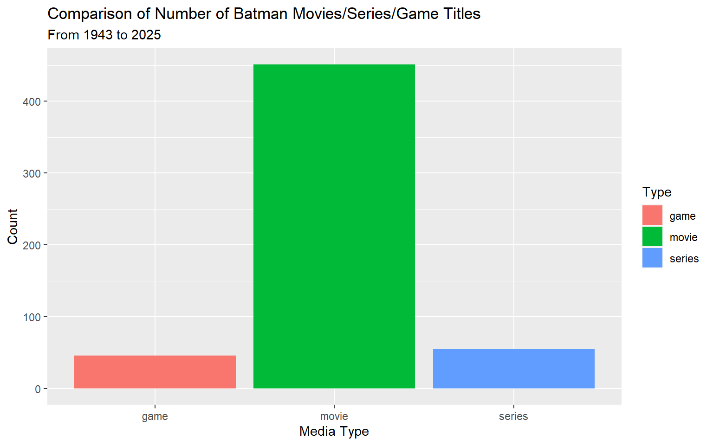
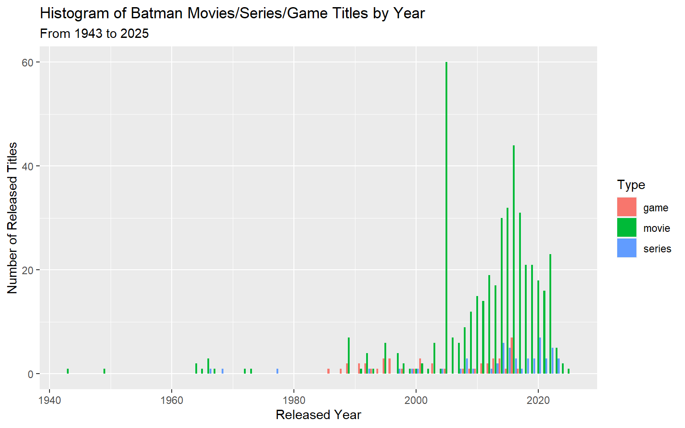
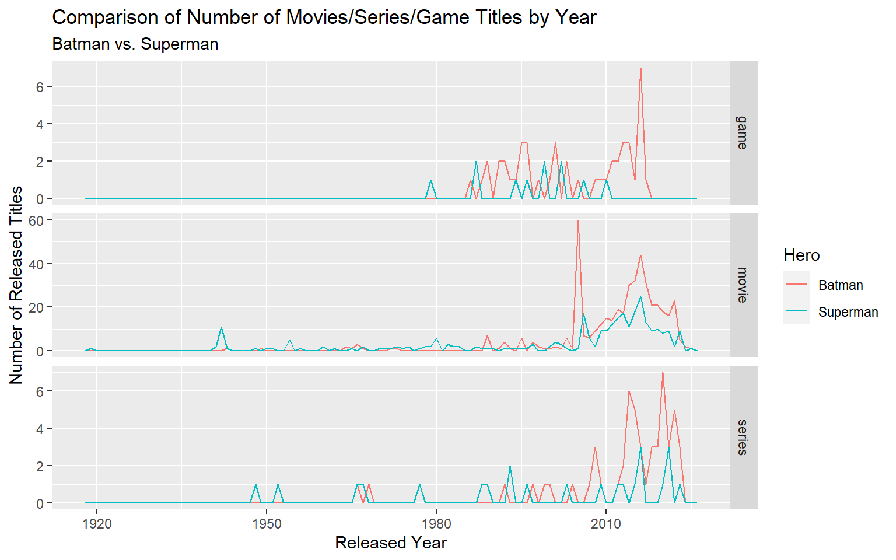
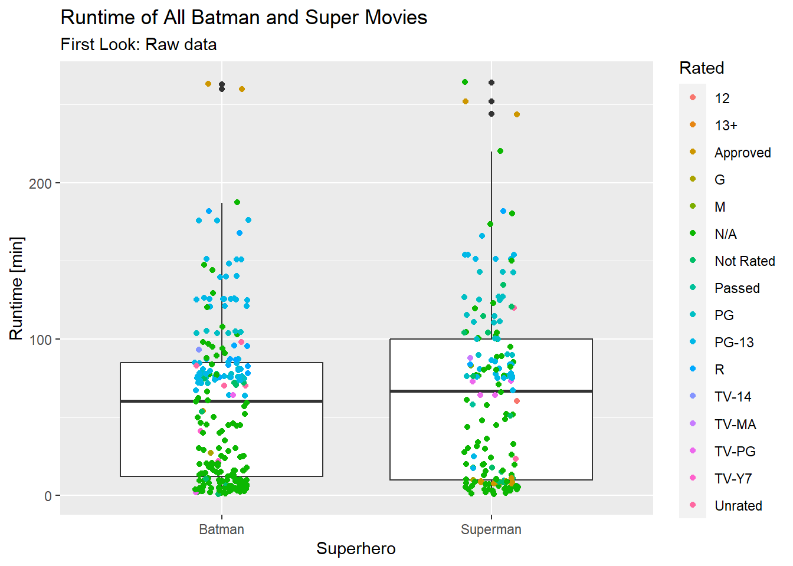
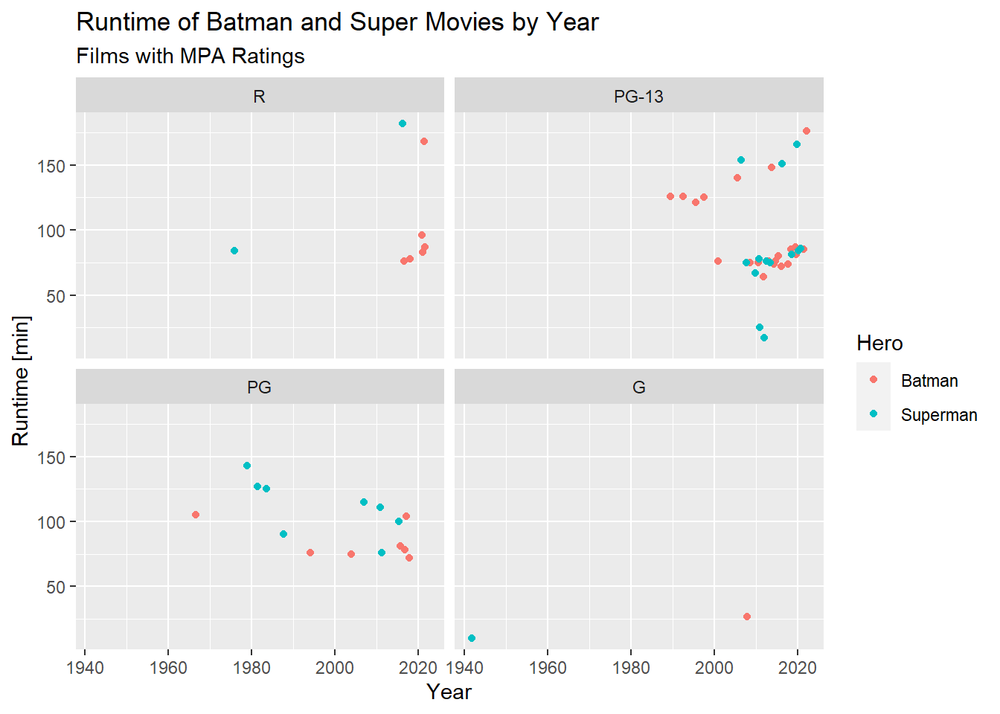
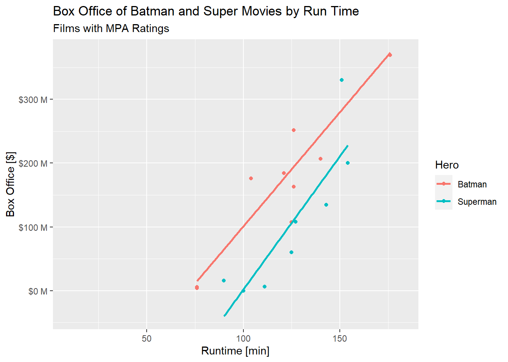

Movie Database API Query
================
Chien-Lan Hsueh
2022-06-26

- [Introduction](#introduction)
- [Setup 0: Codes to Render this Markdown
  Page](#setup-0-codes-to-render-this-markdown-page)
- [Setup 1: Confidential Keys](#setup-1-confidential-keys)
- [Setup 2: (Install and) Load
  Packages](#setup-2-install-and-load-packages)
- [Helper Functions](#helper-functions)
  - [`OMDb_setup_query()`](#omdb_setup_query)
  - [`OMDB_query()`](#omdb_query)
  - [`OMDb_parse_movie()`](#omdb_parse_movie)
  - [`OMDb_parse_search()`](#omdb_parse_search)
  - [`OMDb_movie()`](#omdb_movie)
- [Test and Examples of Using
  `OMDb_movie()`](#test-and-examples-of-using-omdb_movie)
  - [Single-movie queries (by IMDb
    ID)](#single-movie-queries-by-imdb-id)
  - [Single-movie queries (by Title)](#single-movie-queries-by-title)
  - [Search with a Partially Matched
    Value](#search-with-a-partially-matched-value)
  - [Tests with Bad Parameters](#tests-with-bad-parameters)
- [EDA](#eda)

## Introduction

[The Open Movie Database (OMDb)](https://www.omdbapi.com/) is a public
online database and provides API to use the web service for movie
information.

In this project, I will go through my setup including a script to render
the rmarkdown, and the tools and libraries I use in this project. Then I
will develop a set of helper functions including a wrapper function to
make the API calls easy with returned data in a data frame format. After
checking all the functions work as expected, I will then use it to
obtain some movie information from OMDb web service and perform some
basic EDA including numerical and graphical summaries on the data.

Meanwhile, a [blog](https://chsueh2.github.io/ST558-1st-project.html) is
posted on my GitHub pages to share my experience and thinking when doing
this project.

## Setup 0: Codes to Render this Markdown Page

This code chunk (don’t execute) shows how to use `RMarkdown::render()`
to render this rmarkdown document.

``` r
library(rmarkdown)
library(knitr)

rmarkdown::render(
  input = input, 
  output_format = github_document(html_preview = FALSE), 
  output_file = "report.md"
  output_dir = output_dir
)
```

## Setup 1: Confidential Keys

It’s a good practice not to include any login confidential information
like passwords or access keys explicitly in codes. Here, we use
`keyring` to store the API key.

At the first time to run this notebook, uncomment the following line and
execute it. RStudio will ask for your API key and store it. This needs
to be done only once.

``` r
# Uncomment the following line to save the API key
#rstudioapi::askForSecret("OMDb")
```

## Setup 2: (Install and) Load Packages

We will use the following packages in this project:

- `here`: enables easy file referencing and builds file paths in a
  OS-independent way
- `keyring`: provides OS-independent ‘API’ to access system’s credential
  store
- `stats`: loads this before loading `tidyverse` to avoid masking some
  `tidyverse` functions
- `tidyverse`: includes collections of useful packages like `dplyr`
  (data manipulation), `tidyr` (tidying data), `ggplots` (creating
  graphs), etc.
- `rlang`: deals with missing arguments in our helper functions
- `lubridate`: handle date and datetime data type
- `glue`: offers interpreted string literals for easy creation of
  dynamic messages and labels
- `scales`: formats and labels scales nicely for better visualization
- `httr`: performs HTTP web APIs
- `jsonliet`: parses data stored in JSON format
- `GGally`: plots a very nice scatterplot matrix

In addition, the `pacman` package provides handy tools to manage R
packages (install, update, load and unload). We use its `p_laod()`
instead of `libarary()` to load the packages listed above.

``` r
# load the `pacman` package
# if it's not yet installed, install and load it
if (!require("pacman")) utils::install.packages("pacman", dependencies = TRUE)
```

    ## Loading required package: pacman

``` r
# load the required packages whether it's installed or not
pacman::p_load(
    here, keyring,
    stats, 
    tidyverse, rlang,
    lubridate,
    glue, scales,
    httr, jsonlite,
    GGally
)
```

## Helper Functions

The first helper function is a negated version of the built-in `%in%`
operator. This makes our codes cleaner and easier to read when we check
if an element is absent.

``` r
# not %in%
'%notin%' <- Negate('%in%')
```

To make the OMDb API easy to use, we define some helper functions and
wrap them up in a user-friendly function to perform a query. There are
mainly two different API queries: (1) inquiry by a IMDb ID or a movie
title, and (2) inquiry with a movie title search. To perform the
queries, we define the following helper functions and an easy-to-use
wrapper to do API calls.

- `OMDb_setup_query()`: sets up the query parameters
- `OMDB_query()`: performs an API call and check the results (status)
- `OMDb_parse_movie()`: parse inquiry results of a movie by its IMDb ID
  or title (with/without other optional parameters)
- `OMDb_parse_search()` parse search results (with/without using other
  optional parameters)
- `OMDb_movie()`: a wrapper function to do a movie query or search (with
  or without other optional parameters)

Note: The variable `Year` returned in the query response is character
but might not be a single year. In some cases (especially for media
type: series), it can be a character string like `2015-2020` or `2015-`.
Therefore, `Year` variable will be kept as is. Instead, a new date
variable `Year_satrt` will be created to get the beginning year of the
span.

### `OMDb_setup_query()`

Create query parameters in a list of key-value pairs:

> Arguments:
>
> - `args`: a list of all other arguments passed in from the wrapper
>   function `OMDb_movie()`
> - `by`: method of API query. Needs to be one of the API supported
>   methods
> - `value`: value to inquery or search for
> - `page`: (optional) specified page of search results
> - `verbose`: a boolean switch to print out the query
>
> Returned Value: query parameters in a list of key-value pairs

``` r
# a helper function to create query parameters in a list of key-value pairs
OMDb_setup_query <- function(args, by = c("id", "title", "search"), value, page, verbose = T, ...) {
  # verify query method argument `by` to be one of the supported methods
  by <- match.arg(by)
  
  # assign default query value if it's missing in argument (for demo and test purpose)
  if(is_missing(value)){
    value <- c("tt1285016", "Batman", "Batman")[by == c("id", "title", "search")]
  }

  # assign default page value (only needed when using search method)
  if(by == "search") {
    args$page <- ifelse(is_missing(page), "1", as.character(page))
  }
  
  # remove `by` and `value` from the list
  # also remove argument `r` (if exists) because this function only supports JSON
  args[c("by", "value", "r")] <- NULL

  # construct the query as a list of query parameters and the api key
  query0 <- 
    # key-value pair from the query method `by` and query value `value`
    switch(by,
      id = list(i = value),
      title = list(t = value),
      search = list(s = value)) %>% 
    # append the rest of query parameters
    append(args)

  # print out the query
  if(verbose){
    print(glue(
      "Query: {paste(names(query0), query0, sep = '=', collapse = ',')}"
    ))
  }

  # add the api key
  query <- query0 %>% 
    # add the api key
    append(list(apiKey = key_get("RStudio Keyring Secrets", "OMDb")))
  
  return(query)
}
```

### `OMDB_query()`

A wrapper of `httr::Get()` to send a query request, convert and parse
the response data, and check the execution status.

> Arguments:
>
> - `query`: query parameters in a list of key-value pairs
>
> Returned Value: parsed JSON content data from the API response

``` r
# a low-level helper function to send a query request and check the execution status
OMDB_query <- function(query){
  # send API query request
  rawdata <- GET(url = "http://www.omdbapi.com/", query = query)

  # check if the request is successful
  # if not, stop and print the HTTP status code
  if(!between(rawdata$status_code, 200, 299)) {
    stop(glue(
      "The HTTP GET request is not successful. HTTP status code: {rawdata$status_code}"
    ))
  }
  
  # parse the JSON content data
  parsed <- fromJSON(rawToChar(rawdata$content))
  
  # remove any empty list
  for(i in names(parsed)){
    if(length(parsed[[i]]) == 0) parsed[[i]] <- NA
  }
  
  # failed response
  if(parsed$Response == "False"){
    stop(glue(
      "The HTTR Get request is successful but the respose of the query has a false return ",
      "with an error message from API server: {parsed$Error}"
    ))
  }
  
  return(parsed)
}
```

### `OMDb_parse_movie()`

Parse info of a movie and save in a data frame after data type
conversion for numeric data (`Runtim` in minutes, `imdbRating`,
`BoxOffice` in dollar amount, etc) and date time data (`Released` date).

> Arguments:
>
> - `parsed`: a parsed JSON content data from a query of a movie
>
> Returned Value: a data frame with the information of the movie

``` r
# a helper function to parse info of a movie and save in a data frame
OMDb_parse_movie <- function(parsed){
  # convert the data into appropriate data type and save in a data frame
  df <- parsed %>% 
    as_tibble() %>% 
    # convert columns to numeric type
    mutate(across(matches(
      c("Runtime", "Metascore", "imdbRating", "imdbVotes", "BoxOffice", "totalSeasons")),
      ~parse_number(.x, na = c("", "NA", "N/A")))) %>% 
    # convert columns to datetime type
    mutate(across(matches(
      c("Released", "DVD")), 
      ~parse_date(.x, na = c("", "NA", "N/A"), format = "%d %b %Y"))) %>% 
    mutate(Year_start = parse_number(Year))
  
  return(df)
}
```

### `OMDb_parse_search()`

Parse search results and save in a data frame. If only asks for a
specified page of the search results, return that page, otherwise,
retrieve the remaining pages and return all results.

> Arguments:
>
> - `parsed`: a parsed JSON content data from a query of a movie
> - `query`: query parameters in a list of key-value pairs
> - `args`: a list of all other arguments passed in from the wrapper
>   function `OMDb_movie()`
>
> Returned Value: a data frame with the search results

``` r
# a helper function to parse search results and save in a data frame
OMDb_parse_search <- function(parsed, query, args){
  df <- parsed$Search %>% as_tibble()
  
  # how many pages of the search results    
  totalPages <- ceiling(as.numeric(parsed$totalResults)/10)
  
  # if there are more than one page and page argument is not specified
  # get the remaining pages
  if (("page" %notin% names(args)) && totalPages > 1){
    for (i in 2:totalPages) {
      query$page <- as.character(i)
      df_nextpage <- OMDB_query(query)$Search %>% as_tibble()
      df <- bind_rows(df, df_nextpage)
    }
  }
  
  # add the total results and sort the data by Type and Year  
  df <- df %>% 
    mutate(
      Year_start = parse_number(Year),
      totalResults = parsed$totalResults
    ) %>% 
    arrange(Title, Type, Year)
}
```

### `OMDb_movie()`

A wrapper function to do a movie query or search (with or without other
optional parameters).

> Arguments:
>
> - `by`: method of API query. Needs to be one of the API supported
>   methods
> - `...`: (optional) query parameters including `type`, `y` (year),
>   `page` (page number of search return), `plot`, etc. More info of the
>   API parameters can be found
>   [here](https://www.omdbapi.com/#parameters).
>
> Returned Value: a data frame of what the query returns

``` r
# a user-friendly wrapper function to perform an API query
OMDb_movie <- function(by = c("id", "title", "search"), ...) {
  # save all arguments as a named list
  args <- as.list(match.call())[-1]
  
  # set up query string
  query <- OMDb_setup_query(args, by, ...)
  parsed <- OMDB_query(query)
  
  # convert parsed data into a data frame based on query method
  if (by == "search"){
    # search returns a list of movies
    df <- OMDb_parse_search(parsed, query, args)
  } else {
    # when using search by id and title,  returns info of the movie
    df <- OMDb_parse_movie(parsed)
  }
  
  return(df)
}
```

## Test and Examples of Using `OMDb_movie()`

In this section, we will test the wrapper function and demonstrate its
usages.

### Single-movie queries (by IMDb ID)

When doing a single-movie query with an IMDb ID (using OMDb API’s `i`
parameter), the API only returns an exact match if there exists, or an
false response with an error message if not exact match. The successful
returned data can be a movie, a TV series or a game title. Different
media types have different variables (data columns) in the returns and
the wrapper function should be able to take care of these differences in
the background.

``` r
# Superman
super1 <- OMDb_movie(by = "id", value = "tt0078346") # movie
```

    ## Query: i=tt0078346

``` r
super1
```

    ## Warning in `[<-.data.frame`(`*tmp*`, , j, value = structure(list(Source =
    ## structure(c("Internet Movie Database", : provided 2 variables to replace 1
    ## variables

<div class="kable-table">

| Title    | Year | Rated | Released   | Runtime | Genre                     | Director       | Writer                                | Actors                                         | Plot                                                                                                                                  | Language | Country                               | Awards                                                 | Poster                                                                                                                               | Ratings                 | Metascore | imdbRating | imdbVotes | imdbID    | Type  | DVD        | BoxOffice | Production | Website | Response | Year_start |
|:---------|:-----|:------|:-----------|--------:|:--------------------------|:---------------|:--------------------------------------|:-----------------------------------------------|:--------------------------------------------------------------------------------------------------------------------------------------|:---------|:--------------------------------------|:-------------------------------------------------------|:-------------------------------------------------------------------------------------------------------------------------------------|:------------------------|----------:|-----------:|----------:|:----------|:------|:-----------|----------:|:-----------|:--------|:---------|-----------:|
| Superman | 1978 | PG    | 1978-12-15 |     143 | Action, Adventure, Sci-Fi | Richard Donner | Jerry Siegel, Joe Shuster, Mario Puzo | Christopher Reeve, Margot Kidder, Gene Hackman | An alien orphan is sent from his dying planet to Earth, where he grows up to become his adoptive home’s first and greatest superhero. | English  | United States, United Kingdom, Canada | Nominated for 3 Oscars. 17 wins & 23 nominations total | <https://m.media-amazon.com/images/M/MV5BMzA0YWMwMTUtMTVhNC00NjRkLWE2ZTgtOWEzNjJhYzNiMTlkXkEyXkFqcGdeQXVyNjc1NTYyMjg@._V1_SX300.jpg> | Internet Movie Database |        82 |        7.4 |    184002 | tt0078346 | movie | 2008-01-01 | 134478449 | N/A        | N/A     | True     |       1978 |
| Superman | 1978 | PG    | 1978-12-15 |     143 | Action, Adventure, Sci-Fi | Richard Donner | Jerry Siegel, Joe Shuster, Mario Puzo | Christopher Reeve, Margot Kidder, Gene Hackman | An alien orphan is sent from his dying planet to Earth, where he grows up to become his adoptive home’s first and greatest superhero. | English  | United States, United Kingdom, Canada | Nominated for 3 Oscars. 17 wins & 23 nominations total | <https://m.media-amazon.com/images/M/MV5BMzA0YWMwMTUtMTVhNC00NjRkLWE2ZTgtOWEzNjJhYzNiMTlkXkEyXkFqcGdeQXVyNjc1NTYyMjg@._V1_SX300.jpg> | Rotten Tomatoes         |        82 |        7.4 |    184002 | tt0078346 | movie | 2008-01-01 | 134478449 | N/A        | N/A     | True     |       1978 |
| Superman | 1978 | PG    | 1978-12-15 |     143 | Action, Adventure, Sci-Fi | Richard Donner | Jerry Siegel, Joe Shuster, Mario Puzo | Christopher Reeve, Margot Kidder, Gene Hackman | An alien orphan is sent from his dying planet to Earth, where he grows up to become his adoptive home’s first and greatest superhero. | English  | United States, United Kingdom, Canada | Nominated for 3 Oscars. 17 wins & 23 nominations total | <https://m.media-amazon.com/images/M/MV5BMzA0YWMwMTUtMTVhNC00NjRkLWE2ZTgtOWEzNjJhYzNiMTlkXkEyXkFqcGdeQXVyNjc1NTYyMjg@._V1_SX300.jpg> | Metacritic              |        82 |        7.4 |    184002 | tt0078346 | movie | 2008-01-01 | 134478449 | N/A        | N/A     | True     |       1978 |

</div>

``` r
super2 <- OMDb_movie(by = "id", value = "tt0106057") # series
```

    ## Query: i=tt0106057

``` r
super2
```

    ## Warning in `[<-.data.frame`(`*tmp*`, , j, value = structure(list(Source =
    ## structure("Internet Movie Database", class = "AsIs"), : provided 2 variables to
    ## replace 1 variables

<div class="kable-table">

| Title                                        | Year      | Rated | Released   | Runtime | Genre                    | Director | Writer                                        | Actors                              | Plot                                                                                                   | Language | Country       | Awards                                                         | Poster                                                                                                                               | Ratings                 | Metascore | imdbRating | imdbVotes | imdbID    | Type   | totalSeasons | Response | Year_start |
|:---------------------------------------------|:----------|:------|:-----------|--------:|:-------------------------|:---------|:----------------------------------------------|:------------------------------------|:-------------------------------------------------------------------------------------------------------|:---------|:--------------|:---------------------------------------------------------------|:-------------------------------------------------------------------------------------------------------------------------------------|:------------------------|----------:|-----------:|----------:|:----------|:-------|-------------:|:---------|-----------:|
| Lois & Clark: The New Adventures of Superman | 1993–1997 | TV-PG | 1993-09-12 |      46 | Adventure, Comedy, Drama | N/A      | Deborah Joy LeVine, Joe Shuster, Jerry Siegel | Dean Cain, Teri Hatcher, Lane Smith | In addition to fighting evil, Superman has a burning romance with Lois Lane in both of his identities. | English  | United States | Nominated for 5 Primetime Emmys. 2 wins & 13 nominations total | <https://m.media-amazon.com/images/M/MV5BZTU1ZGFjNzEtZWYzZC00ZmI0LTg2NmMtN2YyNTY4YzhlODIyXkEyXkFqcGdeQXVyMjExMjk0ODk@._V1_SX300.jpg> | Internet Movie Database |        NA |        6.7 |     25733 | tt0106057 | series |            4 | True     |       1993 |

</div>

``` r
super3 <- OMDb_movie(by = "id", value = "tt0772202") # game
```

    ## Query: i=tt0772202

``` r
super3
```

    ## Warning in `[<-.data.frame`(`*tmp*`, , j, value = structure(list(Source =
    ## structure("Internet Movie Database", class = "AsIs"), : provided 2 variables to
    ## replace 1 variables

<div class="kable-table">

| Title            | Year | Rated | Released   | Runtime | Genre                              | Director | Writer                                                                                              | Actors                                                   | Plot                                                                                                                                                                        | Language | Country | Awards | Poster                                                                                                                               | Ratings                 | Metascore | imdbRating | imdbVotes | imdbID    | Type | DVD | BoxOffice | Production | Website | Response | Year_start |
|:-----------------|:-----|:------|:-----------|--------:|:-----------------------------------|:---------|:----------------------------------------------------------------------------------------------------|:---------------------------------------------------------|:----------------------------------------------------------------------------------------------------------------------------------------------------------------------------|:---------|:--------|:-------|:-------------------------------------------------------------------------------------------------------------------------------------|:------------------------|----------:|-----------:|----------:|:----------|:-----|:----|----------:|:-----------|:--------|:---------|-----------:|
| Superman Returns | 2006 | T     | 2006-11-14 |      NA | Action, Adventure, Fantasy, Sci-Fi | N/A      | Flint Dille (screenplay), Marv Wolfman (story), Jerry Siegel (characters), Joe Shuster (characters) | Brandon Routh, Kate Bosworth, Kevin Spacey, Parker Posey | The Man of Steel returns from the extinct planet Kyrpton to his home Metropolis only to find himself protecting it once more from foes such as Metallo, Mongul and Bizarro. | English  | USA     | N/A    | <https://m.media-amazon.com/images/M/MV5BOTAyZjQ0ZWMtNWFkMC00OTE5LWE3NGEtMGU3MWY5YmFjOTY2XkEyXkFqcGdeQXVyMTA1OTEwNjE@._V1_SX300.jpg> | Internet Movie Database |        NA |        5.5 |      1030 | tt0772202 | game | NA  |        NA | N/A        | N/A     | True     |       2006 |

</div>

Note: If a query returns a movie, the variable `ratings` is a date frame
with two columns: `Ratings$Source` and `RatingsValue`. In a tibble, this
is a list column (a column that stores a data frame in it). The data
frame printout might look differently depending on the rendering
options.

### Single-movie queries (by Title)

When doing a query by a title (using OMDb API’s `t` parameter), the API
call again returns one result but its behavior is different from queries
by IMDb ID in the following ways:

- If there is no exact match, it returns one movie with partially
  matched title (not clearly how it decides which to pick).
- If there is only one exact match, it turns that movie.
- If there are more than one exact match, it still returns one movie
  (again, not clearly how it decides which to pick). We can specify an
  additional search parameter like `y` (year) to get other matched
  movies.

``` r
# Batman
batman1 <- OMDb_movie(by = "title", value = "Batman") # title
```

    ## Query: t=Batman

``` r
batman1
```

    ## Warning in `[<-.data.frame`(`*tmp*`, , j, value = structure(list(Source =
    ## structure(c("Internet Movie Database", : provided 2 variables to replace 1
    ## variables

<div class="kable-table">

| Title  | Year | Rated | Released   | Runtime | Genre             | Director   | Writer                             | Actors                                       | Plot                                                                                                                                                        | Language                 | Country                       | Awards                                      | Poster                                                                                                                               | Ratings                 | Metascore | imdbRating | imdbVotes | imdbID    | Type  | DVD        | BoxOffice | Production | Website | Response | Year_start |
|:-------|:-----|:------|:-----------|--------:|:------------------|:-----------|:-----------------------------------|:---------------------------------------------|:------------------------------------------------------------------------------------------------------------------------------------------------------------|:-------------------------|:------------------------------|:--------------------------------------------|:-------------------------------------------------------------------------------------------------------------------------------------|:------------------------|----------:|-----------:|----------:|:----------|:------|:-----------|----------:|:-----------|:--------|:---------|-----------:|
| Batman | 1989 | PG-13 | 1989-06-23 |     126 | Action, Adventure | Tim Burton | Bob Kane, Sam Hamm, Warren Skaaren | Michael Keaton, Jack Nicholson, Kim Basinger | The Dark Knight of Gotham City begins his war on crime with his first major enemy being Jack Napier, a criminal who becomes the clownishly homicidal Joker. | English, French, Spanish | United States, United Kingdom | Won 1 Oscar. 10 wins & 28 nominations total | <https://m.media-amazon.com/images/M/MV5BZWQ0OTQ3ODctMmE0MS00ODc2LTg0ZTEtZWIwNTUxOGExZTQ4XkEyXkFqcGdeQXVyNzAwMjU2MTY@._V1_SX300.jpg> | Internet Movie Database |        69 |        7.5 |    396849 | tt0096895 | movie | 2014-07-24 | 251409241 | N/A        | N/A     | True     |       1989 |
| Batman | 1989 | PG-13 | 1989-06-23 |     126 | Action, Adventure | Tim Burton | Bob Kane, Sam Hamm, Warren Skaaren | Michael Keaton, Jack Nicholson, Kim Basinger | The Dark Knight of Gotham City begins his war on crime with his first major enemy being Jack Napier, a criminal who becomes the clownishly homicidal Joker. | English, French, Spanish | United States, United Kingdom | Won 1 Oscar. 10 wins & 28 nominations total | <https://m.media-amazon.com/images/M/MV5BZWQ0OTQ3ODctMmE0MS00ODc2LTg0ZTEtZWIwNTUxOGExZTQ4XkEyXkFqcGdeQXVyNzAwMjU2MTY@._V1_SX300.jpg> | Rotten Tomatoes         |        69 |        7.5 |    396849 | tt0096895 | movie | 2014-07-24 | 251409241 | N/A        | N/A     | True     |       1989 |
| Batman | 1989 | PG-13 | 1989-06-23 |     126 | Action, Adventure | Tim Burton | Bob Kane, Sam Hamm, Warren Skaaren | Michael Keaton, Jack Nicholson, Kim Basinger | The Dark Knight of Gotham City begins his war on crime with his first major enemy being Jack Napier, a criminal who becomes the clownishly homicidal Joker. | English, French, Spanish | United States, United Kingdom | Won 1 Oscar. 10 wins & 28 nominations total | <https://m.media-amazon.com/images/M/MV5BZWQ0OTQ3ODctMmE0MS00ODc2LTg0ZTEtZWIwNTUxOGExZTQ4XkEyXkFqcGdeQXVyNzAwMjU2MTY@._V1_SX300.jpg> | Metacritic              |        69 |        7.5 |    396849 | tt0096895 | movie | 2014-07-24 | 251409241 | N/A        | N/A     | True     |       1989 |

</div>

``` r
batman2 <- OMDb_movie(by = "title", value = "Batman", y = 1966) # year
```

    ## Query: t=Batman,y=1966

``` r
batman2
```

    ## Warning in `[<-.data.frame`(`*tmp*`, , j, value = structure(list(Source =
    ## structure("Internet Movie Database", class = "AsIs"), : provided 2 variables to
    ## replace 1 variables

<div class="kable-table">

| Title  | Year      | Rated | Released   | Runtime | Genre                  | Director | Writer                             | Actors                            | Plot                                                                   | Language | Country       | Awards                                                        | Poster                                                                                                                               | Ratings                 | Metascore | imdbRating | imdbVotes | imdbID    | Type   | totalSeasons | Response | Year_start |
|:-------|:----------|:------|:-----------|--------:|:-----------------------|:---------|:-----------------------------------|:----------------------------------|:-----------------------------------------------------------------------|:---------|:--------------|:--------------------------------------------------------------|:-------------------------------------------------------------------------------------------------------------------------------------|:------------------------|----------:|-----------:|----------:|:----------|:-------|-------------:|:---------|-----------:|
| Batman | 1966–1968 | TV-G  | 1966-01-12 |      25 | Action, Crime, Fantasy | N/A      | Lorenzo Semple Jr., William Dozier | Adam West, Burt Ward, Alan Napier | The Caped Crusader and his young ward battle evildoers in Gotham City. | English  | United States | Nominated for 3 Primetime Emmys. 6 wins & 7 nominations total | <https://m.media-amazon.com/images/M/MV5BYTc5NGZhNjktOTVhNi00NzBmLTk1MTgtMjEzNDI0OWYxYWVlXkEyXkFqcGdeQXVyMTEyNzgwMDUw._V1_SX300.jpg> | Internet Movie Database |        NA |        7.5 |     25163 | tt0059968 | series |            3 | True     |       1966 |

</div>

We can also specify the parameter `plot` to get different versions of
the plot:

``` r
batman3 <- OMDb_movie(by = "title", value = "Batman", y = 1966, type = "series") # series
```

    ## Query: t=Batman,y=1966,type=series

``` r
batman3
```

    ## Warning in `[<-.data.frame`(`*tmp*`, , j, value = structure(list(Source =
    ## structure("Internet Movie Database", class = "AsIs"), : provided 2 variables to
    ## replace 1 variables

<div class="kable-table">

| Title  | Year      | Rated | Released   | Runtime | Genre                  | Director | Writer                             | Actors                            | Plot                                                                   | Language | Country       | Awards                                                        | Poster                                                                                                                               | Ratings                 | Metascore | imdbRating | imdbVotes | imdbID    | Type   | totalSeasons | Response | Year_start |
|:-------|:----------|:------|:-----------|--------:|:-----------------------|:---------|:-----------------------------------|:----------------------------------|:-----------------------------------------------------------------------|:---------|:--------------|:--------------------------------------------------------------|:-------------------------------------------------------------------------------------------------------------------------------------|:------------------------|----------:|-----------:|----------:|:----------|:-------|-------------:|:---------|-----------:|
| Batman | 1966–1968 | TV-G  | 1966-01-12 |      25 | Action, Crime, Fantasy | N/A      | Lorenzo Semple Jr., William Dozier | Adam West, Burt Ward, Alan Napier | The Caped Crusader and his young ward battle evildoers in Gotham City. | English  | United States | Nominated for 3 Primetime Emmys. 6 wins & 7 nominations total | <https://m.media-amazon.com/images/M/MV5BYTc5NGZhNjktOTVhNi00NzBmLTk1MTgtMjEzNDI0OWYxYWVlXkEyXkFqcGdeQXVyMTEyNzgwMDUw._V1_SX300.jpg> | Internet Movie Database |        NA |        7.5 |     25163 | tt0059968 | series |            3 | True     |       1966 |

</div>

``` r
batman4 <- OMDb_movie(by = "title", value = "Batman", y = 1966, type = "series", plot = "full") # series
```

    ## Query: t=Batman,y=1966,type=series,plot=full

``` r
batman4
```

    ## Warning in `[<-.data.frame`(`*tmp*`, , j, value = structure(list(Source =
    ## structure("Internet Movie Database", class = "AsIs"), : provided 2 variables to
    ## replace 1 variables

<div class="kable-table">

| Title  | Year      | Rated | Released   | Runtime | Genre                  | Director | Writer                             | Actors                            | Plot                                                                                                                                                                                                                                                                                                                                                                                                                                                                                                                                                                                                                                                                                                                             | Language | Country       | Awards                                                        | Poster                                                                                                                               | Ratings                 | Metascore | imdbRating | imdbVotes | imdbID    | Type   | totalSeasons | Response | Year_start |
|:-------|:----------|:------|:-----------|--------:|:-----------------------|:---------|:-----------------------------------|:----------------------------------|:---------------------------------------------------------------------------------------------------------------------------------------------------------------------------------------------------------------------------------------------------------------------------------------------------------------------------------------------------------------------------------------------------------------------------------------------------------------------------------------------------------------------------------------------------------------------------------------------------------------------------------------------------------------------------------------------------------------------------------|:---------|:--------------|:--------------------------------------------------------------|:-------------------------------------------------------------------------------------------------------------------------------------|:------------------------|----------:|-----------:|----------:|:----------|:-------|-------------:|:---------|-----------:|
| Batman | 1966–1968 | TV-G  | 1966-01-12 |      25 | Action, Crime, Fantasy | N/A      | Lorenzo Semple Jr., William Dozier | Adam West, Burt Ward, Alan Napier | Wealthy entrepreneur Bruce Wayne (Adam West) and his ward Dick Grayson (Burt Ward) lead a double life: they are actually the crime-fighting duo Batman and Robin. A secret Batpole in the Wayne mansion leads to the Batcave, where Police Commissioner Gordon (Neil Hamilton) summons the Dynamic Duo on the Batphone with the latest emergency threatening Gotham City. Racing to the scene of the crime in the jet-powered Batmobile, Batman and Robin must (with the help of their trusty utility-belts) thwart the efforts of a rogues gallery of flamboyant archvillains, including The Joker (Cesar Romero), The Penguin (Burgess Meredith), The Riddler (Frank Gorshin) and the Catwoman (Julie Newmar and Eartha Kitt). | English  | United States | Nominated for 3 Primetime Emmys. 6 wins & 7 nominations total | <https://m.media-amazon.com/images/M/MV5BYTc5NGZhNjktOTVhNi00NzBmLTk1MTgtMjEzNDI0OWYxYWVlXkEyXkFqcGdeQXVyMTEyNzgwMDUw._V1_SX300.jpg> | Internet Movie Database |        NA |        7.5 |     25163 | tt0059968 | series |            3 | True     |       1966 |

</div>

``` r
print(glue(
  "Short plot: \n\t{batman3$Plot}\n\n",
  "Full plot: \n\t{batman4$Plot}"
))
```

    ## Short plot: 
    ##  The Caped Crusader and his young ward battle evildoers in Gotham City.
    ## 
    ## Full plot: 
    ##  Wealthy entrepreneur Bruce Wayne (Adam West) and his ward Dick Grayson (Burt Ward) lead a double life: they are actually the crime-fighting duo Batman and Robin. A secret Batpole in the Wayne mansion leads to the Batcave, where Police Commissioner Gordon (Neil Hamilton) summons the Dynamic Duo on the Batphone with the latest emergency threatening Gotham City. Racing to the scene of the crime in the jet-powered Batmobile, Batman and Robin must (with the help of their trusty utility-belts) thwart the efforts of a rogues gallery of flamboyant archvillains, including The Joker (Cesar Romero), The Penguin (Burgess Meredith), The Riddler (Frank Gorshin) and the Catwoman (Julie Newmar and Eartha Kitt).

### Search with a Partially Matched Value

Searches using OMDb API’s `s` parameter return a list of media
(movies/series/games) as long as they have exact or partial match to the
search value. Without specifying `page` parameter, our helper function
will make multiple API calls to retrieve all of the results page by page
and return all results in a data frame.

``` r
batman_list <- OMDb_movie(by = "search", value = "Batman")
```

    ## Query: s=Batman,page=1

``` r
batman_list %>% head()
```

<div class="kable-table">

| Title                                      | Year | imdbID     | Type  | Poster | Year_start | totalResults |
|:-------------------------------------------|:-----|:-----------|:------|:-------|-----------:|:-------------|
| 44: Batman (1989)                          | 1989 | tt25281222 | movie | N/A    |       1989 | 552          |
| 47: Batman & Robin (1997)                  | 1997 | tt25281120 | movie | N/A    |       1997 | 552          |
| 51: The Lego Batman Movie (2017)           | 2017 | tt25282634 | movie | N/A    |       2017 | 552          |
| 52: The Batman (2022)                      | 2022 | tt25282298 | movie | N/A    |       2022 | 552          |
| A Batman Voice Video                       | 2012 | tt10857182 | movie | N/A    |       2012 | 552          |
| A First Look at Batman: Under the Red Hood | 2010 | tt1640102  | movie | N/A    |       2010 | 552          |

</div>

If the `page` parameter is specified, then it will only return the
results on the page (10 results on a page):

``` r
batman_list_p1 <- OMDb_movie(by = "search", value = "Batman", page = 1)
```

    ## Query: s=Batman,page=1

``` r
batman_list_p1
```

<div class="kable-table">

| Title                                                 | Year      | imdbID     | Type   | Poster                                                                                                                               | Year_start | totalResults |
|:------------------------------------------------------|:----------|:-----------|:-------|:-------------------------------------------------------------------------------------------------------------------------------------|-----------:|:-------------|
| Batman                                                | 1989      | tt0096895  | movie  | <https://m.media-amazon.com/images/M/MV5BZWQ0OTQ3ODctMmE0MS00ODc2LTg0ZTEtZWIwNTUxOGExZTQ4XkEyXkFqcGdeQXVyNzAwMjU2MTY@._V1_SX300.jpg> |       1989 | 552          |
| Batman & Robin                                        | 1997      | tt0118688  | movie  | <https://m.media-amazon.com/images/M/MV5BMGQ5YTM1NmMtYmIxYy00N2VmLWJhZTYtN2EwYTY3MWFhOTczXkEyXkFqcGdeQXVyNTA2NTI0MTY@._V1_SX300.jpg> |       1997 | 552          |
| Batman Begins                                         | 2005      | tt0372784  | movie  | <https://m.media-amazon.com/images/M/MV5BOTY4YjI2N2MtYmFlMC00ZjcyLTg3YjEtMDQyM2ZjYzQ5YWFkXkEyXkFqcGdeQXVyMTQxNzMzNDI@._V1_SX300.jpg> |       2005 | 552          |
| Batman Forever                                        | 1995      | tt0112462  | movie  | <https://m.media-amazon.com/images/M/MV5BNDdjYmFiYWEtYzBhZS00YTZkLWFlODgtY2I5MDE0NzZmMDljXkEyXkFqcGdeQXVyMTMxODk2OTU@._V1_SX300.jpg> |       1995 | 552          |
| Batman Returns                                        | 1992      | tt0103776  | movie  | <https://m.media-amazon.com/images/M/MV5BOGZmYzVkMmItM2NiOS00MDI3LWI4ZWQtMTg0YWZkODRkMmViXkEyXkFqcGdeQXVyODY0NzcxNw@@._V1_SX300.jpg> |       1992 | 552          |
| Batman v Superman: Dawn of Justice                    | 2016      | tt2975590  | movie  | <https://m.media-amazon.com/images/M/MV5BYThjYzcyYzItNTVjNy00NDk0LTgwMWQtYjMwNmNlNWJhMzMyXkEyXkFqcGdeQXVyMTQxNzMzNDI@._V1_SX300.jpg> |       2016 | 552          |
| Batman v Superman: Dawn of Justice (Ultimate Edition) | 2016      | tt18689424 | movie  | <https://m.media-amazon.com/images/M/MV5BOTRlNWQwM2ItNjkyZC00MGI3LThkYjktZmE5N2FlMzcyNTIyXkEyXkFqcGdeQXVyMTEyNzgwMDUw._V1_SX300.jpg> |       2016 | 552          |
| Batman: The Animated Series                           | 1992–1995 | tt0103359  | series | <https://m.media-amazon.com/images/M/MV5BOTM3MTRkZjQtYjBkMy00YWE1LTkxOTQtNDQyNGY0YjYzNzAzXkEyXkFqcGdeQXVyOTgwMzk1MTA@._V1_SX300.jpg> |       1992 | 552          |
| The Batman                                            | 2022      | tt1877830  | movie  | <https://m.media-amazon.com/images/M/MV5BM2MyNTAwZGEtNTAxNC00ODVjLTgzZjUtYmU0YjAzNmQyZDEwXkEyXkFqcGdeQXVyNDc2NTg3NzA@._V1_SX300.jpg> |       2022 | 552          |
| The Lego Batman Movie                                 | 2017      | tt4116284  | movie  | <https://m.media-amazon.com/images/M/MV5BMTcyNTEyOTY0M15BMl5BanBnXkFtZTgwOTAyNzU3MDI@._V1_SX300.jpg>                                 |       2017 | 552          |

</div>

``` r
batman_list_p2 <- OMDb_movie(by = "search", value = "Batman", page = 2)
```

    ## Query: s=Batman,page=2

``` r
batman_list_p2
```

<div class="kable-table">

| Title                                   | Year      | imdbID    | Type   | Poster                                                                                                                                               | Year_start | totalResults |
|:----------------------------------------|:----------|:----------|:-------|:-----------------------------------------------------------------------------------------------------------------------------------------------------|-----------:|:-------------|
| Batman Beyond                           | 1999–2001 | tt0147746 | series | <https://m.media-amazon.com/images/M/MV5BZWJhNjA4YTAtODBlMS00NjIzLThhZWUtOGYxMGM3OTRmNDZmXkEyXkFqcGdeQXVyNjk1Njg5NTA@._V1_SX300.jpg>                 |       1999 | 552          |
| Batman: Assault on Arkham               | 2014      | tt3139086 | movie  | <https://m.media-amazon.com/images/M/MV5BZDU1ZGRiY2YtYmZjMi00ZDQwLWJjMWMtNzUwNDMwYjQ4ZTVhXkEyXkFqcGdeQXVyNTAyODkwOQ@@._V1_SX300.jpg>                 |       2014 | 552          |
| Batman: Gotham Knight                   | 2008      | tt1117563 | movie  | <https://m.media-amazon.com/images/M/MV5BM2I0YTFjOTUtMWYzNC00ZTgyLTk2NWEtMmE3N2VlYjEwN2JlXkEyXkFqcGdeQXVyNTAyODkwOQ@@._V1_SX300.jpg>                 |       2008 | 552          |
| Batman: Mask of the Phantasm            | 1993      | tt0106364 | movie  | <https://m.media-amazon.com/images/M/MV5BYTRiMWM3MGItNjAxZC00M2E3LThhODgtM2QwOGNmZGU4OWZhXkEyXkFqcGdeQXVyNjExODE1MDc@._V1_SX300.jpg>                 |       1993 | 552          |
| Batman: The Dark Knight Returns, Part 1 | 2012      | tt2313197 | movie  | <https://m.media-amazon.com/images/M/MV5BMzIxMDkxNDM2M15BMl5BanBnXkFtZTcwMDA5ODY1OQ@@._V1_SX300.jpg>                                                 |       2012 | 552          |
| Batman: The Dark Knight Returns, Part 2 | 2013      | tt2166834 | movie  | <https://m.media-amazon.com/images/M/MV5BYTEzMmE0ZDYtYWNmYi00ZWM4LWJjOTUtYTE0ZmQyYWM3ZjA0XkEyXkFqcGdeQXVyNTA4NzY1MzY@._V1_SX300.jpg>                 |       2013 | 552          |
| Batman: The Killing Joke                | 2016      | tt4853102 | movie  | <https://m.media-amazon.com/images/M/MV5BMTdjZTliODYtNWExMi00NjQ1LWIzN2MtN2Q5NTg5NTk3NzliL2ltYWdlXkEyXkFqcGdeQXVyNTAyODkwOQ@@._V1_SX300.jpg>         |       2016 | 552          |
| Batman: The Movie                       | 1966      | tt0060153 | movie  | <https://m.media-amazon.com/images/M/MV5BMmM1OGIzM2UtNThhZS00ZGNlLWI4NzEtZjlhOTNhNmYxZGQ0XkEyXkFqcGdeQXVyNTkxMzEwMzU@._V1_SX300.jpg>                 |       1966 | 552          |
| Batman: Under the Red Hood              | 2010      | tt1569923 | movie  | <https://m.media-amazon.com/images/M/MV5BNmY4ZDZjY2UtOWFiYy00MjhjLThmMjctOTQ2NjYxZGRjYmNlL2ltYWdlL2ltYWdlXkEyXkFqcGdeQXVyNTAyODkwOQ@@._V1_SX300.jpg> |       2010 | 552          |
| Batman: Year One                        | 2011      | tt1672723 | movie  | <https://m.media-amazon.com/images/M/MV5BNTJjMmVkZjctNjNjMS00ZmI2LTlmYWEtOWNiYmQxYjY0YWVhXkEyXkFqcGdeQXVyNTAyODkwOQ@@._V1_SX300.jpg>                 |       2011 | 552          |

</div>

### Tests with Bad Parameters

It’s always a good idea to test how our functions handle some bad inputs
(query parameters) by users. In this section, we briefly test the
following three cases.

#### Bad (Invalid) IMDBb ID

If we have an invalid IMDb ID, we get an error message from the respond.

Note: I have to turn the evaluation option off or the rendering function
won’t work.

``` r
bad_id <- OMDb_movie(by = "id", value = "in_valid_ID_tt0772203332")
bad_id

# the error message:
#Error in OMDB_query(query) : 
#The HTTR Get request is successful but the respose of the query has a false return with an error message from API server: Incorrect IMDb ID. 
```

#### Bad (Makeup) Title

It seems this API always tries it best and returns a “partially”
matching result even when you use a very weird title to search for:

``` r
bad_title <- OMDb_movie(by = "title", value = "@!#2@#")
```

    ## Query: t=@!#2@#

``` r
bad_title
```

    ## Warning in `[<-.data.frame`(`*tmp*`, , j, value = structure(list(Source =
    ## structure(c("Internet Movie Database", : provided 2 variables to replace 1
    ## variables

<div class="kable-table">

| Title                      | Year | Rated | Released   | Runtime | Genre          | Director      | Writer                        | Actors                                                | Plot                                                                                                                                                       | Language         | Country       | Awards                                       | Poster                                                                                                                               | Ratings                 | Metascore | imdbRating | imdbVotes | imdbID    | Type  | DVD        | BoxOffice | Production | Website | Response | Year_start |
|:---------------------------|:-----|:------|:-----------|--------:|:---------------|:--------------|:------------------------------|:------------------------------------------------------|:-----------------------------------------------------------------------------------------------------------------------------------------------------------|:-----------------|:--------------|:---------------------------------------------|:-------------------------------------------------------------------------------------------------------------------------------------|:------------------------|----------:|-----------:|----------:|:----------|:------|:-----------|----------:|:-----------|:--------|:---------|-----------:|
| Terminator 2: Judgment Day | 1991 | R     | 1991-07-03 |     137 | Action, Sci-Fi | James Cameron | James Cameron, William Wisher | Arnold Schwarzenegger, Linda Hamilton, Edward Furlong | A cyborg, identical to the one who failed to kill Sarah Connor, must now protect her ten year old son John from an even more advanced and powerful cyborg. | English, Spanish | United States | Won 4 Oscars. 38 wins & 33 nominations total | <https://m.media-amazon.com/images/M/MV5BMGU2NzRmZjUtOGUxYS00ZjdjLWEwZWItY2NlM2JhNjkxNTFmXkEyXkFqcGdeQXVyNjU0OTQ0OTY@._V1_SX300.jpg> | Internet Movie Database |        75 |        8.6 |   1147661 | tt0103064 | movie | 2016-08-10 | 205881154 | N/A        | N/A     | True     |       1991 |
| Terminator 2: Judgment Day | 1991 | R     | 1991-07-03 |     137 | Action, Sci-Fi | James Cameron | James Cameron, William Wisher | Arnold Schwarzenegger, Linda Hamilton, Edward Furlong | A cyborg, identical to the one who failed to kill Sarah Connor, must now protect her ten year old son John from an even more advanced and powerful cyborg. | English, Spanish | United States | Won 4 Oscars. 38 wins & 33 nominations total | <https://m.media-amazon.com/images/M/MV5BMGU2NzRmZjUtOGUxYS00ZjdjLWEwZWItY2NlM2JhNjkxNTFmXkEyXkFqcGdeQXVyNjU0OTQ0OTY@._V1_SX300.jpg> | Rotten Tomatoes         |        75 |        8.6 |   1147661 | tt0103064 | movie | 2016-08-10 | 205881154 | N/A        | N/A     | True     |       1991 |
| Terminator 2: Judgment Day | 1991 | R     | 1991-07-03 |     137 | Action, Sci-Fi | James Cameron | James Cameron, William Wisher | Arnold Schwarzenegger, Linda Hamilton, Edward Furlong | A cyborg, identical to the one who failed to kill Sarah Connor, must now protect her ten year old son John from an even more advanced and powerful cyborg. | English, Spanish | United States | Won 4 Oscars. 38 wins & 33 nominations total | <https://m.media-amazon.com/images/M/MV5BMGU2NzRmZjUtOGUxYS00ZjdjLWEwZWItY2NlM2JhNjkxNTFmXkEyXkFqcGdeQXVyNjU0OTQ0OTY@._V1_SX300.jpg> | Metacritic              |        75 |        8.6 |   1147661 | tt0103064 | movie | 2016-08-10 | 205881154 | N/A        | N/A     | True     |       1991 |

</div>

#### Bad Search Value

Because there is no exact match and are too many partial matched
results, the API call return a failure response (although the HTTR
request is successful) with an error message (from API server) saying
that there are too many results.

Note: I have to turn the evaluation option off or the rendering function
won’t work.

``` r
bad_list <- OMDb_movie(by = "search", value = "@!#2@#")
bad_list

# the error message:
#Error in OMDB_query(query) : 
#The HTTR Get request is successful but the response of the query has a false return with an error message from API server: Too many results.
```

## EDA

Since we have already done a search to get a list of all Batman-related
title, let’s take a look at the data.

``` r
print(glue(
  "The Batman search returns {nrow(batman_list)} results ",
  "in {length(unique(batman_list$Type))} types of media ",
  "including {batman_list$Type %>% unique() %>% toString()} ",
  "from {min(batman_list$Year_start)} to {max(batman_list$Year_start)} ",
  "(planned to be released)."
))
```

    ## The Batman search returns 552 results in 3 types of media including movie, series, game from 1943 to 2025 (planned to be released).

``` r
# one-way table
table(batman_list$Type)
```

    ## 
    ##   game  movie series 
    ##     46    451     55

``` r
# bar plot of media types
batman_list %>% 
  ggplot(aes(x = Type, fill = Type)) +
  geom_bar() +
  labs(
    title = "Comparison of Number of Batman Movies/Series/Game Titles",
    subtitle = glue("From {min(batman_list$Year_start)} to {max(batman_list$Year_start)}"),
    x = "Media Type",
    y = "Count"
  )
```

<!-- -->

``` r
# histogram
batman_list %>% ggplot(aes(Year_start, fill = Type)) +
  geom_histogram(position = "dodge2", binwidth = 1) +
  labs(
    title = "Histogram of Batman Movies/Series/Game Titles by Year",
    subtitle = glue("From {min(batman_list$Year_start)} to {max(batman_list$Year_start)}"),
    x = "Released Year",
    y = "Number of Released Titles"
  )
```

<!-- -->

I think it will be interesting to look at the movies of DC’s another big
IP: Superman.

``` r
superman_list <- OMDb_movie(by = "search", value = "Superman")
```

    ## Query: s=Superman,page=1

``` r
superman_list %>% head()
```

<div class="kable-table">

| Title                                                                                          | Year      | imdbID     | Type   | Poster                                                                                                                               | Year_start | totalResults |
|:-----------------------------------------------------------------------------------------------|:----------|:-----------|:-------|:-------------------------------------------------------------------------------------------------------------------------------------|-----------:|:-------------|
| 418: Superman II - Allein gegen alle (1980) & Superman II - The Richard Donner Cut (1980/2006) | 1980      | tt20370830 | movie  | N/A                                                                                                                                  |       1980 | 316          |
| A First Look at Superman/Batman: Apocalypse                                                    | 2010      | tt1706667  | movie  | N/A                                                                                                                                  |       2010 | 316          |
| A Man Who Was Superman                                                                         | 2008      | tt1119199  | movie  | <https://m.media-amazon.com/images/M/MV5BMjAzODYyMDk4NV5BMl5BanBnXkFtZTgwODIzNzE1MjE@._V1_SX300.jpg>                                 |       2008 | 316          |
| A Test of Minds: The Psychology of Superman and Batman                                         | 2009      | tt1542990  | movie  | N/A                                                                                                                                  |       2009 | 316          |
| Aaron Webster’s Superman                                                                       | 1989      | tt2739584  | movie  | N/A                                                                                                                                  |       1989 | 316          |
| Adventures of Superman                                                                         | 1952–1958 | tt0044231  | series | <https://m.media-amazon.com/images/M/MV5BZmYwMzY4OWMtZmYxMC00M2VmLWFlZDgtMWEyY2IzNDdjNWRmXkEyXkFqcGdeQXVyNTAyODkwOQ@@._V1_SX300.jpg> |       1952 | 316          |

</div>

``` r
print(glue(
  "The SuperBatman search returns {nrow(superman_list)} results ",
  "in {length(unique(superman_list$Type))} types of media ",
  "including {superman_list$Type %>% unique() %>% toString()} ",
  "from {min(superman_list$Year_start)} to {max(superman_list$Year_start)} ",
  "(planned to be released)."
))
```

    ## The SuperBatman search returns 316 results in 3 types of media including movie, series, game from 1919 to 2025 (planned to be released).

``` r
# one-way table
table(superman_list$Type)
```

    ## 
    ##   game  movie series 
    ##     11    282     23

We join these two data sets and compare them in a two-way contingency
table:

``` r
DC_heroes <- bind_rows(
  batman_list %>% mutate(Hero = "Batman"),
  superman_list %>% mutate(Hero = "Superman")
)
DC_heroes
```

<div class="kable-table">

| Title                                                                                             | Year      | imdbID     | Type   | Poster                                                                                                                                               | Year_start | totalResults | Hero     |
|:--------------------------------------------------------------------------------------------------|:----------|:-----------|:-------|:-----------------------------------------------------------------------------------------------------------------------------------------------------|-----------:|:-------------|:---------|
| 44: Batman (1989)                                                                                 | 1989      | tt25281222 | movie  | N/A                                                                                                                                                  |       1989 | 552          | Batman   |
| 47: Batman & Robin (1997)                                                                         | 1997      | tt25281120 | movie  | N/A                                                                                                                                                  |       1997 | 552          | Batman   |
| 51: The Lego Batman Movie (2017)                                                                  | 2017      | tt25282634 | movie  | N/A                                                                                                                                                  |       2017 | 552          | Batman   |
| 52: The Batman (2022)                                                                             | 2022      | tt25282298 | movie  | N/A                                                                                                                                                  |       2022 | 552          | Batman   |
| A Batman Voice Video                                                                              | 2012      | tt10857182 | movie  | N/A                                                                                                                                                  |       2012 | 552          | Batman   |
| A First Look at Batman: Under the Red Hood                                                        | 2010      | tt1640102  | movie  | N/A                                                                                                                                                  |       2010 | 552          | Batman   |
| A First Look at Superman/Batman: Apocalypse                                                       | 2010      | tt1706667  | movie  | N/A                                                                                                                                                  |       2010 | 552          | Batman   |
| A Test of Minds: The Psychology of Superman and Batman                                            | 2009      | tt1542990  | movie  | N/A                                                                                                                                                  |       2009 | 552          | Batman   |
| Adis Games: Batman Arkham/Return to Arkham                                                        | 2016–     | tt6446098  | series | N/A                                                                                                                                                  |       2016 | 552          | Batman   |
| Alyas Batman at Robin                                                                             | 1965      | tt1228961  | movie  | <https://m.media-amazon.com/images/M/MV5BM2Y4Y2UzYTUtYWMwYS00ZDA0LThlMjEtOTkyNjVkYzBiNTI5XkEyXkFqcGdeQXVyMzYzNzc1NjY@._V1_SX300.jpg>                 |       1965 | 552          | Batman   |
| Alyas Batman en Robin                                                                             | 1991      | tt0121067  | movie  | <https://m.media-amazon.com/images/M/MV5BNjk2YzkyODctZWRhOC00NDFkLThmNjEtZjE0MTY4N2Q1YWE5XkEyXkFqcGdeQXVyNTYyNzQ2MjY@._V1_SX300.jpg>                 |       1991 | 552          | Batman   |
| An Interview with Batman                                                                          | 2014      | tt3521274  | movie  | <https://m.media-amazon.com/images/M/MV5BZmQ2ODViMWItYWQyMS00N2MwLTg5NWEtYzgyOThjMTg5MjVhXkEyXkFqcGdeQXVyNzU4MjAyMTY@._V1_SX300.jpg>                 |       2014 | 552          | Batman   |
| Ask Batman                                                                                        | 2018      | tt8594296  | movie  | <https://m.media-amazon.com/images/M/MV5BYWMzMDllZjUtYmY1Yy00OGE1LTlkYjctOTEyNzBkZDlkMzBkXkEyXkFqcGdeQXVyMzMzODExODA@._V1_SX300.jpg>                 |       2018 | 552          | Batman   |
| B@ (Batman Parody Film)                                                                           | 2016      | tt5875708  | movie  | <https://m.media-amazon.com/images/M/MV5BNjdhZjM0NGYtMjgxOC00NTkxLTg1ZTEtMjZhNDhjYjZjMjFlXkEyXkFqcGdeQXVyMjQ5MDAyNzc@._V1_SX300.jpg>                 |       2016 | 552          | Batman   |
| B@: It’s a Wonderful Life, Batman!                                                                | 2016      | tt6359334  | movie  | <https://m.media-amazon.com/images/M/MV5BOTdhMjQ3YWEtNjdhNC00MTg3LWI2M2EtOTUwNTc2ODkwOTlhL2ltYWdlXkEyXkFqcGdeQXVyMjQ5MDAyNzc@._V1_SX300.jpg>         |       2016 | 552          | Batman   |
| BATMAN: TOTAL WAR                                                                                 | 2019      | tt11032372 | movie  | <https://m.media-amazon.com/images/M/MV5BMzRmZTgyY2MtZWQ0Ni00ZDU1LWFiMGMtODcyN2RlYzk2NDA1XkEyXkFqcGdeQXVyNDgxMDEzNQ@@._V1_SX300.jpg>                 |       2019 | 552          | Batman   |
| Bane After Batman with Chris Kattan                                                               | 2012      | tt2326014  | movie  | <https://m.media-amazon.com/images/M/MV5BOTE4NzU0NjI1Ml5BMl5BanBnXkFtZTgwOTE2MDY2MDI@._V1_SX300.jpg>                                                 |       2012 | 552          | Batman   |
| Batman                                                                                            | 1986      | tt11171552 | game   | <https://m.media-amazon.com/images/M/MV5BZDk0NDA2NWMtYWQ0Yy00MTBjLTlmZDItYTQyMzc5NDcyNjlmXkEyXkFqcGdeQXVyMTcwNDU4MzU@._V1_SX300.jpg>                 |       1986 | 552          | Batman   |
| Batman                                                                                            | 1989      | tt0206583  | game   | N/A                                                                                                                                                  |       1989 | 552          | Batman   |
| Batman                                                                                            | 1989      | tt11568382 | game   | <https://m.media-amazon.com/images/M/MV5BNjEwMGJkMDktY2FiZC00MTUzLWEwMjUtNWFkMzQzYWIxMzM0XkEyXkFqcGdeQXVyMDEyNTAwMw@@._V1_SX300.jpg>                 |       1989 | 552          | Batman   |
| Batman                                                                                            | 1991      | tt2509372  | game   | N/A                                                                                                                                                  |       1991 | 552          | Batman   |
| Batman                                                                                            | 2013      | tt6949852  | game   | <https://m.media-amazon.com/images/M/MV5BYTc2N2E5YjktZGExNy00MTJmLWJiMWUtYjZlZjA5MTQ0MDg3XkEyXkFqcGdeQXVyMjQxNzM0MjI@._V1_SX300.jpg>                 |       2013 | 552          | Batman   |
| Batman                                                                                            | 2016      | tt5807064  | game   | N/A                                                                                                                                                  |       2016 | 552          | Batman   |
| Batman                                                                                            | 1943      | tt0035665  | movie  | <https://m.media-amazon.com/images/M/MV5BNTIzMDI1MTk3Nl5BMl5BanBnXkFtZTgwODE4NzM1MjE@._V1_SX300.jpg>                                                 |       1943 | 552          | Batman   |
| Batman                                                                                            | 1989      | tt0096895  | movie  | <https://m.media-amazon.com/images/M/MV5BZWQ0OTQ3ODctMmE0MS00ODc2LTg0ZTEtZWIwNTUxOGExZTQ4XkEyXkFqcGdeQXVyNzAwMjU2MTY@._V1_SX300.jpg>                 |       1989 | 552          | Batman   |
| Batman                                                                                            | 2006      | tt1487869  | movie  | N/A                                                                                                                                                  |       2006 | 552          | Batman   |
| Batman                                                                                            | 2020      | tt12214724 | movie  | <https://m.media-amazon.com/images/M/MV5BZjg2MzVhZDgtYjZiMi00NmM0LTlkYTgtYmFhODkyM2Y4ODFlXkEyXkFqcGdeQXVyMzI5NDExMTE@._V1_SX300.jpg>                 |       2020 | 552          | Batman   |
| Batman                                                                                            | 1966–1968 | tt0059968  | series | <https://m.media-amazon.com/images/M/MV5BYTc5NGZhNjktOTVhNi00NzBmLTk1MTgtMjEzNDI0OWYxYWVlXkEyXkFqcGdeQXVyMTEyNzgwMDUw._V1_SX300.jpg>                 |       1966 | 552          | Batman   |
| Batman & Bill                                                                                     | 2017      | tt6067832  | movie  | <https://m.media-amazon.com/images/M/MV5BYjYzZjc2ZTQtYmQyYy00NTk5LThmMTItNWQyNzk3MjNkYzEwXkEyXkFqcGdeQXVyMzYxOTQ3MDg@._V1_SX300.jpg>                 |       2017 | 552          | Batman   |
| Batman & Jesus                                                                                    | 2017      | tt5070262  | movie  | <https://m.media-amazon.com/images/M/MV5BMWNhZGQwNDYtNGZkNC00NzkxLTk2MDYtMzZkMTAyZjAwMDQyXkEyXkFqcGdeQXVyMzgwODQ4Nw@@._V1_SX300.jpg>                 |       2017 | 552          | Batman   |
| Batman & Mr. Freeze: SubZero                                                                      | 1998      | tt0143127  | movie  | <https://m.media-amazon.com/images/M/MV5BOTQ0NmUzMzAtODk5My00MzYwLThlYWEtY2NkOGNhODg5ZmY1XkEyXkFqcGdeQXVyNjExODE1MDc@._V1_SX300.jpg>                 |       1998 | 552          | Batman   |
| Batman & Robin                                                                                    | 1998      | tt0284883  | game   | N/A                                                                                                                                                  |       1998 | 552          | Batman   |
| Batman & Robin                                                                                    | 1997      | tt0118688  | movie  | <https://m.media-amazon.com/images/M/MV5BMGQ5YTM1NmMtYmIxYy00N2VmLWJhZTYtN2EwYTY3MWFhOTczXkEyXkFqcGdeQXVyNTA2NTI0MTY@._V1_SX300.jpg>                 |       1997 | 552          | Batman   |
| Batman & Robin (1997)                                                                             | 1997      | tt16417820 | movie  | N/A                                                                                                                                                  |       1997 | 552          | Batman   |
| Batman & Robin Forever                                                                            | 2020      | tt12809960 | movie  | <https://m.media-amazon.com/images/M/MV5BNzkzYjBjMzktNDFmNC00NTE3LWE1MzMtNmEyZTI1MjFjOGMwXkEyXkFqcGdeQXVyMjQ1NzY3MjQ@._V1_SX300.jpg>                 |       2020 | 552          | Batman   |
| Batman & Robin Heroes: Batgirl                                                                    | 2005      | tt5524986  | movie  | N/A                                                                                                                                                  |       2005 | 552          | Batman   |
| Batman & Robin Heroes: Batman                                                                     | 2005      | tt5524972  | movie  | N/A                                                                                                                                                  |       2005 | 552          | Batman   |
| Batman & Robin Heroes: Robin                                                                      | 2005      | tt5524976  | movie  | N/A                                                                                                                                                  |       2005 | 552          | Batman   |
| Batman & Robin Villains: Bane                                                                     | 2005      | tt5524996  | movie  | N/A                                                                                                                                                  |       2005 | 552          | Batman   |
| Batman & Robin Villains: Mr. Freeze                                                               | 2005      | tt5524988  | movie  | N/A                                                                                                                                                  |       2005 | 552          | Batman   |
| Batman & Robin Villains: Poison Ivy                                                               | 2005      | tt5524990  | movie  | N/A                                                                                                                                                  |       2005 | 552          | Batman   |
| Batman & Robin: Pillow Talk                                                                       | 2008      | tt1773298  | movie  | <https://m.media-amazon.com/images/M/MV5BMTk2ODgwNDgyMF5BMl5BanBnXkFtZTcwMzg0OTAxNA@@._V1_SX300.jpg>                                                 |       2008 | 552          | Batman   |
| Batman & Robin: To the Fest                                                                       | 2019      | tt10924754 | movie  | <https://m.media-amazon.com/images/M/MV5BNDY3ZWNmOTktZDkwMi00MDRjLTgyYzQtODQ1ZjA2ODUyMGM2XkEyXkFqcGdeQXVyNjQzMjAwMjg@._V1_SX300.jpg>                 |       2019 | 552          | Batman   |
| Batman (1989)                                                                                     | 1989      | tt16417798 | movie  | N/A                                                                                                                                                  |       1989 | 552          | Batman   |
| Batman - 80 Years of the Dark Knight (DCAU)                                                       | 2019      | tt12190566 | movie  | N/A                                                                                                                                                  |       2019 | 552          | Batman   |
| Batman 20 Years On                                                                                | 2009      | tt2483270  | movie  | N/A                                                                                                                                                  |       2009 | 552          | Batman   |
| Batman Adventures: Mad Love                                                                       | 2008      | tt1614951  | series | <https://m.media-amazon.com/images/M/MV5BNzg1YmE2NTgtZGE3Ny00ZWRjLThiZDMtZTZjZTYzMjE0YTQzXkEyXkFqcGdeQXVyMTEyNzgwMDUw._V1_SX300.jpg>                 |       2008 | 552          | Batman   |
| Batman Alley                                                                                      | 2018      | tt11469356 | movie  | N/A                                                                                                                                                  |       2018 | 552          | Batman   |
| Batman Arkham City: Harley Quinn’s Revenge                                                        | 2012      | tt9734584  | game   | <https://m.media-amazon.com/images/M/MV5BOWY0NWNlMjUtYzA3YS00YmUwLWI4ZTMtMTM0NzNmNzczNzE2XkEyXkFqcGdeQXVyOTExNzM4NDM@._V1_SX300.jpg>                 |       2012 | 552          | Batman   |
| Batman Arkham Origins: Cold, Cold Heart                                                           | 2014      | tt8883642  | game   | <https://m.media-amazon.com/images/M/MV5BNWE5ZmQxMzMtYzAxNC00NzU2LWIwYzktMmZiMGU1OWFkYmRjXkEyXkFqcGdeQXVyNjI2OTgxNzY@._V1_SX300.jpg>                 |       2014 | 552          | Batman   |
| Batman Azteca: Choque De Imperios                                                                 | 2024      | tt21110654 | movie  | <https://m.media-amazon.com/images/M/MV5BMGZkYTcxZjctZjZkZC00MDIzLTk2ZjItNWFiN2U0NmM5MzIyXkEyXkFqcGdeQXVyMTY1NDA0NjU5._V1_SX300.jpg>                 |       2024 | 552          | Batman   |
| Batman Begins                                                                                     | 2005      | tt0450392  | game   | <https://m.media-amazon.com/images/M/MV5BYWRkMGNjYmQtMTJlMi00ODgyLWIyZGEtOTZkY2FlZWI3NzIwXkEyXkFqcGdeQXVyNDEyNjEzOTg@._V1_SX300.jpg>                 |       2005 | 552          | Batman   |
| Batman Begins                                                                                     | 2005      | tt0372784  | movie  | <https://m.media-amazon.com/images/M/MV5BOTY4YjI2N2MtYmFlMC00ZjcyLTg3YjEtMDQyM2ZjYzQ5YWFkXkEyXkFqcGdeQXVyMTQxNzMzNDI@._V1_SX300.jpg>                 |       2005 | 552          | Batman   |
| Batman Begins (2005)                                                                              | 2005      | tt18303446 | movie  | <https://m.media-amazon.com/images/M/MV5BNzkyZTAzZjktMWVmMC00Yzg0LWIxZWYtNWRjMTljM2I3MjE2XkEyXkFqcGdeQXVyMTE4NTEwNTky._V1_SX300.jpg>                 |       2005 | 552          | Batman   |
| Batman Begins Stunts                                                                              | 2005      | tt6010270  | movie  | N/A                                                                                                                                                  |       2005 | 552          | Batman   |
| Batman Begins: Behind the Mask                                                                    | 2005      | tt1074939  | movie  | N/A                                                                                                                                                  |       2005 | 552          | Batman   |
| Batman Begins: Path to Discovery                                                                  | 2005      | tt0485689  | movie  | <https://m.media-amazon.com/images/M/MV5BNzRlMzBjYjItMmI0YS00MjJiLThiZmUtNGFkMWRkNzAwNjQxXkEyXkFqcGdeQXVyMTY4MjQ0NzU@._V1_SX300.jpg>                 |       2005 | 552          | Batman   |
| Batman Begins: Reflections on Writing                                                             | 2005      | tt6010256  | movie  | <https://m.media-amazon.com/images/M/MV5BY2Y2N2EzM2YtZjdhNC00MTYwLWJiNDgtMDVlZDZjMDRlMDY1XkEyXkFqcGdeQXVyMTY4MjQ0NzU@._V1_SX300.jpg>                 |       2005 | 552          | Batman   |
| Batman Beyond                                                                                     | 2000      | tt0290453  | game   | N/A                                                                                                                                                  |       2000 | 552          | Batman   |
| Batman Beyond                                                                                     | 2013      | tt5870152  | movie  | <https://m.media-amazon.com/images/M/MV5BZGI0YmNmNTQtNjc1NS00Yzk3LWJkMDItZmY0ZjJiZTRmMmY0XkEyXkFqcGdeQXVyMzI3MTE1Mzc@._V1_SX300.jpg>                 |       2013 | 552          | Batman   |
| Batman Beyond                                                                                     | 2014      | tt3643216  | movie  | <https://m.media-amazon.com/images/M/MV5BNmU0N2Y5M2ItMWZlMi00OWQwLTk4NWYtNDc5OWE2YzYzZTZmXkEyXkFqcGdeQXVyMTA0MTM5NjI2._V1_SX300.jpg>                 |       2014 | 552          | Batman   |
| Batman Beyond                                                                                     | 2018      | tt7899164  | movie  | <https://m.media-amazon.com/images/M/MV5BMDkxN2MyYWEtYmRlMC00ZTY4LTliYzktZDlmMTg3ZTIyNjg3XkEyXkFqcGdeQXVyMjExMDE1MzQ@._V1_SX300.jpg>                 |       2018 | 552          | Batman   |
| Batman Beyond                                                                                     | 1999–2001 | tt0147746  | series | <https://m.media-amazon.com/images/M/MV5BZWJhNjA4YTAtODBlMS00NjIzLThhZWUtOGYxMGM3OTRmNDZmXkEyXkFqcGdeQXVyNjk1Njg5NTA@._V1_SX300.jpg>                 |       1999 | 552          | Batman   |
| Batman Beyond                                                                                     | 2015–     | tt4178838  | series | <https://m.media-amazon.com/images/M/MV5BMjA2NTQ5NzkzM15BMl5BanBnXkFtZTgwNjc4NjY5NTE@._V1_SX300.jpg>                                                 |       2015 | 552          | Batman   |
| Batman Beyond Angel of Death                                                                      | 2008      | tt3524416  | movie  | <https://m.media-amazon.com/images/M/MV5BYWIyMjQ2MTUtMGM5Yi00ZWIyLWI3MjUtODU2M2VlNDc4YWI3XkEyXkFqcGdeQXVyMTA5NzI2MQ@@._V1_SX300.jpg>                 |       2008 | 552          | Batman   |
| Batman Beyond Path of Destruction                                                                 | 2006      | tt3564180  | movie  | N/A                                                                                                                                                  |       2006 | 552          | Batman   |
| Batman Beyond: Forgotten Memories                                                                 | 2007      | tt3186140  | movie  | <https://m.media-amazon.com/images/M/MV5BMGUyYzRhOTYtZGY1OC00ODNjLWJkNzktYWYzZDUyMzhkYmE5XkEyXkFqcGdeQXVyNDU5Nzc4MTg@._V1_SX300.jpg>                 |       2007 | 552          | Batman   |
| Batman Beyond: Night of the Pickpocket                                                            | 2010      | tt4778252  | movie  | <https://m.media-amazon.com/images/M/MV5BYzg0ZWVmZGQtZTZjNS00N2JhLTk2MWUtOTMyNmNmOTk0MDgyXkEyXkFqcGdeQXVyMzYzNzc1NjY@._V1_SX300.jpg>                 |       2010 | 552          | Batman   |
| Batman Beyond: Return of the Joker                                                                | 2000      | tt0233298  | movie  | <https://m.media-amazon.com/images/M/MV5BNmRmODEwNzctYzU1MS00ZDQ1LWI2NWMtZWFkNTQwNDg1ZDFiXkEyXkFqcGdeQXVyNTI4MjkwNjA@._V1_SX300.jpg>                 |       2000 | 552          | Batman   |
| Batman Beyond: Return of the Joker                                                                | 2019      | tt11332628 | movie  | <https://m.media-amazon.com/images/M/MV5BN2YyMzUzZTctNDlhNi00OWIzLTkxNWItMGM4NjEzNDc2YmYzXkEyXkFqcGdeQXVyMjI2ODkzODY@._V1_SX300.jpg>                 |       2019 | 552          | Batman   |
| Batman Beyond: Rising Knight                                                                      | 2014      | tt5870174  | movie  | <https://m.media-amazon.com/images/M/MV5BYWE1OTllYjYtM2NiNi00ZWMxLWI3M2UtZjUzNTUxM2QyMDI5XkEyXkFqcGdeQXVyMzI3MTE1Mzc@._V1_SX300.jpg>                 |       2014 | 552          | Batman   |
| Batman Beyond: The Beginning                                                                      | 2017      | tt4983524  | movie  | N/A                                                                                                                                                  |       2017 | 552          | Batman   |
| Batman Beyond: The Lost Fan Film                                                                  | 2006      | tt4807930  | movie  | N/A                                                                                                                                                  |       2006 | 552          | Batman   |
| Batman Beyond: The Movie                                                                          | 1999      | tt0231237  | movie  | <https://m.media-amazon.com/images/M/MV5BZjdjN2VjMDQtZjc2Ni00ZTIxLWIzYjktOTE0MTY3ZTFiNGZiXkEyXkFqcGdeQXVyMjI4OTg3MTc@._V1_SX300.jpg>                 |       1999 | 552          | Batman   |
| Batman Beyond: Zero                                                                               | 2012      | tt2950250  | movie  | <https://m.media-amazon.com/images/M/MV5BMmUzZDM5NzEtYzEzOS00ZmQyLTg0NDItMTQzZmZlNDM5NWRlXkEyXkFqcGdeQXVyMzYzNzc1NjY@._V1_SX300.jpg>                 |       2012 | 552          | Batman   |
| Batman City of Heros                                                                              | 2015      | tt19425140 | movie  | <https://m.media-amazon.com/images/M/MV5BMjBkNTM3MDItNmMxMy00YTFjLTg2OWEtYmY3ZTNhNTg3MzM1XkEyXkFqcGdeQXVyOTM0NzUzMDE@._V1_SX300.jpg>                 |       2015 | 552          | Batman   |
| Batman Consequences: Ending with the Premiere                                                     | 2011      | tt2139635  | movie  | N/A                                                                                                                                                  |       2011 | 552          | Batman   |
| Batman Consquences                                                                                | 2011      | tt2112111  | movie  | N/A                                                                                                                                                  |       2011 | 552          | Batman   |
| Batman Date with Destiny                                                                          | 2009      | tt3467120  | movie  | <https://m.media-amazon.com/images/M/MV5BMjAzMDYzNDc0Nl5BMl5BanBnXkFtZTgwOTUwMzQ1MjE@._V1_SX300.jpg>                                                 |       2009 | 552          | Batman   |
| Batman Delivrance                                                                                 | 2011      | tt2546522  | movie  | <https://m.media-amazon.com/images/M/MV5BOTNlMjAxYzAtODk0Zi00M2FjLTk3MDItZTFkODNlZmRmNTY4XkEyXkFqcGdeQXVyMzYzNzc1NjY@._V1_SX300.jpg>                 |       2011 | 552          | Batman   |
| Batman Dracula                                                                                    | 1964      | tt0057875  | movie  | <https://m.media-amazon.com/images/M/MV5BYzhiYTYyMWQtZmNmMy00YzU2LWFkNjctOTA5MmZlNzVjMzI5XkEyXkFqcGdeQXVyNjUzNTMxNDY@._V1_SX300.jpg>                 |       1964 | 552          | Batman   |
| Batman Evolution                                                                                  | 2014      | tt3532246  | movie  | N/A                                                                                                                                                  |       2014 | 552          | Batman   |
| Batman Featurette                                                                                 | 2001      | tt0471583  | movie  | <https://m.media-amazon.com/images/M/MV5BOGRlYTBmMWItYjVhNS00Mjg2LTk2NDQtNTRmNWUzYjkzMmNkXkEyXkFqcGdeQXVyMTQxMjk0Mg@@._V1_SX300.jpg>                 |       2001 | 552          | Batman   |
| Batman Fights Dracula                                                                             | 1967      | tt0061386  | movie  | <https://m.media-amazon.com/images/M/MV5BZjk3ODhjZDUtYmQwZS00MzI0LTgzNWItMjdjYmMxZjM4ZGI3XkEyXkFqcGdeQXVyMDgyNjA5MA@@._V1_SX300.jpg>                 |       1967 | 552          | Batman   |
| Batman Forever                                                                                    | 1995      | tt11808894 | game   | <https://m.media-amazon.com/images/M/MV5BYjdkNTFiZTQtY2I5YS00ZWI4LWFiZTgtZjk4MzViNjQ2ZGJhXkEyXkFqcGdeQXVyNjMxMTE2Mjg@._V1_SX300.jpg>                 |       1995 | 552          | Batman   |
| Batman Forever                                                                                    | 1995      | tt0112462  | movie  | <https://m.media-amazon.com/images/M/MV5BNDdjYmFiYWEtYzBhZS00YTZkLWFlODgtY2I5MDE0NzZmMDljXkEyXkFqcGdeQXVyMTMxODk2OTU@._V1_SX300.jpg>                 |       1995 | 552          | Batman   |
| Batman Forever (1995)                                                                             | 1995      | tt16417816 | movie  | <https://m.media-amazon.com/images/M/MV5BY2I4YzU4YTYtZDc3OC00NjcwLTlhM2ItNjlmYjNiMjFkMTRiXkEyXkFqcGdeQXVyMTE4NTEwNTky._V1_SX300.jpg>                 |       1995 | 552          | Batman   |
| Batman Forever (1995) Part One with AJ Detisch - Tommy Lee Jonesin’ for the ’90s                  | 1995      | tt15594328 | movie  | N/A                                                                                                                                                  |       1995 | 552          | Batman   |
| Batman Forever (1995) Part Two with AJ Detisch - Tommy Lee Jonesin’ for the ’90s                  | 1995      | tt15594330 | movie  | <https://m.media-amazon.com/images/M/MV5BMDgzZTNhOWUtNGRmZi00Mjg3LTlmMmMtMjkyZjJmMmVmNGIzXkEyXkFqcGdeQXVyNzYzMTgwMw@@._V1_SX300.jpg>                 |       1995 | 552          | Batman   |
| Batman Forever Heroes: Batman                                                                     | 2005      | tt5524936  | movie  | N/A                                                                                                                                                  |       2005 | 552          | Batman   |
| Batman Forever Heroes: Dr. Chase Meridian                                                         | 2005      | tt5524958  | movie  | <https://m.media-amazon.com/images/M/MV5BOTdiNDcyYTUtMmYwZC00NDk4LTg5YjgtYzRiODRkMmE3NTRjXkEyXkFqcGdeQXVyMTM5NzI3OTA@._V1_SX300.jpg>                 |       2005 | 552          | Batman   |
| Batman Forever Heroes: Robin                                                                      | 2005      | tt5524956  | movie  | N/A                                                                                                                                                  |       2005 | 552          | Batman   |
| Batman Forever Villains: The Riddler                                                              | 2005      | tt5524962  | movie  | N/A                                                                                                                                                  |       2005 | 552          | Batman   |
| Batman Forever Villains: Two-Face                                                                 | 2005      | tt5524966  | movie  | N/A                                                                                                                                                  |       2005 | 552          | Batman   |
| Batman Forever: The Arcade Game                                                                   | 1996      | tt0290454  | game   | <https://m.media-amazon.com/images/M/MV5BOGVmYmM3MTktZGU2OC00YzI1LWJlOTUtZDE0NWNkMjA0ODBlXkEyXkFqcGdeQXVyNjExODE1MDc@._V1_SX300.jpg>                 |       1996 | 552          | Batman   |
| Batman Goes to School                                                                             | 2015      | tt5582988  | movie  | <https://m.media-amazon.com/images/M/MV5BZmM5YThkMmMtY2ZjYS00YjhlLTg2ZWItYTRlNGE4ZDJkNDE3XkEyXkFqcGdeQXVyNjAwOTY3ODg@._V1_SX300.jpg>                 |       2015 | 552          | Batman   |
| Batman Hangover                                                                                   | 2013      | tt3060324  | movie  | N/A                                                                                                                                                  |       2013 | 552          | Batman   |
| Batman Heroes: Alexander Knox                                                                     | 2005      | tt1636734  | movie  | <https://m.media-amazon.com/images/M/MV5BMTk2MTM4ZDYtYTgxYS00NzkxLTk0OTAtZWM5OWVmZjNjYWE2XkEyXkFqcGdeQXVyMjQ0NzE0MQ@@._V1_SX300.jpg>                 |       2005 | 552          | Batman   |
| Batman Heroes: Batman                                                                             | 2005      | tt1297266  | movie  | N/A                                                                                                                                                  |       2005 | 552          | Batman   |
| Batman Heroes: Commissioner Gordon                                                                | 2005      | tt1636735  | movie  | N/A                                                                                                                                                  |       2005 | 552          | Batman   |
| Batman Heroes: Harvey Dent                                                                        | 2005      | tt1636736  | movie  | N/A                                                                                                                                                  |       2005 | 552          | Batman   |
| Batman Heroes: Vicki Vale                                                                         | 2005      | tt1636737  | movie  | N/A                                                                                                                                                  |       2005 | 552          | Batman   |
| Batman Infinite                                                                                   | 2016      | tt3727758  | movie  | N/A                                                                                                                                                  |       2016 | 552          | Batman   |
| Batman Is Awesome                                                                                 | 2015      | tt6550050  | movie  | N/A                                                                                                                                                  |       2015 | 552          | Batman   |
| Batman Is Just Not That Into You                                                                  | 2017      | tt6843610  | movie  | <https://m.media-amazon.com/images/M/MV5BNTI0YmM5NmQtNzRjMC00ZWQ4LWFkNTUtYzExNTY5M2MwZTQwXkEyXkFqcGdeQXVyNDQ2MTMzODA@._V1_SX300.jpg>                 |       2017 | 552          | Batman   |
| Batman Legends                                                                                    | 2006      | tt0846671  | movie  | <https://m.media-amazon.com/images/M/MV5BMjBiNjQwMTktNzUwYi00ZjlkLTk3YTctYWFjNzkwZGQwNDg0XkEyXkFqcGdeQXVyMzYzNzc1NjY@._V1_SX300.jpg>                 |       2006 | 552          | Batman   |
| Batman Missions                                                                                   | 2018      | tt11235952 | series | <https://m.media-amazon.com/images/M/MV5BNDExZmM3NTYtY2MzMS00ZDUzLTk1NDEtNTcxNWRhOTUwNDE1XkEyXkFqcGdeQXVyNDU0OTA0ODI@._V1_SX300.jpg>                 |       2018 | 552          | Batman   |
| Batman Monsters                                                                                   | 2012      | tt2495274  | movie  | N/A                                                                                                                                                  |       2012 | 552          | Batman   |
| Batman Ninja                                                                                      | 2018      | tt7451284  | movie  | <https://m.media-amazon.com/images/M/MV5BMjFlMDc2NGMtYjkyMS00MTlhLTgxNWItMmYxZjc5NzVhMGE0XkEyXkFqcGdeQXVyMTA4NjE0NjEy._V1_SX300.jpg>                 |       2018 | 552          | Batman   |
| Batman Ninja: Made in Japan                                                                       | 2018      | tt10058878 | movie  | <https://m.media-amazon.com/images/M/MV5BMjJlMmI5YzAtNzY4YS00YzMzLTk0ZDAtMjUwMWU0OTdhYTkzXkEyXkFqcGdeQXVyMDEyMDU1Mw@@._V1_SX300.jpg>                 |       2018 | 552          | Batman   |
| Batman Other Worlds                                                                               | 2021      | tt14364244 | movie  | <https://m.media-amazon.com/images/M/MV5BMDI3MDA2MDUtNzc4OS00NjIyLWI5ZjctMzE2MjM2MGFkOTMxXkEyXkFqcGdeQXVyMjI1MTU4OTM@._V1_SX300.jpg>                 |       2021 | 552          | Batman   |
| Batman Parody                                                                                     | 2015      | tt8059124  | movie  | N/A                                                                                                                                                  |       2015 | 552          | Batman   |
| Batman Reboots                                                                                    | 2010      | tt4653674  | movie  | N/A                                                                                                                                                  |       2010 | 552          | Batman   |
| Batman Rebuilt                                                                                    | 2008      | tt1391658  | movie  | N/A                                                                                                                                                  |       2008 | 552          | Batman   |
| Batman Remembers                                                                                  | 2017      | tt12948860 | movie  | N/A                                                                                                                                                  |       2017 | 552          | Batman   |
| Batman Retired                                                                                    | 2012      | tt2483560  | movie  | N/A                                                                                                                                                  |       2012 | 552          | Batman   |
| Batman Retires                                                                                    | 2014      | tt3955964  | movie  | N/A                                                                                                                                                  |       2014 | 552          | Batman   |
| Batman Returns                                                                                    | 1992      | tt0290455  | game   | N/A                                                                                                                                                  |       1992 | 552          | Batman   |
| Batman Returns                                                                                    | 1993      | tt6710462  | game   | N/A                                                                                                                                                  |       1993 | 552          | Batman   |
| Batman Returns                                                                                    | 1992      | tt0103776  | movie  | <https://m.media-amazon.com/images/M/MV5BOGZmYzVkMmItM2NiOS00MDI3LWI4ZWQtMTg0YWZkODRkMmViXkEyXkFqcGdeQXVyODY0NzcxNw@@._V1_SX300.jpg>                 |       1992 | 552          | Batman   |
| Batman Returns (1992)                                                                             | 1992      | tt24819774 | movie  | N/A                                                                                                                                                  |       1992 | 552          | Batman   |
| Batman Returns (1992)                                                                             | 1992      | tt25210348 | movie  | N/A                                                                                                                                                  |       1992 | 552          | Batman   |
| Batman Returns Heroes: Alfred                                                                     | 2005      | tt1653999  | movie  | N/A                                                                                                                                                  |       2005 | 552          | Batman   |
| Batman Returns Heroes: Batman                                                                     | 2005      | tt1654000  | movie  | N/A                                                                                                                                                  |       2005 | 552          | Batman   |
| Batman Returns Villains: Catwoman                                                                 | 2005      | tt1654001  | movie  | <https://m.media-amazon.com/images/M/MV5BYThjMGZhOTEtNTZiYy00NDE0LTk2NWQtZTZlMjU3ZTVkYmY3XkEyXkFqcGdeQXVyMTY2MzYyNzA@._V1_SX300.jpg>                 |       2005 | 552          | Batman   |
| Batman Returns Villains: Max Shreck                                                               | 2005      | tt1654002  | movie  | N/A                                                                                                                                                  |       2005 | 552          | Batman   |
| Batman Returns Villains: The Penguin                                                              | 2005      | tt1654003  | movie  | N/A                                                                                                                                                  |       2005 | 552          | Batman   |
| Batman Returns: Rob Burman on Mold Making and Costumes                                            | 2012      | tt2186524  | movie  | <https://m.media-amazon.com/images/M/MV5BMDFkOTU4NmEtNTM5ZC00ZTRlLWJmNjItNjY3NzY0MmJjNzM5XkEyXkFqcGdeQXVyMTY2MzYyNzA@._V1_SX300.jpg>                 |       2012 | 552          | Batman   |
| Batman Revealed                                                                                   | 2012      | tt2602174  | movie  | <https://m.media-amazon.com/images/M/MV5BMTg5MzYwMTM1MV5BMl5BanBnXkFtZTcwNDg4Mjc5OA@@._V1_SX300.jpg>                                                 |       2012 | 552          | Batman   |
| Batman Tech                                                                                       | 2008      | tt1265588  | movie  | <https://m.media-amazon.com/images/M/MV5BNWM4ZWQ2ODktNWE5Mi00YmZiLTkzOTMtYzZjMTI1ZjU2MjJiXkEyXkFqcGdeQXVyMTc5MjA5MDQ@._V1_SX300.jpg>                 |       2008 | 552          | Batman   |
| Batman Unburied                                                                                   | 2021–     | tt15124208 | series | N/A                                                                                                                                                  |       2021 | 552          | Batman   |
| Batman Unlimited                                                                                  | 2015–2016 | tt4818178  | series | <https://m.media-amazon.com/images/M/MV5BNTI0M2ZkYmItNDEyZi00ODMzLWIxMzktNjY1MjA5ZTFjZDMzXkEyXkFqcGdeQXVyNTQzMjAxMzA@._V1_SX300.jpg>                 |       2015 | 552          | Batman   |
| Batman Unlimited: Animal Instincts                                                                | 2015      | tt4437640  | movie  | <https://m.media-amazon.com/images/M/MV5BMTQ2NTAyNDY0NF5BMl5BanBnXkFtZTgwMjc0Mzc1NTE@._V1_SX300.jpg>                                                 |       2015 | 552          | Batman   |
| Batman Unlimited: Animal Instincts, Penguin: High Society Criminal                                | 2014      | tt4906622  | movie  | <https://m.media-amazon.com/images/M/MV5BNmVmOWRhNTYtZjYyNS00ZTU5LTkyNzUtYjZjZmQyMDAwYzdkXkEyXkFqcGdeQXVyMTExNDQ2MTI@._V1_SX300.jpg>                 |       2014 | 552          | Batman   |
| Batman Unlimited: Mechs vs. Mutants                                                               | 2016      | tt5896146  | movie  | <https://m.media-amazon.com/images/M/MV5BZWVhZTNmZTQtZTgwYS00YWE5LThjMjktMjFkNjEwYzdkODA2XkEyXkFqcGdeQXVyNDM1NDAyNDk@._V1_SX300.jpg>                 |       2016 | 552          | Batman   |
| Batman Unlimited: Monster Mayhem                                                                  | 2015      | tt4729754  | movie  | <https://m.media-amazon.com/images/M/MV5BZTFlMGFmNWUtNzExNy00ZWY2LWIxN2ItODFlYTg5YzEzYmU3XkEyXkFqcGdeQXVyNDgyODgxNjE@._V1_SX300.jpg>                 |       2015 | 552          | Batman   |
| Batman Unmasked                                                                                   | 2008      | tt1265589  | movie  | <https://m.media-amazon.com/images/M/MV5BNjVlMjczMGItNTM5Ny00ZjFlLThjNTctYjIxN2IwMzQzMGY5XkEyXkFqcGdeQXVyNjU0NzE1NDY@._V1_SX300.jpg>                 |       2008 | 552          | Batman   |
| Batman Untold                                                                                     | 2010      | tt4724924  | movie  | <https://m.media-amazon.com/images/M/MV5BZjRiZDM0NzAtYzg1Yy00ZWM3LThmYmQtNzA2MTVlMzk3MzNkXkEyXkFqcGdeQXVyMjI2MTgxNDU@._V1_SX300.jpg>                 |       2010 | 552          | Batman   |
| Batman Unveiled                                                                                   | 2018      | tt5718528  | movie  | <https://m.media-amazon.com/images/M/MV5BMGMyYTg4MjQtYmU4Ny00ZmZmLWJkMjktNzljYTVhOTkxMGE3XkEyXkFqcGdeQXVyNjUzNDk2Mzk@._V1_SX300.jpg>                 |       2018 | 552          | Batman   |
| Batman V Arrow                                                                                    | 2016      | tt5479456  | movie  | <https://m.media-amazon.com/images/M/MV5BY2UzYzQwNzctMzc2MC00MDk2LTljZjgtMGE3NDdiYmY5MzFiXkEyXkFqcGdeQXVyNDk4MzA4Mjk@._V1_SX300.jpg>                 |       2016 | 552          | Batman   |
| Batman V Superman: League at War                                                                  | 2018      | tt7596414  | movie  | N/A                                                                                                                                                  |       2018 | 552          | Batman   |
| Batman V. Superman: Dawn of Justice (2016)                                                        | 2016      | tt13797668 | movie  | <https://m.media-amazon.com/images/M/MV5BZGMyMmFmMWQtNWYwNy00YzQxLWE5ZDUtZTJhMTBmMTUxM2JlXkEyXkFqcGdeQXVyMTEwNDU1MzEy._V1_SX300.jpg>                 |       2016 | 552          | Batman   |
| Batman VS the Joker                                                                               | 2023      | tt23117982 | movie  | <https://m.media-amazon.com/images/M/MV5BNGRkNTVkNDAtNTI4Mi00ZmEzLWFjMTQtYmJhNzI1OTQxNjllXkEyXkFqcGdeQXVyNzc2MjU5MzA@._V1_SX300.jpg>                 |       2023 | 552          | Batman   |
| Batman Vendetta                                                                                   | 2012      | tt2455550  | movie  | <https://m.media-amazon.com/images/M/MV5BODU0NjQ3MGEtMDQ4Ny00ZmZiLWFlYWUtMWYwZDgzNTFjOTkwXkEyXkFqcGdeQXVyMzYzNzc1NjY@._V1_SX300.jpg>                 |       2012 | 552          | Batman   |
| Batman Villains: Bob the Goon                                                                     | 2005      | tt1630033  | movie  | <https://m.media-amazon.com/images/M/MV5BNmU3YWE4ZmYtNGYxZi00MmQ2LWI3NDgtZDg1N2UxN2ZiM2IwXkEyXkFqcGdeQXVyMjQ0NzE0MQ@@._V1_SX300.jpg>                 |       2005 | 552          | Batman   |
| Batman Villains: The Joker                                                                        | 2005      | tt1297268  | movie  | <https://m.media-amazon.com/images/M/MV5BNzUyOTcwNzYtZGM5MS00NzYxLWE3N2MtMjBjZDA4MjY2M2FiXkEyXkFqcGdeQXVyMjQ0NzE0MQ@@._V1_SX300.jpg>                 |       2005 | 552          | Batman   |
| Batman Year One: A Conversation with DC Comics                                                    | 2011      | tt2098631  | movie  | <https://m.media-amazon.com/images/M/MV5BNTM0M2JlMjUtNTcyNi00NTkzLWI5MmQtNmY1MDJmZDExMDhlXkEyXkFqcGdeQXVyNjM2NDIwMzQ@._V1_SX300.jpg>                 |       2011 | 552          | Batman   |
| Batman and Harley Quinn                                                                           | 2017      | tt6556890  | movie  | <https://m.media-amazon.com/images/M/MV5BNTQzM2JkYTAtY2ExNi00N2ZhLWE5NDctMDQyMWU5ZjcwZDEwXkEyXkFqcGdeQXVyMjM5NDQzNTk@._V1_SX300.jpg>                 |       2017 | 552          | Batman   |
| Batman and Jimbo                                                                                  | 2015      | tt4295146  | movie  | N/A                                                                                                                                                  |       2015 | 552          | Batman   |
| Batman and Me                                                                                     | 2020      | tt12736322 | movie  | <https://m.media-amazon.com/images/M/MV5BYzJjOWQ0NmYtZjNjMi00ZmViLThmZjYtYmIxZjI4NDI3ZGRkXkEyXkFqcGdeQXVyMTIwNDE1MzUy._V1_SX300.jpg>                 |       2020 | 552          | Batman   |
| Batman and Me: A Devotion to Destiny, the Bob Kane Story                                          | 2008      | tt1781773  | movie  | N/A                                                                                                                                                  |       2008 | 552          | Batman   |
| Batman and Robin                                                                                  | 1949      | tt0041162  | movie  | <https://m.media-amazon.com/images/M/MV5BMTk3MzU1OTM2Nl5BMl5BanBnXkFtZTgwOTIyODM1MjE@._V1_SX300.jpg>                                                 |       1949 | 552          | Batman   |
| Batman and Robin                                                                                  | 1964      | tt3959414  | movie  | <https://m.media-amazon.com/images/M/MV5BN2MxMTZmYjctNDZkNy00M2U5LWE1ZDAtM2IyMGY0ZTM2ODIyXkEyXkFqcGdeQXVyMzI2MDEwNA@@._V1_SX300.jpg>                 |       1964 | 552          | Batman   |
| Batman and Robin and the Other Super Heroes                                                       | 1989      | tt2181896  | movie  | <https://m.media-amazon.com/images/M/MV5BMzMyY2YwMDctZGQ2MS00MmYwLWJlOTctYTdkNmJkNjViYjc2XkEyXkFqcGdeQXVyNDU5NjAxMTg@._V1_SX300.jpg>                 |       1989 | 552          | Batman   |
| Batman and the Pizza Time part 1                                                                  | 2017      | tt7959470  | movie  | <https://m.media-amazon.com/images/M/MV5BZGM1NTdiZjEtMjU3NS00Mjk0LWI4NTctNmU3ODFmY2RhNzVlXkEyXkFqcGdeQXVyODQ3NTg5ODc@._V1_SX300.jpg>                 |       2017 | 552          | Batman   |
| Batman at the Checkpoint                                                                          | 2012      | tt2241031  | movie  | <https://m.media-amazon.com/images/M/MV5BMGY5YzJkYzktY2Y2Ny00Y2NmLTkyZjUtMjAyY2MzMTE2Y2Y1XkEyXkFqcGdeQXVyODc1NjA2NA@@._V1_SX300.jpg>                 |       2012 | 552          | Batman   |
| Batman back to Dawn                                                                               | 2021      | tt15608658 | movie  | <https://m.media-amazon.com/images/M/MV5BZDJlNTY3NGUtYjc5Ny00MDk5LTg0NTMtMDYxMDA5NTQ2OGIwXkEyXkFqcGdeQXVyMTM5NDkxOTc1._V1_SX300.jpg>                 |       2021 | 552          | Batman   |
| Batman beyond the movie                                                                           | 2023      | tt18938888 | movie  | N/A                                                                                                                                                  |       2023 | 552          | Batman   |
| Batman by Your Side                                                                               | 2005      | tt0489936  | movie  | N/A                                                                                                                                                  |       2005 | 552          | Batman   |
| Batman is a Vampire                                                                               | 2014      | tt3960410  | movie  | <https://m.media-amazon.com/images/M/MV5BOTkzYjRlMzktYmVlMC00OGY1LTg1MTEtNjE0YWY2YzQ5YWI1XkEyXkFqcGdeQXVyNDk1MTQ1Mg@@._V1_SX300.jpg>                 |       2014 | 552          | Batman   |
| Batman now (Fan film)                                                                             | 2017      | tt21806092 | movie  | N/A                                                                                                                                                  |       2017 | 552          | Batman   |
| Batman of Suburbia                                                                                | 2010      | tt1842319  | movie  | N/A                                                                                                                                                  |       2010 | 552          | Batman   |
| Batman the Dawn of the Knight                                                                     | 2016      | tt5988932  | movie  | <https://m.media-amazon.com/images/M/MV5BMjVjZTY0MWUtZGE3Ny00MWQ2LWE4N2QtMDkyYzI1NTc1M2YxXkEyXkFqcGdeQXVyNjgyMjM1NTc@._V1_SX300.jpg>                 |       2016 | 552          | Batman   |
| Batman the Dawn of the Knight                                                                     | 2017      | tt7058516  | movie  | <https://m.media-amazon.com/images/M/MV5BNGViZTg3NzMtOGYzMC00YTk4LTkwY2ItOWU3MjBiNGJiZjIzXkEyXkFqcGdeQXVyNjgyMjM1NTc@._V1_SX300.jpg>                 |       2017 | 552          | Batman   |
| Batman the Rise of Red Hood                                                                       | 2018      | tt7076968  | movie  | N/A                                                                                                                                                  |       2018 | 552          | Batman   |
| Batman v Superman                                                                                 | 2013      | tt6130880  | movie  | N/A                                                                                                                                                  |       2013 | 552          | Batman   |
| Batman v Superman: Animated                                                                       | 2015      | tt12190482 | movie  | N/A                                                                                                                                                  |       2015 | 552          | Batman   |
| Batman v Superman: Dawn of Breakfast                                                              | 2016      | tt6654350  | movie  | N/A                                                                                                                                                  |       2016 | 552          | Batman   |
| Batman v Superman: Dawn of Justice                                                                | 2016      | tt2975590  | movie  | <https://m.media-amazon.com/images/M/MV5BYThjYzcyYzItNTVjNy00NDk0LTgwMWQtYjMwNmNlNWJhMzMyXkEyXkFqcGdeQXVyMTQxNzMzNDI@._V1_SX300.jpg>                 |       2016 | 552          | Batman   |
| Batman v Superman: Dawn of Justice (Ultimate Edition)                                             | 2016      | tt18689424 | movie  | <https://m.media-amazon.com/images/M/MV5BOTRlNWQwM2ItNjkyZC00MGI3LThkYjktZmE5N2FlMzcyNTIyXkEyXkFqcGdeQXVyMTEyNzgwMDUw._V1_SX300.jpg>                 |       2016 | 552          | Batman   |
| Batman v Superman: The Dawn Of Justice (2016) V.S. Captain America: Civil War (2016) W/Dan Keatis | 2016      | tt22087648 | movie  | <https://m.media-amazon.com/images/M/MV5BOGQ2MWJlZmUtNWMxMi00MjdjLWFhNDctNjBiZjZhYjAyZTQyXkEyXkFqcGdeQXVyMzg2NjIxNTY@._V1_SX300.jpg>                 |       2016 | 552          | Batman   |
| Batman v. Superman: A Parody of Justice                                                           | 2017      | tt7370494  | movie  | N/A                                                                                                                                                  |       2017 | 552          | Batman   |
| Batman vs Batman                                                                                  | 2012      | tt2338396  | movie  | N/A                                                                                                                                                  |       2012 | 552          | Batman   |
| Batman vs Captain America                                                                         | 2020      | tt10726286 | movie  | <https://m.media-amazon.com/images/M/MV5BYzM1OWRiNTItY2E2Mi00NGQ5LTgyYzItOTY5MWRlMzBlYWQ5XkEyXkFqcGdeQXVyNjY1ODQxNjE@._V1_SX300.jpg>                 |       2020 | 552          | Batman   |
| Batman vs Superman: Artist Shahla Yma - Fangirls DOTRT                                            | 2013      | tt4999368  | movie  | N/A                                                                                                                                                  |       2013 | 552          | Batman   |
| Batman vs Superman: The Best Superpower Ever                                                      | 2016      | tt6159030  | movie  | <https://m.media-amazon.com/images/M/MV5BYThjYzcyYzItNTVjNy00NDk0LTgwMWQtYjMwNmNlNWJhMzMyXkEyXkFqcGdeQXVyMTQxNzMzNDI@._V1_SX300.jpg>                 |       2016 | 552          | Batman   |
| Batman vs Teenage Mutant Ninja Turtles                                                            | 2019      | tt9775360  | movie  | <https://m.media-amazon.com/images/M/MV5BNzk3MGZlYWQtNDU4Ny00Y2I5LTk2YmItM2QxYjFiMjM0ZmQxXkEyXkFqcGdeQXVyNDUzMTkzMDI@._V1_SX300.jpg>                 |       2019 | 552          | Batman   |
| Batman vs. Catwoman                                                                               | 2013      | tt3024878  | movie  | N/A                                                                                                                                                  |       2013 | 552          | Batman   |
| Batman vs. Predator                                                                               | 2013      | tt3162198  | movie  | N/A                                                                                                                                                  |       2013 | 552          | Batman   |
| Batman vs. Robin                                                                                  | 2015      | tt4324274  | movie  | <https://m.media-amazon.com/images/M/MV5BMjI0ODY2MDE5Nl5BMl5BanBnXkFtZTgwMTk0NTcyNTE@._V1_SX300.jpg>                                                 |       2015 | 552          | Batman   |
| Batman vs. Robin: Talon of the Owls                                                               | 2015      | tt4906656  | movie  | N/A                                                                                                                                                  |       2015 | 552          | Batman   |
| Batman vs. Superman Hawaii                                                                        | 2016      | tt6051984  | movie  | <https://m.media-amazon.com/images/M/MV5BM2U1NDhhNzMtM2UyMy00YzBlLWE5YjAtM2IyMDg4N2ZjNTc3XkEyXkFqcGdeQXVyMjMyMTA4MTc@._V1_SX300.jpg>                 |       2016 | 552          | Batman   |
| Batman vs. Superman: Spoof                                                                        | 2016      | tt5602908  | movie  | N/A                                                                                                                                                  |       2016 | 552          | Batman   |
| Batman vs. Superman: The Clones of Justice                                                        | 2015      | tt6365452  | movie  | N/A                                                                                                                                                  |       2015 | 552          | Batman   |
| Batman vs. Two-Face                                                                               | 2017      | tt6142314  | movie  | <https://m.media-amazon.com/images/M/MV5BY2MyY2NjNzgtZDAxNi00OWM2LTg3MDUtOTcyOGU1OTdjODNjXkEyXkFqcGdeQXVyMTg2NjYzOA@@._V1_SX300.jpg>                 |       2017 | 552          | Batman   |
| Batman! Night of the Knight                                                                       | 2020      | tt15598866 | movie  | <https://m.media-amazon.com/images/M/MV5BZjg3MTg2YzItY2M4Mi00NWI0LWJjYjUtYmI0ZDZjYTE5MDg3XkEyXkFqcGdeQXVyMTM5NDY3MjU4._V1_SX300.jpg>                 |       2020 | 552          | Batman   |
| Batman, the Punchline                                                                             | 2018      | tt12307390 | movie  | <https://m.media-amazon.com/images/M/MV5BNTM3ZjBjYWMtZWVmYi00MTM2LTg3Y2QtNWMyMDk0YTQxYjY1XkEyXkFqcGdeQXVyNjkyNjg2MjI@._V1_SX300.jpg>                 |       2018 | 552          | Batman   |
| Batman- Out of Character                                                                          | 2011      | tt2154366  | movie  | N/A                                                                                                                                                  |       2011 | 552          | Batman   |
| Batman: A Beautiful Lie                                                                           | 2022      | tt12815434 | movie  | <https://m.media-amazon.com/images/M/MV5BNTZmZTAxZDctN2FhOC00ZWFjLThiYjMtMTBiNDg4Y2NmYzQ4XkEyXkFqcGdeQXVyMTIwMTEzNjQ2._V1_SX300.jpg>                 |       2022 | 552          | Batman   |
| Batman: A Beautiful Lie                                                                           | 2022      | tt13534276 | movie  | N/A                                                                                                                                                  |       2022 | 552          | Batman   |
| Batman: A Face a Laugh and a Crow                                                                 | 2006      | tt4105288  | movie  | N/A                                                                                                                                                  |       2006 | 552          | Batman   |
| Batman: Abyss                                                                                     | 2013–     | tt4856116  | series | <https://m.media-amazon.com/images/M/MV5BN2VlMmI5MDYtMjYyMC00OWM1LTk5ZGItOTE0OWQ1OWFiMWRlXkEyXkFqcGdeQXVyMzQxMjI2MTM@._V1_SX300.jpg>                 |       2013 | 552          | Batman   |
| Batman: Aftermath                                                                                 | 2022      | tt13456320 | movie  | <https://m.media-amazon.com/images/M/MV5BNmJmYWU3YzAtY2ZmMS00MzU5LWI3ZDMtNGY1MjEwMWU3MTBmXkEyXkFqcGdeQXVyODgwOTAwMTU@._V1_SX300.jpg>                 |       2022 | 552          | Batman   |
| Batman: Anarchy                                                                                   | 2016      | tt5516944  | movie  | <https://m.media-amazon.com/images/M/MV5BODM3MmUyYjAtNzk1OS00ZjA1LTk0NmEtY2VkMjkxYjg4YzljXkEyXkFqcGdeQXVyMjE5MjI4NDI@._V1_SX300.jpg>                 |       2016 | 552          | Batman   |
| Batman: Arkham Asylum                                                                             | 2009      | tt1282022  | game   | <https://m.media-amazon.com/images/M/MV5BMWE1MGI0ZmItNzU2My00Mzk5LThkNTMtMmFiMjRiZDNlNzkwXkEyXkFqcGdeQXVyNjgyODQ1Mzk@._V1_SX300.jpg>                 |       2009 | 552          | Batman   |
| Batman: Arkham City                                                                               | 2011      | tt1568322  | game   | <https://m.media-amazon.com/images/M/MV5BZDE2ZDFhMDAtMDAzZC00ZmY3LThlMTItMGFjMzRlYzExOGE1XkEyXkFqcGdeQXVyNTAyODkwOQ@@._V1_SX300.jpg>                 |       2011 | 552          | Batman   |
| Batman: Arkham City Lockdown                                                                      | 2011      | tt4671780  | game   | N/A                                                                                                                                                  |       2011 | 552          | Batman   |
| Batman: Arkham City: End Game                                                                     | 2014–2019 | tt27251650 | series | <https://m.media-amazon.com/images/M/MV5BZjBiZWVhODgtZjE3ZS00ZjMxLTlmODktMmIwOTIzMDVjZTBkXkEyXkFqcGdeQXVyMTU3ODE4OTU3._V1_SX300.jpg>                 |       2014 | 552          | Batman   |
| Batman: Arkham Knight                                                                             | 2015      | tt3554580  | game   | <https://m.media-amazon.com/images/M/MV5BMTc0MTcxMzQ0Ml5BMl5BanBnXkFtZTgwNDc3MzE0MTE@._V1_SX300.jpg>                                                 |       2015 | 552          | Batman   |
| Batman: Arkham Knight                                                                             | 2015      | tt3421844  | movie  | <https://m.media-amazon.com/images/M/MV5BMjEzNDA4MDI0N15BMl5BanBnXkFtZTgwNjk2ODc4MDE@._V1_SX300.jpg>                                                 |       2015 | 552          | Batman   |
| Batman: Arkham Origins                                                                            | 2013      | tt2842418  | game   | <https://m.media-amazon.com/images/M/MV5BMzczNTkxODU5NF5BMl5BanBnXkFtZTgwNDcwMzU1MDE@._V1_SX300.jpg>                                                 |       2013 | 552          | Batman   |
| Batman: Arkham Origins - Blackgate                                                                | 2013      | tt2973462  | game   | <https://m.media-amazon.com/images/M/MV5BMTQxMzYxMzE1M15BMl5BanBnXkFtZTgwNjExMzc1MDE@._V1_SX300.jpg>                                                 |       2013 | 552          | Batman   |
| Batman: Arkham Origins - Cold, Cold Heart                                                         | 2014      | tt3595492  | game   | <https://m.media-amazon.com/images/M/MV5BOTI3ODMyMzAtNjc5YS00MWMyLWFiZGItN2M3MjJjMDk1ZDkxXkEyXkFqcGdeQXVyNTQ2MjM5MTg@._V1_SX300.jpg>                 |       2014 | 552          | Batman   |
| Batman: Arkham Underworld                                                                         | 2016      | tt5913906  | game   | <https://m.media-amazon.com/images/M/MV5BZjJjNTVhNDEtMzI0Ny00NDBjLTg1MWQtZjJlYTZjZGNlNmYxXkEyXkFqcGdeQXVyNTk5Nzg0MDE@._V1_SX300.jpg>                 |       2016 | 552          | Batman   |
| Batman: Arkham VR                                                                                 | 2016      | tt5807562  | game   | <https://m.media-amazon.com/images/M/MV5BNGU2MzZkOWQtM2U3Ny00NDQ0LTk3NjctOTE3Mjk5Njc4Y2Y2XkEyXkFqcGdeQXVyNDYyNDIxNDM@._V1_SX300.jpg>                 |       2016 | 552          | Batman   |
| Batman: Arkham VR                                                                                 | 2016      | tt5808316  | game   | N/A                                                                                                                                                  |       2016 | 552          | Batman   |
| Batman: Ashes to Ashes                                                                            | 2009      | tt2089628  | movie  | <https://m.media-amazon.com/images/M/MV5BMjExODYwNjU5OF5BMl5BanBnXkFtZTcwOTEyNzU5Ng@@._V1_SX300.jpg>                                                 |       2009 | 552          | Batman   |
| Batman: Assault on Arkham                                                                         | 2014      | tt3139086  | movie  | <https://m.media-amazon.com/images/M/MV5BZDU1ZGRiY2YtYmZjMi00ZDQwLWJjMWMtNzUwNDMwYjQ4ZTVhXkEyXkFqcGdeQXVyNTAyODkwOQ@@._V1_SX300.jpg>                 |       2014 | 552          | Batman   |
| Batman: Austerity & Rage                                                                          | 2016      | tt5916948  | movie  | N/A                                                                                                                                                  |       2016 | 552          | Batman   |
| Batman: Bad Blood                                                                                 | 2016      | tt4870838  | movie  | <https://m.media-amazon.com/images/M/MV5BZWZiZmZhYmQtYjVkZi00MWIzLWEzM2MtYzhkNjliNzc2MTMwL2ltYWdlL2ltYWdlXkEyXkFqcGdeQXVyNTAyODkwOQ@@._V1_SX300.jpg> |       2016 | 552          | Batman   |
| Batman: Battle for the Cowl                                                                       | 2015      | tt3760436  | movie  | N/A                                                                                                                                                  |       2015 | 552          | Batman   |
| Batman: Behind the Mystery                                                                        | 2003      | tt1670222  | movie  | N/A                                                                                                                                                  |       2003 | 552          | Batman   |
| Batman: Black and White                                                                           | 2008–2009 | tt1458796  | series | <https://m.media-amazon.com/images/M/MV5BNDdhMTVlNDgtY2VlYy00YmU0LWI2YzctYWYwMmVkZjFiYWU0XkEyXkFqcGdeQXVyMTEyNzgwMDUw._V1_SX300.jpg>                 |       2008 | 552          | Batman   |
| Batman: Cape & Cowl                                                                               | 2014–     | tt4774188  | series | N/A                                                                                                                                                  |       2014 | 552          | Batman   |
| Batman: Caped Crusader                                                                            | 2023–     | tt14681596 | series | <https://m.media-amazon.com/images/M/MV5BNzM5MjBmZmYtMGVkNS00NzIxLTgzNDgtYjMwZmRkNzdhZGM3XkEyXkFqcGdeQXVyMTEyNzgwMDUw._V1_SX300.jpg>                 |       2023 | 552          | Batman   |
| Batman: Chaos in Gotham                                                                           | 2001      | tt0291744  | game   | N/A                                                                                                                                                  |       2001 | 552          | Batman   |
| Batman: Chaos in Gotham City                                                                      | 2012      | tt2340280  | movie  | N/A                                                                                                                                                  |       2012 | 552          | Batman   |
| Batman: Choose Your Mission                                                                       | 2020      | tt13470244 | series | N/A                                                                                                                                                  |       2020 | 552          | Batman   |
| Batman: Crusader                                                                                  | 2014      | tt3848506  | movie  | <https://m.media-amazon.com/images/M/MV5BNWUxNDYzYTItMGUzZS00ZjgyLWFhYjctZjYwNjM5NjI2ODY4L2ltYWdlL2ltYWdlXkEyXkFqcGdeQXVyMjM4MzQ4OTQ@._V1_SX300.jpg> |       2014 | 552          | Batman   |
| Batman: Dante                                                                                     | 2016      | tt5845956  | movie  | <https://m.media-amazon.com/images/M/MV5BYjVkODhlNjUtNTY1MC00Yjg0LTkyOTUtZGJlOWQ1Yzg1Y2ZiXkEyXkFqcGdeQXVyMTg1MTc3MQ@@._V1_SX300.jpg>                 |       2016 | 552          | Batman   |
| Batman: Dark City                                                                                 | 2019      | tt10152756 | movie  | <https://m.media-amazon.com/images/M/MV5BMWQ5NWUyZDYtMjhkZC00MjM0LTllOTYtMzBmNGQ3OGFhYzc0XkEyXkFqcGdeQXVyNzk5OTM5ODg@._V1_SX300.jpg>                 |       2019 | 552          | Batman   |
| Batman: Dark Flight                                                                               | 2015      | tt5014758  | movie  | <https://m.media-amazon.com/images/M/MV5BNGUzYzkyYzEtYTUyYy00NGM0LWEzZGMtNzg4Y2QxZWM2YWQ3XkEyXkFqcGdeQXVyMDQzODc1OA@@._V1_SX300.jpg>                 |       2015 | 552          | Batman   |
| Batman: Dark Tomorrow                                                                             | 2003      | tt0291745  | game   | N/A                                                                                                                                                  |       2003 | 552          | Batman   |
| Batman: Darkness of Day                                                                           | 2022      | tt19267476 | movie  | <https://m.media-amazon.com/images/M/MV5BMmE1MDliYmMtYWRhOC00MGI3LTkyMTItYWZlOGI4NWRiNjY5XkEyXkFqcGdeQXVyMTUwMTQyMDA2._V1_SX300.jpg>                 |       2022 | 552          | Batman   |
| Batman: Dawn of Fear                                                                              | 2021      | tt11937652 | movie  | <https://m.media-amazon.com/images/M/MV5BZmUyY2NkMTQtNTk0ZS00ZjA4LWJlOWMtMGNmYWI5NzE3YzQxXkEyXkFqcGdeQXVyMTA0MzYxODEx._V1_SX300.jpg>                 |       2021 | 552          | Batman   |
| Batman: Dawn of the Knight                                                                        | 2021      | tt12860898 | movie  | N/A                                                                                                                                                  |       2021 | 552          | Batman   |
| Batman: Dead End                                                                                  | 2003      | tt0374526  | movie  | <https://m.media-amazon.com/images/M/MV5BMTkzMDI0MTIyNF5BMl5BanBnXkFtZTYwMTUxMTY3._V1_SX300.jpg>                                                     |       2003 | 552          | Batman   |
| Batman: Death Wish                                                                                | 2012      | tt2197827  | movie  | <https://m.media-amazon.com/images/M/MV5BOTc2ZTEzOGItZmU0YS00Y2Y2LThlNDctNjMxM2ZlNjc3MTkwXkEyXkFqcGdeQXVyMzYzNzc1NjY@._V1_SX300.jpg>                 |       2012 | 552          | Batman   |
| Batman: Death in the Family                                                                       | 2020      | tt12794046 | movie  | <https://m.media-amazon.com/images/M/MV5BZWNhNzk2YjItOWZiZC00ZGM0LTg2NjUtYzgwYWQzNjk0NjlmXkEyXkFqcGdeQXVyMTEyNzgwMDUw._V1_SX300.jpg>                 |       2020 | 552          | Batman   |
| Batman: Face to Face                                                                              | 2013      | tt3442188  | movie  | N/A                                                                                                                                                  |       2013 | 552          | Batman   |
| Batman: Fallen Son                                                                                | 2015      | tt4969362  | movie  | N/A                                                                                                                                                  |       2015 | 552          | Batman   |
| Batman: Gotham City Racer                                                                         | 2001      | tt0281642  | game   | <https://m.media-amazon.com/images/M/MV5BZjk2OGQ0YWYtMTBjNC00NTRiLWIxMDAtZDdiOTgyYjgwNzZiXkEyXkFqcGdeQXVyNDQ2OTk4MzI@._V1_SX300.jpg>                 |       2001 | 552          | Batman   |
| Batman: Gotham Knight                                                                             | 2008      | tt1117563  | movie  | <https://m.media-amazon.com/images/M/MV5BM2I0YTFjOTUtMWYzNC00ZTgyLTk2NWEtMmE3N2VlYjEwN2JlXkEyXkFqcGdeQXVyNTAyODkwOQ@@._V1_SX300.jpg>                 |       2008 | 552          | Batman   |
| Batman: Gotham Pizza                                                                              | 2019      | tt9740168  | movie  | <https://m.media-amazon.com/images/M/MV5BMTI4ZGU5Y2MtZWI1Ni00NjBmLTlmZjMtNDQ1ZDhkNjFjNjBiXkEyXkFqcGdeQXVyODY2NDY0NTU@._V1_SX300.jpg>                 |       2019 | 552          | Batman   |
| Batman: Gotham by Gaslight                                                                        | 2018      | tt7167630  | movie  | <https://m.media-amazon.com/images/M/MV5BYTJhNjYyMGItODdhOC00ZTZmLTk1MTMtZDRhMmZkYTRiOGJkXkEyXkFqcGdeQXVyMTg2NjYzOA@@._V1_SX300.jpg>                 |       2018 | 552          | Batman   |
| Batman: Heart of Ice                                                                              | 2022      | tt21825892 | movie  | <https://m.media-amazon.com/images/M/MV5BODc5YWU2MzUtZGFkNS00MWRiLTg2OTYtOThiZTJmNTQzNWEwXkEyXkFqcGdeQXVyMTAwOTU0ODgz._V1_SX300.jpg>                 |       2022 | 552          | Batman   |
| Batman: Hell On Earth                                                                             | 2019–     | tt9827220  | series | N/A                                                                                                                                                  |       2019 | 552          | Batman   |
| Batman: Hidden Affairs                                                                            | 2015      | tt4338228  | movie  | N/A                                                                                                                                                  |       2015 | 552          | Batman   |
| Batman: Hush                                                                                      | 2019      | tt8752440  | movie  | <https://m.media-amazon.com/images/M/MV5BYWY5ODhlMWQtNDRiMC00MDk0LTgyMDItYmRmYWFkMjdmYWFmXkEyXkFqcGdeQXVyNTA4NzExMDg@._V1_SX300.jpg>                 |       2019 | 552          | Batman   |
| Batman: Joker Escapes!                                                                            | 2018      | tt8876038  | movie  | <https://m.media-amazon.com/images/M/MV5BNzNjZjE3NTQtOGJiNy00YWZiLTg0YmUtMTYzY2ZjOGE4ZmVkXkEyXkFqcGdeQXVyODMyMjU2NzQ@._V1_SX300.jpg>                 |       2018 | 552          | Batman   |
| Batman: Knightfall                                                                                | 2022      | tt13087500 | movie  | <https://m.media-amazon.com/images/M/MV5BZTQwNmY4MmEtYjNhZi00MzJjLTgxNGItNmQyNmI0YzQ4NWNhXkEyXkFqcGdeQXVyMTIwNjUyOTA3._V1_SX300.jpg>                 |       2022 | 552          | Batman   |
| Batman: Knightmare                                                                                | 2020      | tt12374438 | movie  | <https://m.media-amazon.com/images/M/MV5BZTQ0NTg1MTAtOTIyNi00MjMzLWFlYjktYTc3MWVkODIzZGUxXkEyXkFqcGdeQXVyMTA1NzczNjI4._V1_SX300.jpg>                 |       2020 | 552          | Batman   |
| Batman: Legend of Arkham City                                                                     | 2012      | tt2495764  | movie  | N/A                                                                                                                                                  |       2012 | 552          | Batman   |
| Batman: Lockdown                                                                                  | 2020      | tt13394336 | movie  | N/A                                                                                                                                                  |       2020 | 552          | Batman   |
| Batman: Manhunt                                                                                   | 2023      | tt29064227 | movie  | <https://m.media-amazon.com/images/M/MV5BNjNjYmNiYmYtMGFjNi00OTA0LTkzMDAtYzBiYTFkYzAyOGE4XkEyXkFqcGdeQXVyMTcwMzQ1Mjg0._V1_SX300.jpg>                 |       2023 | 552          | Batman   |
| Batman: Mask of the Phantasm                                                                      | 1993      | tt0106364  | movie  | <https://m.media-amazon.com/images/M/MV5BYTRiMWM3MGItNjAxZC00M2E3LThhODgtM2QwOGNmZGU4OWZhXkEyXkFqcGdeQXVyNjExODE1MDc@._V1_SX300.jpg>                 |       1993 | 552          | Batman   |
| Batman: Master of Fear                                                                            | 2017      | tt6084014  | movie  | <https://m.media-amazon.com/images/M/MV5BMzJkZjU5ZDItNmEwMi00NGRiLWIyMDAtOTFiOGY0NmY0YTdhXkEyXkFqcGdeQXVyNjkwMTY4MDI@._V1_SX300.jpg>                 |       2017 | 552          | Batman   |
| Batman: Mini-Figure                                                                               | 2014      | tt3508120  | movie  | N/A                                                                                                                                                  |       2014 | 552          | Batman   |
| Batman: Most Wanted                                                                               | 2020      | tt12059074 | movie  | <https://m.media-amazon.com/images/M/MV5BYTM3ZGIwYjQtYTE1My00MGRiLWJlMGItMDc2NDhkZDEyMTQyXkEyXkFqcGdeQXVyMTE1NTM5MTIy._V1_SX300.jpg>                 |       2020 | 552          | Batman   |
| Batman: Mystery of the Batwoman                                                                   | 2003      | tt0346578  | movie  | <https://m.media-amazon.com/images/M/MV5BN2IwYTVlZGQtOTRhNy00MDI5LThmMTUtYWI1MGUwMGFkYzI1XkEyXkFqcGdeQXVyNzQzNzQxNzI@._V1_SX300.jpg>                 |       2003 | 552          | Batman   |
| Batman: New Times                                                                                 | 2005      | tt0482900  | movie  | <https://m.media-amazon.com/images/M/MV5BMTY4Nzc4MTE5OF5BMl5BanBnXkFtZTcwMjcwMzY2Ng@@._V1_SX300.jpg>                                                 |       2005 | 552          | Batman   |
| Batman: Night’s End                                                                               | 2011      | tt2275537  | movie  | <https://m.media-amazon.com/images/M/MV5BMDE1ZjM3OWMtODFkZS00MzU3LTgzZWEtMmQ4YWE3NzEzOTI1XkEyXkFqcGdeQXVyMzYzNzc1NjY@._V1_SX300.jpg>                 |       2011 | 552          | Batman   |
| Batman: Partners in Peril                                                                         | 1996      | tt1064722  | game   | N/A                                                                                                                                                  |       1996 | 552          | Batman   |
| Batman: Patient Zero                                                                              | 2016      | tt6212746  | movie  | <https://m.media-amazon.com/images/M/MV5BZTVkZjAxODItMWZiZS00ZDZiLTkxMTYtMDc1MjM0ZGQ0YmQwXkEyXkFqcGdeQXVyNTQ4MzA4NDQ@._V1_SX300.jpg>                 |       2016 | 552          | Batman   |
| Batman: Personal Issues                                                                           | 2015      | tt4972406  | movie  | <https://m.media-amazon.com/images/M/MV5BMTliZjM3ZTktZmYxMC00NmZiLTlmNjItZTQwNTU4MzlmNTUzXkEyXkFqcGdeQXVyNzM1MDY2OTI@._V1_SX300.jpg>                 |       2015 | 552          | Batman   |
| Batman: Raw Groove                                                                                | 2021      | tt14488904 | movie  | N/A                                                                                                                                                  |       2021 | 552          | Batman   |
| Batman: Requiem for a Bat                                                                         | 2019      | tt10666638 | movie  | <https://m.media-amazon.com/images/M/MV5BMzk2NGE5NDQtNmJjMi00Zjk1LTk1OGUtOGUyMzNjZmEzMDg0XkEyXkFqcGdeQXVyMTA0MzYxODEx._V1_SX300.jpg>                 |       2019 | 552          | Batman   |
| Batman: Retribution                                                                               | 2014      | tt4531936  | movie  | <https://m.media-amazon.com/images/M/MV5BMzY0NWMxOGQtZjRjYy00NDUyLTk4NWYtNTQ1MjA1NDY1YTc4XkEyXkFqcGdeQXVyMzUwMDIzMDQ@._V1_SX300.jpg>                 |       2014 | 552          | Batman   |
| Batman: Return of the Caped Crusaders                                                             | 2016      | tt5973626  | movie  | <https://m.media-amazon.com/images/M/MV5BOTdlNjNhOGEtZTk2Yy00MjI5LTllOTMtODczMWFmNmNhZmVlXkEyXkFqcGdeQXVyNTAyODkwOQ@@._V1_SX300.jpg>                 |       2016 | 552          | Batman   |
| Batman: Return of the Joker                                                                       | 1991      | tt6722782  | game   | <https://m.media-amazon.com/images/M/MV5BMTI1NTcwYzgtZjhhNS00Y2JlLTk5NGEtMTUyNzA1M2MxYWE1XkEyXkFqcGdeQXVyNjI2OTgxNzY@._V1_SX300.jpg>                 |       1991 | 552          | Batman   |
| Batman: Return to Arkham                                                                          | 2016      | tt5734258  | game   | <https://m.media-amazon.com/images/M/MV5BYmZmNWM0NjgtODc1OC00OTViLWE0N2EtOTIyNjc2MTdhYTE2XkEyXkFqcGdeQXVyNjUzNDk2Mzk@._V1_SX300.jpg>                 |       2016 | 552          | Batman   |
| Batman: Revenge of the Joker                                                                      | 1992      | tt0469030  | game   | <https://m.media-amazon.com/images/M/MV5BMjhjZjA1NTUtZTM0NS00MTQ3LWFjOTktNWYwZGM0MjMxZWJiXkEyXkFqcGdeQXVyNDQ2OTk4MzI@._V1_SX300.jpg>                 |       1992 | 552          | Batman   |
| Batman: Rise of Sin Tzu                                                                           | 2003      | tt0395109  | game   | <https://m.media-amazon.com/images/M/MV5BZGQyMmU0ODQtMzNiMS00ZDM2LTkzMzEtNzZkNjQxZmQ1N2VmXkEyXkFqcGdeQXVyNDQ2OTk4MzI@._V1_SX300.jpg>                 |       2003 | 552          | Batman   |
| Batman: Secrets of the Caped Crusader                                                             | 1992      | tt1959343  | movie  | <https://m.media-amazon.com/images/M/MV5BZGY5YTkzYjgtMjgzNy00Y2QxLThiYjItNmY5MjI0YjAzN2E3XkEyXkFqcGdeQXVyMDYxMTUwNg@@._V1_SX300.jpg>                 |       1992 | 552          | Batman   |
| Batman: Son of Gotham                                                                             | 2017      | tt6880312  | movie  | <https://m.media-amazon.com/images/M/MV5BMzA5Yjk3MDItZTJiZC00ODQzLTlkMGEtYmExNmYwYTU1ZTllXkEyXkFqcGdeQXVyMzQxNTk5OTY@._V1_SX300.jpg>                 |       2017 | 552          | Batman   |
| Batman: Soul of the Dragon                                                                        | 2021      | tt12885852 | movie  | <https://m.media-amazon.com/images/M/MV5BYmQ4YjZlZjAtYzljOS00ZjViLWE1NGYtMzlmZDZjZTcxYzRiXkEyXkFqcGdeQXVyMTEyNzgwMDUw._V1_SX300.jpg>                 |       2021 | 552          | Batman   |
| Batman: Strange Days                                                                              | 2014      | tt3643208  | movie  | <https://m.media-amazon.com/images/M/MV5BYjEzNWU5NzctMDgwNS00NThlLWI1YzEtYjVkYzNiOWU2YWIzXkEyXkFqcGdeQXVyNTA4NzExMDg@._V1_SX300.jpg>                 |       2014 | 552          | Batman   |
| Batman: Taking Flight                                                                             | 2022      | tt22855072 | movie  | <https://m.media-amazon.com/images/M/MV5BYTUxZWM4ZmEtMmM3ZS00N2ZhLWIwZWUtZGVjNTE2MTNmODIxXkEyXkFqcGdeQXVyMjkxNjk4NDU@._V1_SX300.jpg>                 |       2022 | 552          | Batman   |
| Batman: Terror of Arkham                                                                          | 2019      | tt6230896  | movie  | <https://m.media-amazon.com/images/M/MV5BYTZhMGRhMmEtNGJiZS00NzI0LWI0OWEtM2E3YmQ4MDNjM2RjXkEyXkFqcGdeQXVyMTA1NTk4OTAz._V1_SX300.jpg>                 |       2019 | 552          | Batman   |
| Batman: The Abridgimated One-Shot                                                                 | 2011      | tt1971329  | movie  | N/A                                                                                                                                                  |       2011 | 552          | Batman   |
| Batman: The Adventures Continue                                                                   | 2020–2023 | tt29008703 | series | <https://m.media-amazon.com/images/M/MV5BY2JjOTUxMDQtMWU0NS00NjljLTlhYTktYzhjN2U2YWYyY2JmXkEyXkFqcGdeQXVyMDYxMTUwNg@@._V1_SX300.jpg>                 |       2020 | 552          | Batman   |
| Batman: The Adventures Continue - Broken or Beautiful?                                            | 2021      | tt19759834 | movie  | N/A                                                                                                                                                  |       2021 | 552          | Batman   |
| Batman: The Animated Series                                                                       | 1992–1995 | tt0103359  | series | <https://m.media-amazon.com/images/M/MV5BOTM3MTRkZjQtYjBkMy00YWE1LTkxOTQtNDQyNGY0YjYzNzAzXkEyXkFqcGdeQXVyOTgwMzk1MTA@._V1_SX300.jpg>                 |       1992 | 552          | Batman   |
| Batman: The Audio Adventures                                                                      | 2021–     | tt15179396 | series | N/A                                                                                                                                                  |       2021 | 552          | Batman   |
| Batman: The Beginning                                                                             | 2018      | tt8409234  | movie  | <https://m.media-amazon.com/images/M/MV5BOTMzM2IxMDgtMTViZC00M2Y3LThmMjUtMTExYWVhOTE5ZDAzXkEyXkFqcGdeQXVyNzk5OTM5ODg@._V1_SX300.jpg>                 |       2018 | 552          | Batman   |
| Batman: The Birth of the Modern Blockbuster                                                       | 2014      | tt4355656  | movie  | <https://m.media-amazon.com/images/M/MV5BNzE5NDVkYmEtMTM4Mi00MmRiLWIwZjUtZmRmNWI3NGU4ODFlXkEyXkFqcGdeQXVyNDMxMTc5OTE@._V1_SX300.jpg>                 |       2014 | 552          | Batman   |
| Batman: The Bloody Valentine                                                                      | 2015      | tt4459324  | movie  | <https://m.media-amazon.com/images/M/MV5BNjNkMTRhMGMtNTVkMS00MDdiLTg2MTctNTMyZjA0ZmI5YzRmXkEyXkFqcGdeQXVyMTAwNDM3OA@@._V1_SX300.jpg>                 |       2015 | 552          | Batman   |
| Batman: The Brave and the Bold                                                                    | 2008–2011 | tt1213218  | series | <https://m.media-amazon.com/images/M/MV5BYzAyMzZjMDMtYTYyZS00NGJlLWI2ZmQtZTQ3ZGJmNjYwZWFiXkEyXkFqcGdeQXVyNTAyODkwOQ@@._V1_SX300.jpg>                 |       2008 | 552          | Batman   |
| Batman: The Brave and the Bold - The Videogame                                                    | 2010      | tt1613073  | game   | <https://m.media-amazon.com/images/M/MV5BZGJlODUzNzQtMGY4Ny00ZjU0LThjZGUtMDg5ZTUyMzExYmE2XkEyXkFqcGdeQXVyNDQ2OTk4MzI@._V1_SX300.jpg>                 |       2010 | 552          | Batman   |
| Batman: The Caped Crusader                                                                        | 1988      | tt0473297  | game   | N/A                                                                                                                                                  |       1988 | 552          | Batman   |
| Batman: The Case of the Laughing Death                                                            | 2021      | tt15424526 | movie  | <https://m.media-amazon.com/images/M/MV5BYzZlZDZiMDUtOTMyNy00OWU0LTgxOTgtYjY5OGJmMzhiMGQwXkEyXkFqcGdeQXVyMTc1NTkwNjk@._V1_SX300.jpg>                 |       2021 | 552          | Batman   |
| Batman: The Creep Crusader                                                                        | 2013      | tt3645538  | movie  | N/A                                                                                                                                                  |       2013 | 552          | Batman   |
| Batman: The Dark Knight                                                                           | 2008      | tt2098632  | movie  | <https://m.media-amazon.com/images/M/MV5BMzRjOTg1YWYtZTE0NC00MGI5LTlmNDAtMzllM2M1MmQ4N2ViXkEyXkFqcGdeQXVyNjczMzc5NzQ@._V1_SX300.jpg>                 |       2008 | 552          | Batman   |
| Batman: The Dark Knight                                                                           | 2018      | tt8841990  | movie  | <https://m.media-amazon.com/images/M/MV5BNTU3OGY1NTEtNWFhNy00YjhhLTk5NGQtY2Q5NGNmMDE0OTFlXkEyXkFqcGdeQXVyODc5OTgyODQ@._V1_SX300.jpg>                 |       2018 | 552          | Batman   |
| Batman: The Dark Knight Beyond                                                                    | 2016      | tt4430982  | movie  | N/A                                                                                                                                                  |       2016 | 552          | Batman   |
| Batman: The Dark Knight Returns                                                                   | 2013      | tt11060882 | movie  | <https://m.media-amazon.com/images/M/MV5BMjExMGE4NDQtM2MwMS00YzhlLTlkYjgtNmExNzM1ZDBhYzg1XkEyXkFqcGdeQXVyMTY5Nzc4MDY@._V1_SX300.jpg>                 |       2013 | 552          | Batman   |
| Batman: The Dark Knight Returns, Part 1                                                           | 2012      | tt2313197  | movie  | <https://m.media-amazon.com/images/M/MV5BMzIxMDkxNDM2M15BMl5BanBnXkFtZTcwMDA5ODY1OQ@@._V1_SX300.jpg>                                                 |       2012 | 552          | Batman   |
| Batman: The Dark Knight Returns, Part 2                                                           | 2013      | tt2166834  | movie  | <https://m.media-amazon.com/images/M/MV5BYTEzMmE0ZDYtYWNmYi00ZWM4LWJjOTUtYTE0ZmQyYWM3ZjA0XkEyXkFqcGdeQXVyNTA4NzY1MzY@._V1_SX300.jpg>                 |       2013 | 552          | Batman   |
| Batman: The Dark Truth                                                                            | 2011      | tt2340262  | movie  | <https://m.media-amazon.com/images/M/MV5BMTgwMzc5OTQ3OV5BMl5BanBnXkFtZTgwMTczNTA3NzE@._V1_SX300.jpg>                                                 |       2011 | 552          | Batman   |
| Batman: The Darkest Night                                                                         | 2018–     | tt5893252  | series | <https://m.media-amazon.com/images/M/MV5BZmY1MDA1MWQtOGE4MS00N2FkLThjZjYtMGUwYTllNWE2ZDBmXkEyXkFqcGdeQXVyNjMxNDI4OTM@._V1_SX300.jpg>                 |       2018 | 552          | Batman   |
| Batman: The Dawn Sequel                                                                           | 2022      | tt22041034 | movie  | N/A                                                                                                                                                  |       2022 | 552          | Batman   |
| Batman: The Death of Robin                                                                        | 2019      | tt11347762 | movie  | <https://m.media-amazon.com/images/M/MV5BZjgwMjVmNmYtNDhkOC00ZmY5LWE3YTQtYzViYmEyYTU2NmYwXkEyXkFqcGdeQXVyMTA1NzczNjI4._V1_SX300.jpg>                 |       2019 | 552          | Batman   |
| Batman: The Enemy Within                                                                          | 2017      | tt7170214  | game   | <https://m.media-amazon.com/images/M/MV5BM2Y5NjhlODctMGQ1ZS00Y2I0LTk0YjgtM2Y5MzFkZTBiZTAzXkEyXkFqcGdeQXVyMjM5NzU3OTM@._V1_SX300.jpg>                 |       2017 | 552          | Batman   |
| Batman: The Enemy Within                                                                          | 1995      | tt2099561  | movie  | N/A                                                                                                                                                  |       1995 | 552          | Batman   |
| Batman: The Fan Series                                                                            | 2020–     | tt16914522 | series | <https://m.media-amazon.com/images/M/MV5BZjJkY2RhM2MtZDQ3Ni00YTViLTg1ZDctZDMyNDJkYzYzNmVlXkEyXkFqcGdeQXVyNTU5MjczNg@@._V1_SX300.jpg>                 |       2020 | 552          | Batman   |
| Batman: The Final Battle                                                                          | 2008      | tt4109740  | movie  | <https://m.media-amazon.com/images/M/MV5BNTE5YWMyMzEtMTJiMC00MWQ5LTgyNjctNWM1ZmVlMDJiNDFiXkEyXkFqcGdeQXVyNzg3NjQyOQ@@._V1_SX300.jpg>                 |       2008 | 552          | Batman   |
| Batman: The Final Victory                                                                         | 2010      | tt6824186  | movie  | <https://m.media-amazon.com/images/M/MV5BZDVmNmEwZjYtZjNlNC00M2JlLThiM2MtYzE4MjNjOTU4NjQ5XkEyXkFqcGdeQXVyMjI2OTEzMDA@._V1_SX300.jpg>                 |       2010 | 552          | Batman   |
| Batman: The Fire Rises                                                                            | 2013      | tt2815320  | movie  | N/A                                                                                                                                                  |       2013 | 552          | Batman   |
| Batman: The Hunt for Red Hood                                                                     | 2016–     | tt4976342  | series | N/A                                                                                                                                                  |       2016 | 552          | Batman   |
| Batman: The Journey Begins                                                                        | 2005      | tt0485593  | movie  | <https://m.media-amazon.com/images/M/MV5BYTc0MjQ1MTctZDNlMy00NTZjLTg1MjMtN2NkMGI2ZDAwYjg3XkEyXkFqcGdeQXVyMTY4MjQ0NzU@._V1_SX300.jpg>                 |       2005 | 552          | Batman   |
| Batman: The Killing Joke                                                                          | 2016      | tt4853102  | movie  | <https://m.media-amazon.com/images/M/MV5BMTdjZTliODYtNWExMi00NjQ1LWIzN2MtN2Q5NTg5NTk3NzliL2ltYWdlXkEyXkFqcGdeQXVyNTAyODkwOQ@@._V1_SX300.jpg>         |       2016 | 552          | Batman   |
| Batman: The Killing Joke                                                                          | 2020      | tt27672939 | movie  | <https://m.media-amazon.com/images/M/MV5BYjU1YzA2YWEtNWY0ZC00NjFkLWI0OGUtYWZiODNkYWNlMWIxXkEyXkFqcGdeQXVyMTU3ODE4OTU3._V1_SX300.jpg>                 |       2020 | 552          | Batman   |
| Batman: The Killing Joke                                                                          | 2024      | tt17374750 | movie  | <https://m.media-amazon.com/images/M/MV5BNWY0M2IyNTQtYmY2Zi00NDk3LWFlMDktZTIwMmFkMjRmZTkwXkEyXkFqcGdeQXVyMzUwMTE1NzE@._V1_SX300.jpg>                 |       2024 | 552          | Batman   |
| Batman: The Legacy Continues                                                                      | 2004      | tt1508951  | movie  | N/A                                                                                                                                                  |       2004 | 552          | Batman   |
| Batman: The Line                                                                                  | 2011      | tt1979188  | movie  | <https://m.media-amazon.com/images/M/MV5BZDI5MzMwMDItYWU5Ni00NGE5LWE4NzItYTI0ZThmNWMxODcyXkEyXkFqcGdeQXVyMTAwNDM3OA@@._V1_SX300.jpg>                 |       2011 | 552          | Batman   |
| Batman: The Long Halloween                                                                        | 2021      | tt21445686 | movie  | <https://m.media-amazon.com/images/M/MV5BNjNmNjJhZTUtMGM2Zi00YTBiLThjOWItYmE0NjRjNzgxNzMwXkEyXkFqcGdeQXVyMTY5Nzc4MDY@._V1_SX300.jpg>                 |       2021 | 552          | Batman   |
| Batman: The Long Halloween                                                                        | 2015      | tt4705944  | series | <https://m.media-amazon.com/images/M/MV5BODA2YzI0YTctZGYzOS00NzlhLTlmZDAtNjNhYmU1MzJiMjRhXkEyXkFqcGdeQXVyMjI4OTgyODI@._V1_SX300.jpg>                 |       2015 | 552          | Batman   |
| Batman: The Long Halloween, Part One                                                              | 2021      | tt14324650 | movie  | <https://m.media-amazon.com/images/M/MV5BNDBkYTJjZjgtNDlhNi00ZTE1LWI2NmYtMDBjMDUzOWMwNzQwXkEyXkFqcGdeQXVyMTEyNzgwMDUw._V1_SX300.jpg>                 |       2021 | 552          | Batman   |
| Batman: The Long Halloween, Part Two                                                              | 2021      | tt14402926 | movie  | <https://m.media-amazon.com/images/M/MV5BOThjY2UzNDUtYWMzZC00MjJlLThmZTktZTY5ZjI1N2FiYTU5XkEyXkFqcGdeQXVyMTAwMjYyMjQ2._V1_SX300.jpg>                 |       2021 | 552          | Batman   |
| Batman: The Making of a Hero                                                                      | 1989      | tt27788317 | movie  | <https://m.media-amazon.com/images/M/MV5BZDUwNGJlNWEtYmIxNy00NzRjLWE2ZTktYzhlNzg5YmEwMzFiXkEyXkFqcGdeQXVyMzY4ODk0Nw@@._V1_SX300.jpg>                 |       1989 | 552          | Batman   |
| Batman: The Movie                                                                                 | 1966      | tt0060153  | movie  | <https://m.media-amazon.com/images/M/MV5BMmM1OGIzM2UtNThhZS00ZGNlLWI4NzEtZjlhOTNhNmYxZGQ0XkEyXkFqcGdeQXVyNTkxMzEwMzU@._V1_SX300.jpg>                 |       1966 | 552          | Batman   |
| Batman: The Puzzle Master                                                                         | 2015      | tt3679964  | movie  | N/A                                                                                                                                                  |       2015 | 552          | Batman   |
| Batman: The Series                                                                                | 2023–     | tt21025456 | series | <https://m.media-amazon.com/images/M/MV5BMzEyY2VjOGYtNDc2Mi00YTA1LWI4Y2EtYjg5MDBlYWIwMWJkXkEyXkFqcGdeQXVyMTQ3MzQ2NDgy._V1_SX300.jpg>                 |       2023 | 552          | Batman   |
| Batman: The Shattered Cowl                                                                        | 2016      | tt4221290  | movie  | <https://m.media-amazon.com/images/M/MV5BM2NmZjZiNDItZTRmNC00OWU2LWFiNjYtNTVjMWIwNDA0YTQzXkEyXkFqcGdeQXVyNDYyNjUxNTc@._V1_SX300.jpg>                 |       2016 | 552          | Batman   |
| Batman: The Telltale Series                                                                       | 2016      | tt5785964  | game   | <https://m.media-amazon.com/images/M/MV5BMDQ0YTU2ZjgtZmZiZC00YWM2LTljYWYtOWI2NzUzZmIwMzg4XkEyXkFqcGdeQXVyNDQ2MTMzODA@._V1_SX300.jpg>                 |       2016 | 552          | Batman   |
| Batman: The Tumbler                                                                               | 2005      | tt0485594  | movie  | <https://m.media-amazon.com/images/M/MV5BYzNkNDUzYWUtNzJmNi00Y2I3LWJkOTYtMTljMzMyNDAyZmM0XkEyXkFqcGdeQXVyMTY4MjQ0NzU@._V1_SX300.jpg>                 |       2005 | 552          | Batman   |
| Batman: The White Knight                                                                          | 2020      | tt7709716  | movie  | <https://m.media-amazon.com/images/M/MV5BOGQwNjhjNmItZjgyYy00NmJmLWE5ZTgtNDkxYTM4ODg3MWFlXkEyXkFqcGdeQXVyNzEwOTAyMzc@._V1_SX300.jpg>                 |       2020 | 552          | Batman   |
| Batman: Two Face’s Revenge                                                                        | 2013      | tt2322377  | movie  | <https://m.media-amazon.com/images/M/MV5BMzI2MzU4NDY2OV5BMl5BanBnXkFtZTgwOTA1OTExMjE@._V1_SX300.jpg>                                                 |       2013 | 552          | Batman   |
| Batman: Two Faces Are Better Than One                                                             | 2006      | tt4733750  | movie  | N/A                                                                                                                                                  |       2006 | 552          | Batman   |
| Batman: Under the Dark                                                                            | 2020–     | tt13998876 | series | <https://m.media-amazon.com/images/M/MV5BNmUxM2Q4Y2ItOGU4OS00YmExLWJkZTctYTAzMjBmOGFjOTgwXkEyXkFqcGdeQXVyMTI1NjYyNzE3._V1_SX300.jpg>                 |       2020 | 552          | Batman   |
| Batman: Under the Red Hood                                                                        | 2010      | tt1569923  | movie  | <https://m.media-amazon.com/images/M/MV5BNmY4ZDZjY2UtOWFiYy00MjhjLThmMjctOTQ2NjYxZGRjYmNlL2ltYWdlL2ltYWdlXkEyXkFqcGdeQXVyNTAyODkwOQ@@._V1_SX300.jpg> |       2010 | 552          | Batman   |
| Batman: Vengeance                                                                                 | 2001      | tt0285446  | game   | <https://m.media-amazon.com/images/M/MV5BOGQ1NzIxNWUtNWUyNi00YzgxLTgyMjUtNzc4OGI3YWZmZWMzXkEyXkFqcGdeQXVyMTA1OTEwNjE@._V1_SX300.jpg>                 |       2001 | 552          | Batman   |
| Batman: Wayne Family Adventures                                                                   | 2022–     | tt18305174 | series | <https://m.media-amazon.com/images/M/MV5BMzE0MzhlZDEtODg5ZC00ZDVhLWJlNzktMzY0NGJiMzU3YTU1XkEyXkFqcGdeQXVyMzc1MDQyNTM@._V1_SX300.jpg>                 |       2022 | 552          | Batman   |
| Batman: Where is he Now?                                                                          | 2016      | tt5754504  | movie  | N/A                                                                                                                                                  |       2016 | 552          | Batman   |
| Batman: Year One                                                                                  | 2011      | tt1672723  | movie  | <https://m.media-amazon.com/images/M/MV5BNTJjMmVkZjctNjNjMS00ZmI2LTlmYWEtOWNiYmQxYjY0YWVhXkEyXkFqcGdeQXVyNTAyODkwOQ@@._V1_SX300.jpg>                 |       2011 | 552          | Batman   |
| Batman: Year One                                                                                  | 2019      | tt7829938  | movie  | <https://m.media-amazon.com/images/M/MV5BYTMzNzAxOTAtZTFmOS00NWQ5LWI2MzQtODQwZjc1NzcwM2ZmXkEyXkFqcGdeQXVyNzEwOTAyMzc@._V1_SX300.jpg>                 |       2019 | 552          | Batman   |
| Because I’m Batman Films                                                                          | 2014–     | tt6297036  | series | N/A                                                                                                                                                  |       2014 | 552          | Batman   |
| Behind the Mask: The Batman Dead End Story                                                        | 2015      | tt3181178  | movie  | <https://m.media-amazon.com/images/M/MV5BODczOTY0MTg1MV5BMl5BanBnXkFtZTgwODgwNjMyMjE@._V1_SX300.jpg>                                                 |       2015 | 552          | Batman   |
| Beware the Batman                                                                                 | 2013–2014 | tt2329077  | series | <https://m.media-amazon.com/images/M/MV5BMjY2ZmMyZTMtMDBiYi00MTZlLWFmZjAtYzE2NWE4OTBmYTJiXkEyXkFqcGdeQXVyMTI1MzYzODMy._V1_SX300.jpg>                 |       2013 | 552          | Batman   |
| Beyond Batman: ‘Those Wonderful Toys’ - The Props & Gadgets of Batman                             | 2005      | tt1297267  | movie  | N/A                                                                                                                                                  |       2005 | 552          | Batman   |
| Beyond Batman: Assembling the Arctic Army                                                         | 2005      | tt1006831  | movie  | <https://m.media-amazon.com/images/M/MV5BNGMyZTllYzEtMGVhZC00ZTc2LTg1M2EtMmJlMTRhNjNjYTVmXkEyXkFqcGdeQXVyMjQ0NzE0MQ@@._V1_SX300.jpg>                 |       2005 | 552          | Batman   |
| Beyond Batman: Bats, Mattes & Dark Nights - The Visual FX of Batman Returns                       | 2005      | tt1018682  | movie  | N/A                                                                                                                                                  |       2005 | 552          | Batman   |
| Beyond Batman: Bigger, Bolder, Brighter - The Production Design of ‘Batman & Robin’               | 2005      | tt5186618  | movie  | N/A                                                                                                                                                  |       2005 | 552          | Batman   |
| Beyond Batman: Building the Batmobile                                                             | 2005      | tt1006832  | movie  | N/A                                                                                                                                                  |       2005 | 552          | Batman   |
| Beyond Batman: Designing the Batsuit                                                              | 2005      | tt1006833  | movie  | N/A                                                                                                                                                  |       2005 | 552          | Batman   |
| Beyond Batman: Dressed to Thrill - The Costumes of ‘Batman & Robin’                               | 2005      | tt1018683  | movie  | N/A                                                                                                                                                  |       2005 | 552          | Batman   |
| Beyond Batman: Freeze Frame - The Visual FX of ‘Batman & Robin’                                   | 2005      | tt1018684  | movie  | N/A                                                                                                                                                  |       2005 | 552          | Batman   |
| Beyond Batman: From Jack to the Joker                                                             | 2005      | tt1006834  | movie  | <https://m.media-amazon.com/images/M/MV5BNzA4ZjZkODYtM2Y4NS00NDBjLWE5NjMtYzg2MzUwYjkzOTFjXkEyXkFqcGdeQXVyMjQ0NzE0MQ@@._V1_SX300.jpg>                 |       2005 | 552          | Batman   |
| Beyond Batman: Frozen Freaks and Femme Fatales - The Makeup of ‘Batman & Robin’                   | 2005      | tt5186650  | movie  | N/A                                                                                                                                                  |       2005 | 552          | Batman   |
| Beyond Batman: Gotham City Revisited - The Production Design of Batman Returns                    | 2005      | tt1006836  | movie  | N/A                                                                                                                                                  |       2005 | 552          | Batman   |
| Beyond Batman: Imaging Forever: The Visual Effects of ‘Batman Forever’                            | 2005      | tt5186892  | movie  | N/A                                                                                                                                                  |       2005 | 552          | Batman   |
| Beyond Batman: Inside the Elfman Studio - The Music of Batman Returns                             | 2005      | tt1006837  | movie  | N/A                                                                                                                                                  |       2005 | 552          | Batman   |
| Beyond Batman: Knight Moves - The Stunts of ‘Batman Forever’                                      | 2005      | tt5186872  | movie  | N/A                                                                                                                                                  |       2005 | 552          | Batman   |
| Beyond Batman: Making Up the Penguin                                                              | 2005      | tt1018687  | movie  | N/A                                                                                                                                                  |       2005 | 552          | Batman   |
| Beyond Batman: Maximum Overdrive - The Vehicles of ‘Batman & Robin’                               | 2005      | tt1018685  | movie  | N/A                                                                                                                                                  |       2005 | 552          | Batman   |
| Beyond Batman: Nocturnal Overtures - The Music of Batman                                          | 2005      | tt1006838  | movie  | <https://m.media-amazon.com/images/M/MV5BMTc3YzM4NmEtNzhiZi00ZjQyLWJiOWYtOWI0NWI2Y2IwOWUxXkEyXkFqcGdeQXVyMjQ0NzE0MQ@@._V1_SX300.jpg>                 |       2005 | 552          | Batman   |
| Beyond Batman: Out of the Shadows - The Production Design of ‘Batman Forever’                     | 2005      | tt5186788  | movie  | N/A                                                                                                                                                  |       2005 | 552          | Batman   |
| Beyond Batman: Scoring Forever - The Music of ‘Batman Forever’                                    | 2005      | tt5186904  | movie  | N/A                                                                                                                                                  |       2005 | 552          | Batman   |
| Beyond Batman: Sleek, Sexy and Sinister - The Costumes of Batman Returns                          | 2005      | tt1006839  | movie  | <https://m.media-amazon.com/images/M/MV5BOTZhOTUxODUtZWY1MS00ODllLTlmMGYtNjgxMGFmMTVmZDBmXkEyXkFqcGdeQXVyMTY2MzYyNzA@._V1_SX300.jpg>                 |       2005 | 552          | Batman   |
| Beyond Batman: The Many Faces of Gotham City                                                      | 2005      | tt5186838  | movie  | N/A                                                                                                                                                  |       2005 | 552          | Batman   |
| Beyond Batman: Visualizing Gotham - The Production Design of Batman                               | 2005      | tt1006835  | movie  | N/A                                                                                                                                                  |       2005 | 552          | Batman   |
| Bizim Batman                                                                                      | 2015      | tt4105670  | movie  | N/A                                                                                                                                                  |       2015 | 552          | Batman   |
| Bloody Batman                                                                                     | 2015      | tt6549894  | movie  | N/A                                                                                                                                                  |       2015 | 552          | Batman   |
| Bond P Batman                                                                                     | 2016      | tt13428368 | movie  | N/A                                                                                                                                                  |       2016 | 552          | Batman   |
| Bond V Batman: Age of Vengeance                                                                   | 2015      | tt12622400 | movie  | <https://m.media-amazon.com/images/M/MV5BMmM3YjY2OGUtYTAwMS00YWFiLTk4ZjUtZDEyMDc5MmRjYWYwXkEyXkFqcGdeQXVyNTg4OTQ0NzQ@._V1_SX300.jpg>                 |       2015 | 552          | Batman   |
| Building Batman                                                                                   | 2013      | tt4905852  | movie  | N/A                                                                                                                                                  |       2013 | 552          | Batman   |
| Building with Batman                                                                              | 2020–     | tt15722756 | series | N/A                                                                                                                                                  |       2020 | 552          | Batman   |
| Chicano Batman en el Retrovisor                                                                   | 2013      | tt3377958  | movie  | N/A                                                                                                                                                  |       2013 | 552          | Batman   |
| Chicano Batman: Black Lipstick                                                                    | 2016      | tt6011504  | movie  | N/A                                                                                                                                                  |       2016 | 552          | Batman   |
| Comment embrasser une fille avec trois questions? Batman dating tips                              | 2015      | tt4773104  | movie  | N/A                                                                                                                                                  |       2015 | 552          | Batman   |
| Cowabunga, Batman! When Comic Worlds Collide                                                      | 2019      | tt10020908 | movie  | N/A                                                                                                                                                  |       2019 | 552          | Batman   |
| Crane (Batman - DC universe Fan Film)                                                             | 2016      | tt9203430  | movie  | <https://m.media-amazon.com/images/M/MV5BYjVlMmFlNDItMzEwYi00YzkxLWFlNzktMzE0YTY1ZmQwOTBkXkEyXkFqcGdeQXVyMzYzNzc1NjY@._V1_SX300.jpg>                 |       2016 | 552          | Batman   |
| Crossing Over: Batman Meets Dexter                                                                | 2015      | tt3486834  | movie  | <https://m.media-amazon.com/images/M/MV5BYTlmYmFlMTUtNWVlNS00YTJhLTkxMDctZTI3ZWMwNWQyMmIzXkEyXkFqcGdeQXVyMzYzNzc1NjY@._V1_SX300.jpg>                 |       2015 | 552          | Batman   |
| Dan Harmon’s Batman                                                                               | 2002      | tt2887006  | movie  | <https://m.media-amazon.com/images/M/MV5BM2ZlZWU4OWMtZTgzOS00NmI3LTg0MTctYzAwMzFjNWRjNDBlXkEyXkFqcGdeQXVyMzAzODY0NzE@._V1_SX300.jpg>                 |       2002 | 552          | Batman   |
| Deconstructing Andy Warhol’s Batman/Dracula                                                       | 2018      | tt8422210  | movie  | N/A                                                                                                                                                  |       2018 | 552          | Batman   |
| Deconstructing Boaz Yakin’s Batman Beyond                                                         | 2018      | tt8452560  | movie  | N/A                                                                                                                                                  |       2018 | 552          | Batman   |
| Digital Batman                                                                                    | 2005      | tt6010262  | movie  | N/A                                                                                                                                                  |       2005 | 552          | Batman   |
| East/West Batman                                                                                  | 2018      | tt10695666 | movie  | N/A                                                                                                                                                  |       2018 | 552          | Batman   |
| El día que conocí a Batman                                                                        | 2009      | tt1635444  | movie  | N/A                                                                                                                                                  |       2009 | 552          | Batman   |
| Episode 208: "Batman" (1989): Movie Review                                                        | 1989      | tt22375898 | movie  | <https://m.media-amazon.com/images/M/MV5BMTYwMzQ5Y2EtMjhiYS00ZDc5LWI1ZDUtNmU3MGRhYTZkYzMyXkEyXkFqcGdeQXVyMTUyMTUzNjE0._V1_SX300.jpg>                 |       1989 | 552          | Batman   |
| FRESH CUTS - The Batman (2022)                                                                    | 2022      | tt25281158 | movie  | N/A                                                                                                                                                  |       2022 | 552          | Batman   |
| Fat Man on Batman with Kevin Smith & Marc Bernardin!                                              | 2015–     | tt5631058  | series | <https://m.media-amazon.com/images/M/MV5BZjgwZDlmMGUtYTM4NS00NjEyLWE2OTktYWU5ZmNkNDM4ZGFlXkEyXkFqcGdeQXVyODY0NzcxNw@@._V1_SX300.jpg>                 |       2015 | 552          | Batman   |
| Fight! Batman, Fight!                                                                             | 1973      | tt1168705  | movie  | <https://m.media-amazon.com/images/M/MV5BZGMyYzM3YWYtNGRiYi00MzgxLWJlOWQtYjEyNGU5YWZjODAyXkEyXkFqcGdeQXVyMjQxMDc1NDc@._V1_SX300.jpg>                 |       1973 | 552          | Batman   |
| GTTV Presents Batman: Arkham Asylum Launched!                                                     | 2009      | tt1509122  | movie  | N/A                                                                                                                                                  |       2009 | 552          | Batman   |
| Gay Batman                                                                                        | 2014      | tt3815998  | movie  | <https://m.media-amazon.com/images/M/MV5BMjA3OTA0OTUxOF5BMl5BanBnXkFtZTgwNTc0MzkwMjE@._V1_SX300.jpg>                                                 |       2014 | 552          | Batman   |
| Gay Batman Forever                                                                                | 2015      | tt5905490  | movie  | <https://m.media-amazon.com/images/M/MV5BYzc3NDBiOTctZTlkMi00Y2Y2LTlmNmQtY2MxY2UyYTgyNTIyXkEyXkFqcGdeQXVyMjIyNjc3OTI@._V1_SX300.jpg>                 |       2015 | 552          | Batman   |
| Gay Batman Returns                                                                                | 2014      | tt3816018  | movie  | <https://m.media-amazon.com/images/M/MV5BYmE2OGJjMDAtOTJkMy00YWI3LTgxN2QtNTFlNGFkMDZhNGUyXkEyXkFqcGdeQXVyMjIyNjc3OTI@._V1_SX300.jpg>                 |       2014 | 552          | Batman   |
| Goldentusk’s Batman Theme Song                                                                    | 2007      | tt1813157  | movie  | <https://m.media-amazon.com/images/M/MV5BZDQ1MDBmZWUtMzExYy00MDFkLTk4MjMtMTQxZjgxZDc0N2Q1XkEyXkFqcGdeQXVyMzEzMzc3NA@@._V1_SX300.jpg>                 |       2007 | 552          | Batman   |
| Good Knight (AKA Batman)                                                                          | 2014      | tt6233928  | movie  | <https://m.media-amazon.com/images/M/MV5BNjMyOGU1ZmUtNTBiMi00MDQyLTg1YjAtMmFhNjQ2YzRmZmI0XkEyXkFqcGdeQXVyMTk1OTA1Mw@@._V1_SX300.jpg>                 |       2014 | 552          | Batman   |
| Guarding the Balance: Batman and the JLA                                                          | 2012      | tt2279003  | movie  | <https://m.media-amazon.com/images/M/MV5BNmEwNjhhZWUtMTI0MC00NDlhLTgxYTAtNjkyYTMxZmQzNDk1XkEyXkFqcGdeQXVyMDEyMDU1Mw@@._V1_SX300.jpg>                 |       2012 | 552          | Batman   |
| Hanging with Batman                                                                               | 2014      | tt4906600  | movie  | <https://m.media-amazon.com/images/M/MV5BOWEzZjljMDAtMWJiNS00ZGE2LWE4MjQtY2JkN2Q5NWJlOTg2XkEyXkFqcGdeQXVyMTQxMjk0Mg@@._V1_SX300.jpg>                 |       2014 | 552          | Batman   |
| Happy Birthday, Batman!                                                                           | 2019      | tt11424968 | movie  | <https://m.media-amazon.com/images/M/MV5BOTI1MmEzOTgtNGIyNi00ODExLTk1MzItZGFkNjI0NGIyYTFhXkEyXkFqcGdeQXVyMTA1OTEwNjE@._V1_SX300.jpg>                 |       2019 | 552          | Batman   |
| Heart of Batman                                                                                   | 2018      | tt9555800  | movie  | <https://m.media-amazon.com/images/M/MV5BM2VlMzg1ZDMtZTZkMS00YTFjLWE1ZjctYTI2N2I1ZDZiMTNmXkEyXkFqcGdeQXVyMDEyMDU1Mw@@._V1_SX300.jpg>                 |       2018 | 552          | Batman   |
| Heart of Vengeance: Returning Batman to His Roots                                                 | 2011      | tt2098701  | movie  | N/A                                                                                                                                                  |       2011 | 552          | Batman   |
| Hell Yeah Batman                                                                                  | 2015      | tt12948188 | movie  | N/A                                                                                                                                                  |       2015 | 552          | Batman   |
| Henry Cavill Asks Kids: Batman or Superman?                                                       | 2016      | tt5536192  | movie  | N/A                                                                                                                                                  |       2016 | 552          | Batman   |
| Holy BatCast 353 - Carl Newman, Keaton’s Movement Double in Batman (1989)                         | 1989      | tt21754174 | movie  | <https://m.media-amazon.com/images/M/MV5BYWMxNTI4YzItYjc4MS00NmFjLWI0MTktMzI3MGEyOWU3MDc2XkEyXkFqcGdeQXVyMjg2NzY5Mw@@._V1_SX300.jpg>                 |       1989 | 552          | Batman   |
| Holy Board Meeting Batman!                                                                        | 2014      | tt4614012  | movie  | N/A                                                                                                                                                  |       2014 | 552          | Batman   |
| Holy Memorabilia Batman!                                                                          | 2014      | tt4245626  | movie  | <https://m.media-amazon.com/images/M/MV5BNTUyNmZkNmMtYWJlZC00YjFkLWJlZmUtODg4M2UzODkyOTY1XkEyXkFqcGdeQXVyNjUzNjY0NTE@._V1_SX300.jpg>                 |       2014 | 552          | Batman   |
| Hot Wheels All Access: Batman v. Superman                                                         | 2016      | tt6684296  | series | N/A                                                                                                                                                  |       2016 | 552          | Batman   |
| How I Be Batman                                                                                   | 2017      | tt6749430  | movie  | <https://m.media-amazon.com/images/M/MV5BZmFjNGU1NDctMjI2Zi00MTYzLThkMDItYWVjYzJmNDFlZDcyXkEyXkFqcGdeQXVyNzQ3MzA1MzM@._V1_SX300.jpg>                 |       2017 | 552          | Batman   |
| How to, Batman!                                                                                   | 2009–     | tt1852413  | series | <https://m.media-amazon.com/images/M/MV5BMjI2NTE3NzA4MV5BMl5BanBnXkFtZTcwNjM5ODI3NA@@._V1_SX300.jpg>                                                 |       2009 | 552          | Batman   |
| I Hate Living with You, Batman                                                                    | 2003      | tt0492886  | movie  | N/A                                                                                                                                                  |       2003 | 552          | Batman   |
| I’m Batman (The Truth About Bats)                                                                 | 2014      | tt16763806 | movie  | N/A                                                                                                                                                  |       2014 | 552          | Batman   |
| IS BATMAN (1966) THE BEST BATMAN MOVIE?                                                           | 1966      | tt27268947 | movie  | N/A                                                                                                                                                  |       1966 | 552          | Batman   |
| Indecisive Batman                                                                                 | 2014      | tt4078622  | movie  | N/A                                                                                                                                                  |       2014 | 552          | Batman   |
| Iron Man vs Batman                                                                                | 2010      | tt3426078  | movie  | N/A                                                                                                                                                  |       2010 | 552          | Batman   |
| JDR Batman Gotham City Chronicles                                                                 | 2021–     | tt15672658 | series | N/A                                                                                                                                                  |       2021 | 552          | Batman   |
| James Batman                                                                                      | 1966      | tt0361763  | movie  | <https://m.media-amazon.com/images/M/MV5BMjU3MGU3ZTktN2M1OS00OGNjLWIyNzEtYzU3Nzg5ZjllODY5XkEyXkFqcGdeQXVyMzYzNzc1NjY@._V1_SX300.jpg>                 |       1966 | 552          | Batman   |
| Jesse Eisenberg Asks Fans: Batman or Superman?                                                    | 2016      | tt5536258  | movie  | N/A                                                                                                                                                  |       2016 | 552          | Batman   |
| LEGO Batman vs. Superman 2: Dawn of Just Desserts                                                 | 2015      | tt4984898  | movie  | <https://m.media-amazon.com/images/M/MV5BODlmNDE4OTQtZGMzOS00Y2U2LWE3MDYtMWVmNDliNGFkNTgxXkEyXkFqcGdeQXVyMTUyMjc4OQ@@._V1_SX300.jpg>                 |       2015 | 552          | Batman   |
| LEGO Batman: Brick by Brick Featurette                                                            | 2017      | tt18296666 | movie  | N/A                                                                                                                                                  |       2017 | 552          | Batman   |
| LEGO Batman: Crime War                                                                            | 2018      | tt12669842 | movie  | N/A                                                                                                                                                  |       2018 | 552          | Batman   |
| LEGO Dark Knights: The Batman who Laughs                                                          | 2020–     | tt12702866 | series | N/A                                                                                                                                                  |       2020 | 552          | Batman   |
| Legends of the Dark Knight: The History of Batman                                                 | 2005      | tt0486410  | movie  | <https://m.media-amazon.com/images/M/MV5BOThhYmY3MjItMWFiZC00ZmRjLTg1NmQtMzdkMDJkYzc0ZDNhXkEyXkFqcGdeQXVyNzAwMjQwMTA@._V1_SX300.jpg>                 |       2005 | 552          | Batman   |
| Lego Batman                                                                                       | 2014–2018 | tt26246998 | series | <https://m.media-amazon.com/images/M/MV5BYTg0OTk3NjAtY2EzNC00N2YwLTg2ODUtN2M5MGQwYmJjNTc3XkEyXkFqcGdeQXVyOTAwNTI4NDM@._V1_SX300.jpg>                 |       2014 | 552          | Batman   |
| Lego Batman                                                                                       | 2020–     | tt15146020 | series | <https://m.media-amazon.com/images/M/MV5BNzNhZDhmMDktMzM1Yi00MTM1LTgzZGMtZmJlNGU5NDg3NTgyXkEyXkFqcGdeQXVyNzg5OTk2OA@@._V1_SX300.jpg>                 |       2020 | 552          | Batman   |
| Lego Batman 2: DC Super Heroes                                                                    | 2012      | tt2316821  | game   | <https://m.media-amazon.com/images/M/MV5BNWFmYjczZjgtMDI1Yi00ZTkyLTgzYTQtY2MzOTFlMTMwMDM5XkEyXkFqcGdeQXVyOTA1ODU0Mzc@._V1_SX300.jpg>                 |       2012 | 552          | Batman   |
| Lego Batman 3: Beyond Gotham                                                                      | 2014      | tt3757728  | game   | <https://m.media-amazon.com/images/M/MV5BY2Q5YWY4YTEtYzBmOS00MzE3LTgwOTYtYTBmZTdiNjMzNDY5XkEyXkFqcGdeQXVyOTA1ODU0Mzc@._V1_SX300.jpg>                 |       2014 | 552          | Batman   |
| Lego Batman Retires                                                                               | 2017      | tt6854152  | movie  | N/A                                                                                                                                                  |       2017 | 552          | Batman   |
| Lego Batman Returns                                                                               | 2017      | tt6854176  | movie  | N/A                                                                                                                                                  |       2017 | 552          | Batman   |
| Lego Batman Rises                                                                                 | 2019      | tt10560572 | movie  | <https://m.media-amazon.com/images/M/MV5BZWUxYjUwMDctOTFhNy00MjgwLTg2MjEtYmFiMWE4MDY5MzdmXkEyXkFqcGdeQXVyMTE5NTU4OTEx._V1_SX300.jpg>                 |       2019 | 552          | Batman   |
| Lego Batman Triumphant                                                                            | 2017      | tt8111010  | movie  | N/A                                                                                                                                                  |       2017 | 552          | Batman   |
| Lego Batman the Show                                                                              | 2022–2024 | tt26741255 | series | <https://m.media-amazon.com/images/M/MV5BNzgxN2ZlMTgtMTYyNC00ZDc2LWJmYWItYmQ1Nzk5MGRlNGRjXkEyXkFqcGdeQXVyMTYyMzU2ODIx._V1_SX300.jpg>                 |       2022 | 552          | Batman   |
| Lego Batman vs. Superman                                                                          | 2014      | tt4955340  | movie  | <https://m.media-amazon.com/images/M/MV5BMTQ0MDkwOTQxNV5BMl5BanBnXkFtZTgwOTExNzM2NjE@._V1_SX300.jpg>                                                 |       2014 | 552          | Batman   |
| Lego Batman: Arkham City Vol. 1                                                                   | 2016      | tt6728046  | movie  | N/A                                                                                                                                                  |       2016 | 552          | Batman   |
| Lego Batman: Arkham City Vol. 2                                                                   | 2017      | tt7607366  | movie  | N/A                                                                                                                                                  |       2017 | 552          | Batman   |
| Lego Batman: Arkham City Vol. 3                                                                   | 2017      | tt7697464  | movie  | N/A                                                                                                                                                  |       2017 | 552          | Batman   |
| Lego Batman: Dark Knight Vol. 1                                                                   | 2016      | tt6728018  | movie  | N/A                                                                                                                                                  |       2016 | 552          | Batman   |
| Lego Batman: Dark Knight Vol. 2                                                                   | 2016      | tt6728026  | movie  | N/A                                                                                                                                                  |       2016 | 552          | Batman   |
| Lego Batman: Dark Knight Vol. 3                                                                   | 2016      | tt6728034  | movie  | N/A                                                                                                                                                  |       2016 | 552          | Batman   |
| Lego Batman: Jokers Team-Up!                                                                      | 2011      | tt5608178  | movie  | <https://m.media-amazon.com/images/M/MV5BMzk4YzY1NTYtN2Q2Ni00MDU0LTg4YzAtNzFlNzMyMzMzYTE0XkEyXkFqcGdeQXVyNTY2MzQ3MDE@._V1_SX300.jpg>                 |       2011 | 552          | Batman   |
| Lego Batman: Me & My Minifig - Michael Cera                                                       | 2017      | tt7504298  | movie  | <https://m.media-amazon.com/images/M/MV5BZjczY2E3OGUtZjFiYi00ZjI3LThkOTctZjQ1Yjc3ZWZhM2VmXkEyXkFqcGdeQXVyODA1NjQ0OTY@._V1_SX300.jpg>                 |       2017 | 552          | Batman   |
| Lego Batman: Me & My Minifig - Rosario Dawson                                                     | 2017      | tt7504366  | movie  | <https://m.media-amazon.com/images/M/MV5BZDU0MGYxMTYtYWNlMi00YjE2LTg2NmUtMDMxY2VlZDhhZmIwXkEyXkFqcGdeQXVyODA1NjQ0OTY@._V1_SX300.jpg>                 |       2017 | 552          | Batman   |
| Lego Batman: Me and My Minifig - Will Arnett                                                      | 2017      | tt7504488  | movie  | <https://m.media-amazon.com/images/M/MV5BZjE3ZGVlY2MtNDNmYy00YzU1LThiNGYtZDNiNDVlYzI4MTA4XkEyXkFqcGdeQXVyODA1NjQ0OTY@._V1_SX300.jpg>                 |       2017 | 552          | Batman   |
| Lego Batman: Nightwing’s Return                                                                   | 2010      | tt5608310  | movie  | <https://m.media-amazon.com/images/M/MV5BYjZjZjZjY2ItOThkYi00ZTNlLTkzNDUtZDcwNjJiNTg2ZWE0XkEyXkFqcGdeQXVyNTY2MzQ3MDE@._V1_SX300.jpg>                 |       2010 | 552          | Batman   |
| Lego Batman: Origins Vol. 1                                                                       | 2016      | tt6727988  | movie  | N/A                                                                                                                                                  |       2016 | 552          | Batman   |
| Lego Batman: Origins Vol. 2                                                                       | 2016      | tt6728000  | movie  | N/A                                                                                                                                                  |       2016 | 552          | Batman   |
| Lego Batman: Origins Vol. 3                                                                       | 2016      | tt6728010  | movie  | N/A                                                                                                                                                  |       2016 | 552          | Batman   |
| Lego Batman: Rebrick Contest Winners                                                              | 2017      | tt7505020  | movie  | <https://m.media-amazon.com/images/M/MV5BZDFjMTA1MWQtZDE0ZC00MDVmLWI4YzMtNGMzYTQwN2FmNTIwXkEyXkFqcGdeQXVyODA1NjQ0OTY@._V1_SX300.jpg>                 |       2017 | 552          | Batman   |
| Lego Batman: Riddler Returns                                                                      | 2010      | tt5608302  | movie  | N/A                                                                                                                                                  |       2010 | 552          | Batman   |
| Lego Batman: The Movie - DC Super Heroes Unite                                                    | 2013      | tt2465238  | movie  | <https://m.media-amazon.com/images/M/MV5BNjRjOGU2NzUtMjAwOC00MDI3LThmNmUtNTVkZTQ0MDEyYTc1XkEyXkFqcGdeQXVyMTA5NzUzODM4._V1_SX300.jpg>                 |       2013 | 552          | Batman   |
| Lego Batman: The Ridiculous Cape                                                                  | 2010      | tt10567834 | movie  | N/A                                                                                                                                                  |       2010 | 552          | Batman   |
| Lego Batman: The Series                                                                           | 2015–     | tt24326128 | series | <https://m.media-amazon.com/images/M/MV5BYjYwY2I4ZWYtZTQ4Zi00MjIyLWI5M2UtNWQyOWM0Zjg4ZjlhXkEyXkFqcGdeQXVyMzQxMjI2MTM@._V1_SX300.jpg>                 |       2015 | 552          | Batman   |
| Lego Batman: The Videogame                                                                        | 2008      | tt1149317  | game   | <https://m.media-amazon.com/images/M/MV5BZjViNzNkNjAtMGZmZi00MDM2LTk1OGUtYjVlNzhjNjIxNDgwXkEyXkFqcGdeQXVyMTAyNzc0MDkz._V1_SX300.jpg>                 |       2008 | 552          | Batman   |
| Lego DC Batman: Family Matters                                                                    | 2019      | tt10327712 | movie  | <https://m.media-amazon.com/images/M/MV5BODU1ODlhNGEtZGNlOC00NTU0LThhMmItNzVmZjQxOGE1MGMxXkEyXkFqcGdeQXVyMjQ0OTA1Nzc@._V1_SX300.jpg>                 |       2019 | 552          | Batman   |
| Lego DC Comics: Batman Be-Leaguered                                                               | 2014      | tt4189294  | movie  | <https://m.media-amazon.com/images/M/MV5BYjQwMTU4MWYtMzIyNi00YmM2LTliYzEtOTk4OWUwYTQ3ZjY5XkEyXkFqcGdeQXVyNjI2MDk3MTU@._V1_SX300.jpg>                 |       2014 | 552          | Batman   |
| Lego Star Wars, Batman and Indiana Jones Movie                                                    | 2009      | tt6077590  | movie  | N/A                                                                                                                                                  |       2009 | 552          | Batman   |
| Lego batman-the zombie riddler                                                                    | 2021      | tt14242596 | movie  | <https://m.media-amazon.com/images/M/MV5BYmRlYjdlZTYtYWNlZC00NGE0LWJjMjQtYWFjNDVlYTk0NTc0XkEyXkFqcGdeQXVyMTI1MTY5MDAx._V1_SX300.jpg>                 |       2021 | 552          | Batman   |
| Lonely Batman                                                                                     | 2019      | tt10872990 | movie  | <https://m.media-amazon.com/images/M/MV5BZThmNjIwMWItZDEzOS00YThlLWJiY2MtYjg1OGE3OTBiMDJiXkEyXkFqcGdeQXVyNjM0MDQ4OTQ@._V1_SX300.jpg>                 |       2019 | 552          | Batman   |
| Merry Little Batman                                                                               | 2023      | tt15352516 | movie  | <https://m.media-amazon.com/images/M/MV5BNWMwZDE1MWEtZDA3My00YjEzLWJmNjEtYjFjNWMyOGNjN2Q0XkEyXkFqcGdeQXVyMTAyMDU2MTU@._V1_SX300.jpg>                 |       2023 | 552          | Batman   |
| Moody Batman                                                                                      | 2015      | tt4837128  | movie  | N/A                                                                                                                                                  |       2015 | 552          | Batman   |
| Na Na Na Batman                                                                                   | 2014      | tt4906756  | movie  | N/A                                                                                                                                                  |       2014 | 552          | Batman   |
| Nostalgic Tomorrow: A Batman Gathering                                                            | 2019      | tt13478014 | movie  | <https://m.media-amazon.com/images/M/MV5BNzE4OTNhMTYtNTgwOC00MzE4LTgxMTYtODBiZDI0YzdjNzhhXkEyXkFqcGdeQXVyMDEyMDU1Mw@@._V1_SX300.jpg>                 |       2019 | 552          | Batman   |
| Office Batman                                                                                     | 2017      | tt7322206  | movie  | <https://m.media-amazon.com/images/M/MV5BY2Y2MTk2NTMtMjEyOC00Yjg1LThjODUtMWUxMWNlMDNkMzI2XkEyXkFqcGdeQXVyODAwMDI4OTQ@._V1_SX300.jpg>                 |       2017 | 552          | Batman   |
| OnStar: Batman                                                                                    | 2000–2002 | tt11509646 | series | <https://m.media-amazon.com/images/M/MV5BMzllNTQxYTItOWVmMC00NzVlLWEzMWEtOWI5OWFkMGZjYWVjXkEyXkFqcGdeQXVyMTU0OTM5ODc1._V1_SX300.jpg>                 |       2000 | 552          | Batman   |
| One Brick at a Time: Making the Lego Batman Movie                                                 | 2017      | tt7504700  | movie  | <https://m.media-amazon.com/images/M/MV5BNjE1YjQwNjEtMzlkNS00NThkLTgzNDItZWQ4YjRkMGZlNzJhXkEyXkFqcGdeQXVyODA1NjQ0OTY@._V1_SX300.jpg>                 |       2017 | 552          | Batman   |
| Pivot Batman                                                                                      | 2015      | tt5898370  | movie  | <https://m.media-amazon.com/images/M/MV5BYTQ2MTI1MWYtODNkYS00OGMzLTg1ZjUtNDFjYzliMTM1OTlmXkEyXkFqcGdeQXVyNjQwMTcyMjY@._V1_SX300.jpg>                 |       2015 | 552          | Batman   |
| Pixel Batman: Enter The Phantom Zone                                                              | 2021      | tt10938042 | movie  | <https://m.media-amazon.com/images/M/MV5BMDVjZDQwN2QtZjA4MC00YjZhLWE1ZmQtMjg5YzgwMDFiYzk1XkEyXkFqcGdeQXVyODg2NDM5MTI@._V1_SX300.jpg>                 |       2021 | 552          | Batman   |
| Puppets vs. People: Batman vs. the Homeless                                                       | 2017      | tt7099058  | movie  | <https://m.media-amazon.com/images/M/MV5BMmI1ZGVmMjktN2U3Zi00NmFmLWI5YmEtNTlmYzcwODJmNzhlXkEyXkFqcGdeQXVyNzgyNDUxNDg@._V1_SX300.jpg>                 |       2017 | 552          | Batman   |
| Purple and Green (Batman Fan Film)                                                                | 2018      | tt7820338  | movie  | <https://m.media-amazon.com/images/M/MV5BMDlhNjI3MmYtZDRiNS00MTZmLWE4NTAtYjg0MjEwYmFhZDdmXkEyXkFqcGdeQXVyMzYzNzc1NjY@._V1_SX300.jpg>                 |       2018 | 552          | Batman   |
| Realistic Batman Villains                                                                         | 2011      | tt10836460 | movie  | N/A                                                                                                                                                  |       2011 | 552          | Batman   |
| RedRacc: Lego Batman: The Video Game                                                              | 2022–     | tt20221002 | series | N/A                                                                                                                                                  |       2022 | 552          | Batman   |
| Riddle Me This: Why Is Batman Forever?                                                            | 1995      | tt0486464  | movie  | N/A                                                                                                                                                  |       1995 | 552          | Batman   |
| Rifftrax: Batman v. Superman                                                                      | 2017      | tt10339232 | movie  | <https://m.media-amazon.com/images/M/MV5BNTQ0NGU5OGMtMDE3Ni00ZGEzLThkYmEtODA2OWIxZWY1YTU1XkEyXkFqcGdeQXVyNzkwNTk1NDM@._V1_SX300.jpg>                 |       2017 | 552          | Batman   |
| Sassy Batman                                                                                      | 2014–     | tt3752894  | series | N/A                                                                                                                                                  |       2014 | 552          | Batman   |
| Scooby-Doo & Batman: The Brave and the Bold                                                       | 2018      | tt7578566  | movie  | <https://m.media-amazon.com/images/M/MV5BNzg1NGY1YjItMDc5MC00NDkwLTgxZTItNjFlYWM5YzI1ZGNiXkEyXkFqcGdeQXVyMzc1MzYxMjc@._V1_SX300.jpg>                 |       2018 | 552          | Batman   |
| Scooby-Doo Meets Batman                                                                           | 1972      | tt13370102 | movie  | <https://m.media-amazon.com/images/M/MV5BNGRkNmFhNDUtNWIxZS00MmMwLWFjNDAtYTc1NTJlZDkzZTI0XkEyXkFqcGdeQXVyNTMyODM3MTg@._V1_SX300.jpg>                 |       1972 | 552          | Batman   |
| Shadows of the Bat: The Cinematic Saga of the Dark Knight - Batman Unbound                        | 2005      | tt0486908  | movie  | N/A                                                                                                                                                  |       2005 | 552          | Batman   |
| Silly Batman: Episode 1, Everything is Awesome!                                                   | 2015      | tt7129628  | movie  | N/A                                                                                                                                                  |       2015 | 552          | Batman   |
| Skyfest 2015: Batman vs Superman                                                                  | 2016      | tt4976276  | movie  | <https://m.media-amazon.com/images/M/MV5BMzE5ODEyMjEzMl5BMl5BanBnXkFtZTgwNzc4MDA3NzE@._V1_SX300.jpg>                                                 |       2016 | 552          | Batman   |
| Son of Batman                                                                                     | 2014      | tt3139072  | movie  | <https://m.media-amazon.com/images/M/MV5BYjdkZWFhNzctYmNhNy00NGM5LTg0Y2YtZWM4NmU2MWQ3ODVkXkEyXkFqcGdeQXVyNTA0OTU0OTQ@._V1_SX300.jpg>                 |       2014 | 552          | Batman   |
| Sooperfilms’ the Batman                                                                           | 2016      | tt15799706 | movie  | <https://m.media-amazon.com/images/M/MV5BOTczMjgyYTEtZmUwZi00NDUwLThiNGQtYWQyMzY3YTNkMGY3XkEyXkFqcGdeQXVyMTA3OTkxNjQy._V1_SX300.jpg>                 |       2016 | 552          | Batman   |
| Spectre Studios’ Batman                                                                           | 2019      | tt11398626 | movie  | <https://m.media-amazon.com/images/M/MV5BN2U0OTYyOGMtNjVhMC00OGMxLTgzNDEtYmIzOTdhYjY4MDk4XkEyXkFqcGdeQXVyMTEwODA3OTI2._V1_SX300.jpg>                 |       2019 | 552          | Batman   |
| Star Trek Versus Batman                                                                           | 2006      | tt1001402  | movie  | <https://m.media-amazon.com/images/M/MV5BN2VkNzk4NzgtMzIyZS00NTNkLTliMjUtODI5MTU3NGI0NGQ3XkEyXkFqcGdeQXVyNjU5MTIxNTM@._V1_SX300.jpg>                 |       2006 | 552          | Batman   |
| Stay ’Tooned! Presents - Batman: The Animated Series                                              | 2021      | tt13701802 | movie  | <https://m.media-amazon.com/images/M/MV5BMTA2NzQyYmMtYzE0OS00MjMyLTkxMzQtMDc3MjYzN2NkYThkXkEyXkFqcGdeQXVyMTg1NTMwOQ@@._V1_SX300.jpg>                 |       2021 | 552          | Batman   |
| Steve Woodier Jr’s Batman: The Movie                                                              | 2019      | tt10356286 | movie  | <https://m.media-amazon.com/images/M/MV5BMWNiZTI2ZTQtNWIxZC00YjIwLWIxY2ItZmI1ZGQ2MzZlOWFjXkEyXkFqcGdeQXVyMjA4NTU2NTM@._V1_SX300.jpg>                 |       2019 | 552          | Batman   |
| Superfan Dogs: Batman and Superman Comics                                                         | 2020      | tt12410244 | movie  | <https://m.media-amazon.com/images/M/MV5BMDhjMGUwYzUtMWY3MS00Y2M2LWE3NGMtNzUwMzBhZjY1ODc3XkEyXkFqcGdeQXVyMTEzMjQzMDM1._V1_SX300.jpg>                 |       2020 | 552          | Batman   |
| Superman Meets Batman                                                                             | 2016      | tt5241796  | movie  | <https://m.media-amazon.com/images/M/MV5BMTgwZTQ2NGMtYmFkMC00ZWRmLWE2Y2YtOGMyYTcyMzVhNzgzXkEyXkFqcGdeQXVyMjU3NTcwNTI@._V1_SX300.jpg>                 |       2016 | 552          | Batman   |
| Superman vs. Batman: When Heroes Collide                                                          | 2013      | tt2662762  | movie  | N/A                                                                                                                                                  |       2013 | 552          | Batman   |
| Superman, Spiderman or Batman                                                                     | 2011      | tt2084949  | movie  | <https://m.media-amazon.com/images/M/MV5BMjQ4MzcxNDU3N15BMl5BanBnXkFtZTgwOTE1MzMxNzE@._V1_SX300.jpg>                                                 |       2011 | 552          | Batman   |
| Superman/Batman: Apocalypse                                                                       | 2010      | tt1673430  | movie  | <https://m.media-amazon.com/images/M/MV5BMjk3ODhmNjgtZjllOC00ZWZjLTkwYzQtNzc1Y2ZhMjY2ODE0XkEyXkFqcGdeQXVyNTAyODkwOQ@@._V1_SX300.jpg>                 |       2010 | 552          | Batman   |
| Superman/Batman: Public Enemies                                                                   | 2009      | tt1398941  | movie  | <https://m.media-amazon.com/images/M/MV5BZDc5NTFiMzgtZWJiOS00N2M1LWJmOGYtZmNjMzFhMzcxZjRiXkEyXkFqcGdeQXVyNTAyODkwOQ@@._V1_SX300.jpg>                 |       2009 | 552          | Batman   |
| Superman/Batman: When Clark Met Bruce                                                             | 2012      | tt2426508  | movie  | N/A                                                                                                                                                  |       2012 | 552          | Batman   |
| Superman: Agent of Batman                                                                         | 2020      | tt14857194 | movie  | N/A                                                                                                                                                  |       2020 | 552          | Batman   |
| Terrible Batman Begins Remake                                                                     | 2007      | tt11723578 | movie  | N/A                                                                                                                                                  |       2007 | 552          | Batman   |
| That’s Batman                                                                                     | 2018      | tt9014912  | movie  | <https://m.media-amazon.com/images/M/MV5BYjBjZDAwMWMtYzY1ZC00YTBlLWEyZGEtZmYyMzAzOTI0MjQ1XkEyXkFqcGdeQXVyMTA1MjQ2MDA4._V1_SX300.jpg>                 |       2018 | 552          | Batman   |
| The Adventures of Batman                                                                          | 1968–1969 | tt0062544  | series | <https://m.media-amazon.com/images/M/MV5BMzg5YTIzNjktZDU1MS00YmVhLWJjY2ItNWE5NjQ3Nzg1OTAwXkEyXkFqcGdeQXVyMTEyNzgwMDUw._V1_SX300.jpg>                 |       1968 | 552          | Batman   |
| The Adventures of Batman & Robin                                                                  | 1994      | tt3339654  | game   | <https://m.media-amazon.com/images/M/MV5BMTdmYzYzYmYtZWE1Mi00MDdjLTgzNjQtMjM1ZjY1NjRhYzdhXkEyXkFqcGdeQXVyMzM4MjM0Nzg@._V1_SX300.jpg>                 |       1994 | 552          | Batman   |
| The Adventures of Batman & Robin                                                                  | 1995      | tt5024506  | game   | N/A                                                                                                                                                  |       1995 | 552          | Batman   |
| The Adventures of Batman & Robin Activity Center                                                  | 1996      | tt6358804  | game   | <https://m.media-amazon.com/images/M/MV5BYTNmMTlhMWYtOTE3My00YjRjLWE1MzgtZGJhZTZkNTJiNGIwL2ltYWdlL2ltYWdlXkEyXkFqcGdeQXVyMzQ1NjE0NTk@._V1_SX300.jpg> |       1996 | 552          | Batman   |
| The Adventures of Batman & Robin Cartoon Maker                                                    | 1995      | tt4837054  | game   | N/A                                                                                                                                                  |       1995 | 552          | Batman   |
| The Amazing Adventures of Little Batman                                                           | 2007      | tt1191900  | movie  | <https://m.media-amazon.com/images/M/MV5BODI0MzgwNzA3MV5BMl5BanBnXkFtZTcwMzc0ODU2MQ@@._V1_SX300.jpg>                                                 |       2007 | 552          | Batman   |
| The Ballad of Alan Batman                                                                         | 2023      | tt27238646 | movie  | <https://m.media-amazon.com/images/M/MV5BOWM5MGU4NWYtOTgyMC00MDM3LWFkMGEtYjM0Njk2MjBlMTgzXkEyXkFqcGdeQXVyMTYzNjczNzYw._V1_SX300.jpg>                 |       2023 | 552          | Batman   |
| The Batman                                                                                        | 2009      | tt8449144  | movie  | N/A                                                                                                                                                  |       2009 | 552          | Batman   |
| The Batman                                                                                        | 2012      | tt2757542  | movie  | N/A                                                                                                                                                  |       2012 | 552          | Batman   |
| The Batman                                                                                        | 2016      | tt11889258 | movie  | N/A                                                                                                                                                  |       2016 | 552          | Batman   |
| The Batman                                                                                        | 2020      | tt11373302 | movie  | N/A                                                                                                                                                  |       2020 | 552          | Batman   |
| The Batman                                                                                        | 2022      | tt1877830  | movie  | <https://m.media-amazon.com/images/M/MV5BM2MyNTAwZGEtNTAxNC00ODVjLTgzZjUtYmU0YjAzNmQyZDEwXkEyXkFqcGdeQXVyNDc2NTg3NzA@._V1_SX300.jpg>                 |       2022 | 552          | Batman   |
| The Batman                                                                                        | 2004–2008 | tt0398417  | series | <https://m.media-amazon.com/images/M/MV5BZDExMWQ5MDQtMWNjNy00M2EzLWE1M2EtYzFhNDVhM2Q5MDI1XkEyXkFqcGdeQXVyNTA4NzExMDg@._V1_SX300.jpg>                 |       2004 | 552          | Batman   |
| The Batman                                                                                        | 2022–     | tt21953682 | series | <https://m.media-amazon.com/images/M/MV5BOTNlZjc1MTUtNWEzYi00YTkwLTgxNGItNmVlOTI1YTNhMzViXkEyXkFqcGdeQXVyMTI3NDUwMzg5._V1_SX300.jpg>                 |       2022 | 552          | Batman   |
| The Batman (2022)                                                                                 | 2022      | tt18554796 | movie  | <https://m.media-amazon.com/images/M/MV5BYWU0Y2Q0ZmUtMjhiZS00NDljLWIwOWMtZjJkNWQ1MjEyODcwXkEyXkFqcGdeQXVyNTMxMTQ1NTk@._V1_SX300.jpg>                 |       2022 | 552          | Batman   |
| The Batman (2022)                                                                                 | 2022      | tt18601798 | movie  | <https://m.media-amazon.com/images/M/MV5BNWY2NjRiYWEtMjhkMS00NjhkLTk2NTQtOWYzMGU4M2ExMmUzXkEyXkFqcGdeQXVyMTE4NTEwNTky._V1_SX300.jpg>                 |       2022 | 552          | Batman   |
| The Batman (2022)                                                                                 | 2022      | tt20149464 | movie  | N/A                                                                                                                                                  |       2022 | 552          | Batman   |
| The Batman (2022)                                                                                 | 2022      | tt20871066 | movie  | <https://m.media-amazon.com/images/M/MV5BYmYyZmZlZWUtZDIyMi00ZWM4LTk4NmUtNWNiY2JkYzU1MGY0XkEyXkFqcGdeQXVyMTIxMzgxMTE1._V1_SX300.jpg>                 |       2022 | 552          | Batman   |
| The Batman (2022) - I’M VENGEANCE                                                                 | 2022      | tt22929736 | movie  | N/A                                                                                                                                                  |       2022 | 552          | Batman   |
| The Batman (Animated MC Series)                                                                   | 2018–     | tt7298666  | series | N/A                                                                                                                                                  |       2018 | 552          | Batman   |
| The Batman Auditions                                                                              | 2014      | tt3428056  | movie  | N/A                                                                                                                                                  |       2014 | 552          | Batman   |
| The Batman Chronicles                                                                             | 2014      | tt3196134  | movie  | <https://m.media-amazon.com/images/M/MV5BMTQ4NTY1MjU3NF5BMl5BanBnXkFtZTgwMjY5NzM4MTE@._V1_SX300.jpg>                                                 |       2014 | 552          | Batman   |
| The Batman Files                                                                                  | 2012–     | tt2409658  | series | N/A                                                                                                                                                  |       2012 | 552          | Batman   |
| The Batman Minecraft Series                                                                       | 2019–     | tt9446358  | series | N/A                                                                                                                                                  |       2019 | 552          | Batman   |
| The Batman Part II                                                                                | 2025      | tt19850008 | movie  | N/A                                                                                                                                                  |       2025 | 552          | Batman   |
| The Batman Plancarte                                                                              | 2022      | tt29579769 | movie  | <https://m.media-amazon.com/images/M/MV5BMTBjNzgzZDgtYjkzMy00MDlmLWJiNTItMWUzYmJhMmQ0ZjA2XkEyXkFqcGdeQXVyMTY0NjcxNjYx._V1_SX300.jpg>                 |       2022 | 552          | Batman   |
| The Batman Shootings                                                                              | 2012      | tt2327888  | movie  | <https://m.media-amazon.com/images/M/MV5BZTNkZmE3ZWYtNDc0Ni00MjQwLTlhNWItNWJkZDZhMzRlZGYzXkEyXkFqcGdeQXVyNDMxMTc5OTE@._V1_SX300.jpg>                 |       2012 | 552          | Batman   |
| The Batman Superman Movie: World’s Finest                                                         | 1997      | tt0169590  | movie  | <https://m.media-amazon.com/images/M/MV5BZTQ3YWJhODMtYTdmNC00MmZiLThhOWYtM2UxZDBjNjRlY2EwXkEyXkFqcGdeQXVyMjI4OTg3MTc@._V1_SX300.jpg>                 |       1997 | 552          | Batman   |
| The Batman vs. Dracula                                                                            | 2005      | tt0472219  | movie  | <https://m.media-amazon.com/images/M/MV5BMTkyMTMwNjA3MV5BMl5BanBnXkFtZTcwNzE2NTI2OQ@@._V1_SX300.jpg>                                                 |       2005 | 552          | Batman   |
| The Batman: Bad Joke                                                                              | 2019      | tt9447688  | movie  | <https://m.media-amazon.com/images/M/MV5BMmMwNzk2ZjktZjA5OS00ZmQ0LWI5OWItNzMyMDA2ZTMzZDQ0XkEyXkFqcGdeQXVyOTY0ODI4MDA@._V1_SX300.jpg>                 |       2019 | 552          | Batman   |
| The Batman: Grundy’s Night (2005) Commentary                                                      | 2005      | tt26409410 | movie  | N/A                                                                                                                                                  |       2005 | 552          | Batman   |
| The Batman: Season 3 Unmasked                                                                     | 2007      | tt3769348  | movie  | <https://m.media-amazon.com/images/M/MV5BMTIxNDg5MzMyMl5BMl5BanBnXkFtZTcwNDQwMDI0MQ@@._V1_SX300.jpg>                                                 |       2007 | 552          | Batman   |
| The Batman: Season 4 Unmasked                                                                     | 2007      | tt3780852  | movie  | <https://m.media-amazon.com/images/M/MV5BMTU0MDY5MDg0M15BMl5BanBnXkFtZTcwNTU2NzE1MQ@@._V1_SX300.jpg>                                                 |       2007 | 552          | Batman   |
| The Darkest Knight (A Batman Musical)                                                             | 2013      | tt13516142 | movie  | <https://m.media-amazon.com/images/M/MV5BN2ZmY2U3OGItMTJhZi00MzIwLTk5YTYtMWMwOGE5OTBmOWY5XkEyXkFqcGdeQXVyMzMzMDMzMjQ@._V1_SX300.jpg>                 |       2013 | 552          | Batman   |
| The Death of Batman                                                                               | 2003      | tt0377753  | movie  | <https://m.media-amazon.com/images/M/MV5BNjM2OTIyMDE2MF5BMl5BanBnXkFtZTcwMjQzNTM4Ng@@._V1_SX300.jpg>                                                 |       2003 | 552          | Batman   |
| The Death of Batman                                                                               | 2016      | tt5867428  | movie  | <https://m.media-amazon.com/images/M/MV5BYjMxYTUwODQtMzczMi00MmFlLTlkMmEtNjZlY2FkZmI3NDdhXkEyXkFqcGdeQXVyMzAyNjQ5NzY@._V1_SX300.jpg>                 |       2016 | 552          | Batman   |
| The Death of Batman                                                                               | 2021      | tt14802300 | movie  | <https://m.media-amazon.com/images/M/MV5BMTY4NjM0NTAtM2RlYy00OWFjLWE2YjYtZGNjOWQxNjgzODliXkEyXkFqcGdeQXVyNDg5NDY5NTA@._V1_SX300.jpg>                 |       2021 | 552          | Batman   |
| The Evolution of Batman in Cinema                                                                 | 2015      | tt4465212  | movie  | N/A                                                                                                                                                  |       2015 | 552          | Batman   |
| The Lego Batman & Santa Team-Up!                                                                  | 2012      | tt5660802  | movie  | N/A                                                                                                                                                  |       2012 | 552          | Batman   |
| The Lego Batman & Spider-Man Movie                                                                | 2009      | tt5608002  | movie  | N/A                                                                                                                                                  |       2009 | 552          | Batman   |
| The Lego Batman & Spider-Man Movie 2                                                              | 2009      | tt5608034  | movie  | N/A                                                                                                                                                  |       2009 | 552          | Batman   |
| The Lego Batman & Superman Movie                                                                  | 2009      | tt5607974  | movie  | <https://m.media-amazon.com/images/M/MV5BZDY3NjhiZDItODg1NC00OTAxLThiMjUtNDRkMTkwZjI1NjQ3XkEyXkFqcGdeQXVyNTY2MzQ3MDE@._V1_SX300.jpg>                 |       2009 | 552          | Batman   |
| The Lego Batman Collection                                                                        | 2007–     | tt13834136 | series | <https://m.media-amazon.com/images/M/MV5BMGUzNGQ5MzAtNWMwMy00Y2VjLWFjNDEtNzdhYmE3YTFhOGVkXkEyXkFqcGdeQXVyMTM3Njg3Nzc2._V1_SX300.jpg>                 |       2007 | 552          | Batman   |
| The Lego Batman Movie                                                                             | 2017      | tt4116284  | movie  | <https://m.media-amazon.com/images/M/MV5BMTcyNTEyOTY0M15BMl5BanBnXkFtZTgwOTAyNzU3MDI@._V1_SX300.jpg>                                                 |       2017 | 552          | Batman   |
| The Lego Batman Movie 2                                                                           | 2022      | tt9673190  | movie  | <https://m.media-amazon.com/images/M/MV5BM2Q5Yjk4OWQtYjJiYy00NDIwLWFmNTYtNzc3NDE1MWU4NzMxXkEyXkFqcGdeQXVyNzI0NDk4OTE@._V1_SX300.jpg>                 |       2022 | 552          | Batman   |
| The Lego Batman and Spider-Man Movie                                                              | 2022      | tt11579056 | movie  | <https://m.media-amazon.com/images/M/MV5BNTY0NTQ3OGEtODMzNi00N2I1LWJlOGYtYjQ2MDQzNzA5NjMxXkEyXkFqcGdeQXVyMTEyMTg5NTYz._V1_SX300.jpg>                 |       2022 | 552          | Batman   |
| The Lego Batman, Spider-Man, & Superman Movie                                                     | 2010      | tt5608070  | movie  | <https://m.media-amazon.com/images/M/MV5BZTBkNDI1YTEtYWRhNS00M2JjLWFjY2QtYjFmMWZhNzIzNDFkXkEyXkFqcGdeQXVyNTY2MzQ3MDE@._V1_SX300.jpg>                 |       2010 | 552          | Batman   |
| The Making of ‘Batman: Dead End’                                                                  | 2003      | tt5457384  | movie  | N/A                                                                                                                                                  |       2003 | 552          | Batman   |
| The Naked Babes of Batman                                                                         | 2016      | tt7668496  | movie  | N/A                                                                                                                                                  |       2016 | 552          | Batman   |
| The New Adventures of Batman                                                                      | 1977–1978 | tt0075543  | series | <https://m.media-amazon.com/images/M/MV5BOTI0MDgyYjUtNGQxMS00MzFlLTllMGUtZDRhZmFjYzgwZjg3XkEyXkFqcGdeQXVyMTEyNzgwMDUw._V1_SX300.jpg>                 |       1977 | 552          | Batman   |
| The New Batman Adventures                                                                         | 1997–1999 | tt0118266  | series | <https://m.media-amazon.com/images/M/MV5BY2JkYjE4MWYtMGJlZC00OWVhLWJlMmUtNGQzYjM0ZDUxNGI2XkEyXkFqcGdeQXVyMjM5NDQzNTk@._V1_SX300.jpg>                 |       1997 | 552          | Batman   |
| The Oath: A Batman Fan Film                                                                       | 2022      | tt15460392 | movie  | <https://m.media-amazon.com/images/M/MV5BYjNiOWQ0MmQtYmY1Ni00NzZkLWIxZjUtYTk2OTY4NDA2OTNlXkEyXkFqcGdeQXVyMTAzNjYzMjcy._V1_SX300.jpg>                 |       2022 | 552          | Batman   |
| The Original Batman                                                                               | 2014–     | tt4267552  | series | N/A                                                                                                                                                  |       2014 | 552          | Batman   |
| The Trinity: Wonder Woman, Superman and Batman                                                    | 2017      | tt7413802  | movie  | <https://m.media-amazon.com/images/M/MV5BMWJhYjVlNjItZGNiMy00N2Y0LTlkNjEtNDAxYTQzZWU2Mzk3XkEyXkFqcGdeQXVyMjU4MDc0NzY@._V1_SX300.jpg>                 |       2017 | 552          | Batman   |
| The Worst Batman Fanfilm Ever… Period                                                             | 2016      | tt10461340 | movie  | N/A                                                                                                                                                  |       2016 | 552          | Batman   |
| Thomas & Friends: DC Super Friends San Diego Comic Con Ft. Thomas as Superman & Diesel as Batman  | 2016      | tt7150484  | movie  | <https://m.media-amazon.com/images/M/MV5BOTU2NmQxMjYtZWI1Mi00MTgxLTk1ODYtZWM3ODQzZTI3YzE1XkEyXkFqcGdeQXVyMjIzMTU3Mjk@._V1_SX300.jpg>                 |       2016 | 552          | Batman   |
| Thomas/Batman                                                                                     | 2020      | tt13062420 | movie  | <https://m.media-amazon.com/images/M/MV5BZDVhMTZkNjMtMTY4ZS00MzJmLTk2NWItZDljY2Y1Mzk2OThmXkEyXkFqcGdeQXVyMTg1MTc3MQ@@._V1_SX300.jpg>                 |       2020 | 552          | Batman   |
| Tomorrow Knight: Batman Reborn                                                                    | 2010      | tt1871421  | movie  | N/A                                                                                                                                                  |       2010 | 552          | Batman   |
| Transformação Do Batman                                                                           | 2019      | tt18104082 | series | <https://m.media-amazon.com/images/M/MV5BZTM4OWY3NjEtM2I0OS00OGI1LWFiYmUtYjFkMWM2OWNkYjQ4XkEyXkFqcGdeQXVyNTAzMjA2MDQ@._V1_SX300.jpg>                 |       2019 | 552          | Batman   |
| Tro, håb og Batman                                                                                | 2001      | tt0287771  | movie  | N/A                                                                                                                                                  |       2001 | 552          | Batman   |
| Twisted Batman Theatre                                                                            | 1998      | tt26744226 | movie  | <https://m.media-amazon.com/images/M/MV5BODRmNDhiOWUtOTYyMy00OGU3LWE2NzQtMGZmYjYwOGJlMzZlXkEyXkFqcGdeQXVyMTUzMDg0MjYx._V1_SX300.jpg>                 |       1998 | 552          | Batman   |
| Um Conto De Batman: Na Psicose Do Ventríloquo                                                     | 2014      | tt3470610  | movie  | <https://m.media-amazon.com/images/M/MV5BOTAyMjgxMTYzMl5BMl5BanBnXkFtZTgwNzY1NDUwMjE@._V1_SX300.jpg>                                                 |       2014 | 552          | Batman   |
| Unqualified Observers 37: The Batman (2022) Discussion with Special Guest Collin Miller           | 2022      | tt22934440 | movie  | N/A                                                                                                                                                  |       2022 | 552          | Batman   |
| Untitled Batman Spin-off Series                                                                   | 2017–     | tt3773050  | series | <https://m.media-amazon.com/images/M/MV5BMjM2MjczNTU1NV5BMl5BanBnXkFtZTgwNjEzNTQ3NzE@._V1_SX300.jpg>                                                 |       2017 | 552          | Batman   |
| Untitled Batman/HBO Max Project                                                                   | 2022–     | tt12687642 | series | N/A                                                                                                                                                  |       2022 | 552          | Batman   |
| Untitled Batman: Reboot                                                                           | 2022      | tt13456446 | movie  | N/A                                                                                                                                                  |       2022 | 552          | Batman   |
| Untitled the Batman Spinoff                                                                       | 2023–     | tt15494650 | series | N/A                                                                                                                                                  |       2023 | 552          | Batman   |
| View-Master Batman Animated VR                                                                    | 2016      | tt9811400  | game   | N/A                                                                                                                                                  |       2016 | 552          | Batman   |
| What If I Killed Batman?                                                                          | 2020      | tt13834204 | movie  | <https://m.media-amazon.com/images/M/MV5BNjhhOGY2ODItYWIyOC00N2JkLWEzM2YtYWIzOGNmMzdlODYzXkEyXkFqcGdeQXVyMzU4MzY2NDg@._V1_SX300.jpg>                 |       2020 | 552          | Batman   |
| What If Tommy Wiseau Directed Batman?                                                             | 2014      | tt6670090  | movie  | <https://m.media-amazon.com/images/M/MV5BZjZjOGQyMjEtMDUzMS00ZTNkLWJhY2UtODRhY2Q2NWU1ODNjXkEyXkFqcGdeQXVyNjc1NDY3NzU@._V1_SX300.jpg>                 |       2014 | 552          | Batman   |
| What if Batman                                                                                    | 2020      | tt12707030 | movie  | <https://m.media-amazon.com/images/M/MV5BNzE0NDlmYjktMWJhOS00YTBhLWJiZDktMTFkMjg1NTgxMWIxXkEyXkFqcGdeQXVyNzAwOTIwNTI@._V1_SX300.jpg>                 |       2020 | 552          | Batman   |
| What if Batman?                                                                                   | 2021      | tt13938264 | movie  | <https://m.media-amazon.com/images/M/MV5BMmE1MDBlODYtNzdmMS00ZTRmLWI3N2UtOTgyN2NlOTEyMGYxXkEyXkFqcGdeQXVyODk0MjY2MTc@._V1_SX300.jpg>                 |       2021 | 552          | Batman   |
| What the Hell Happened in the Writer’s Room: Batman Returns                                       | 2020      | tt14315468 | movie  | <https://m.media-amazon.com/images/M/MV5BMzc5ODEyZmQtOTQ5Zi00YjRjLTg5NzAtZGZiNTdhOTY1MThlXkEyXkFqcGdeQXVyNjkxNDYxODY@._V1_SX300.jpg>                 |       2020 | 552          | Batman   |
| Wonder Woman vs the Batman                                                                        | 2022      | tt18395286 | movie  | N/A                                                                                                                                                  |       2022 | 552          | Batman   |
| \[Bootleg\] Batman: Vickie Valle                                                                  | 2014      | tt4365206  | movie  | <https://m.media-amazon.com/images/M/MV5BMTc1MTk4MDY2Nl5BMl5BanBnXkFtZTgwMzg4NjE2NDE@._V1_SX300.jpg>                                                 |       2014 | 552          | Batman   |
| 418: Superman II - Allein gegen alle (1980) & Superman II - The Richard Donner Cut (1980/2006)    | 1980      | tt20370830 | movie  | N/A                                                                                                                                                  |       1980 | 316          | Superman |
| A First Look at Superman/Batman: Apocalypse                                                       | 2010      | tt1706667  | movie  | N/A                                                                                                                                                  |       2010 | 316          | Superman |
| A Man Who Was Superman                                                                            | 2008      | tt1119199  | movie  | <https://m.media-amazon.com/images/M/MV5BMjAzODYyMDk4NV5BMl5BanBnXkFtZTgwODIzNzE1MjE@._V1_SX300.jpg>                                                 |       2008 | 316          | Superman |
| A Test of Minds: The Psychology of Superman and Batman                                            | 2009      | tt1542990  | movie  | N/A                                                                                                                                                  |       2009 | 316          | Superman |
| Aaron Webster’s Superman                                                                          | 1989      | tt2739584  | movie  | N/A                                                                                                                                                  |       1989 | 316          | Superman |
| Adventures of Superman                                                                            | 1952–1958 | tt0044231  | series | <https://m.media-amazon.com/images/M/MV5BZmYwMzY4OWMtZmYxMC00M2VmLWFlZDgtMWEyY2IzNDdjNWRmXkEyXkFqcGdeQXVyNTAyODkwOQ@@._V1_SX300.jpg>                 |       1952 | 316          | Superman |
| Alice Underground: Superman                                                                       | 2016      | tt5820860  | movie  | <https://m.media-amazon.com/images/M/MV5BZDI3M2RiNTEtMzM1Yi00ZGQwLTg1YWUtZTBkOTk4NDc1ZmIzXkEyXkFqcGdeQXVyNDY2NzI5NjQ@._V1_SX300.jpg>                 |       2016 | 316          | Superman |
| All-Star Superman                                                                                 | 2011      | tt1699114  | movie  | <https://m.media-amazon.com/images/M/MV5BOGM1OTc2MzUtNmMwYi00NTQwLTkzZDItNGI4NmY1ZTJkMGE3XkEyXkFqcGdeQXVyNjExODE1MDc@._V1_SX300.jpg>                 |       2011 | 316          | Superman |
| Allhelluja: Superhero Motherf\*cker Superman                                                      | 2006      | tt4299372  | movie  | N/A                                                                                                                                                  |       2006 | 316          | Superman |
| Argoman the Fantastic Superman                                                                    | 1967      | tt0061500  | movie  | <https://m.media-amazon.com/images/M/MV5BNzY3MTgzMTYxNV5BMl5BanBnXkFtZTgwNTM1Mzk1MTE@._V1_SX300.jpg>                                                 |       1967 | 316          | Superman |
| Argoss - Il fantastico Superman                                                                   | 2003      | tt11924768 | series | N/A                                                                                                                                                  |       2003 | 316          | Superman |
| Atom Man vs. Superman                                                                             | 1950      | tt0042211  | movie  | <https://m.media-amazon.com/images/M/MV5BZDNkYjIzNTEtNzk2MS00ODk1LWI0YzEtYTA4NjM1NTIwMTAzXkEyXkFqcGdeQXVyMTU0OTM5ODc1._V1_SX300.jpg>                 |       1950 | 316          | Superman |
| Back in Blue: The ‘Superman Returns’ Movie Special                                                | 2006      | tt0823171  | movie  | N/A                                                                                                                                                  |       2006 | 316          | Superman |
| Banat Kharqat (Banat Superman)                                                                    | 2016      | tt10522084 | series | <https://m.media-amazon.com/images/M/MV5BZjIxMDliNmEtMTA0NS00MDAxLTgzNzgtYjc4YjI3YTFkZTAxXkEyXkFqcGdeQXVyMjQ1MDI1MzU@._V1_SX300.jpg>                 |       2016 | 316          | Superman |
| Bane v Superman: The Movie                                                                        | 2016      | tt5852184  | movie  | <https://m.media-amazon.com/images/M/MV5BOWE1NGE4ZjMtZDM3My00ODA4LThmYTYtNzg4Y2UyZDRkZDQyXkEyXkFqcGdeQXVyMTgxMTUyOTA@._V1_SX300.jpg>                 |       2016 | 316          | Superman |
| Batman V Superman: League at War                                                                  | 2018      | tt7596414  | movie  | N/A                                                                                                                                                  |       2018 | 316          | Superman |
| Batman V. Superman: Dawn of Justice (2016)                                                        | 2016      | tt13797668 | movie  | <https://m.media-amazon.com/images/M/MV5BZGMyMmFmMWQtNWYwNy00YzQxLWE5ZDUtZTJhMTBmMTUxM2JlXkEyXkFqcGdeQXVyMTEwNDU1MzEy._V1_SX300.jpg>                 |       2016 | 316          | Superman |
| Batman v Superman                                                                                 | 2013      | tt6130880  | movie  | N/A                                                                                                                                                  |       2013 | 316          | Superman |
| Batman v Superman: Animated                                                                       | 2015      | tt12190482 | movie  | N/A                                                                                                                                                  |       2015 | 316          | Superman |
| Batman v Superman: Dawn of Breakfast                                                              | 2016      | tt6654350  | movie  | N/A                                                                                                                                                  |       2016 | 316          | Superman |
| Batman v Superman: Dawn of Justice                                                                | 2016      | tt2975590  | movie  | <https://m.media-amazon.com/images/M/MV5BYThjYzcyYzItNTVjNy00NDk0LTgwMWQtYjMwNmNlNWJhMzMyXkEyXkFqcGdeQXVyMTQxNzMzNDI@._V1_SX300.jpg>                 |       2016 | 316          | Superman |
| Batman v Superman: Dawn of Justice (Ultimate Edition)                                             | 2016      | tt18689424 | movie  | <https://m.media-amazon.com/images/M/MV5BOTRlNWQwM2ItNjkyZC00MGI3LThkYjktZmE5N2FlMzcyNTIyXkEyXkFqcGdeQXVyMTEyNzgwMDUw._V1_SX300.jpg>                 |       2016 | 316          | Superman |
| Batman v Superman: The Dawn Of Justice (2016) V.S. Captain America: Civil War (2016) W/Dan Keatis | 2016      | tt22087648 | movie  | <https://m.media-amazon.com/images/M/MV5BOGQ2MWJlZmUtNWMxMi00MjdjLWFhNDctNjBiZjZhYjAyZTQyXkEyXkFqcGdeQXVyMzg2NjIxNTY@._V1_SX300.jpg>                 |       2016 | 316          | Superman |
| Batman v. Superman: A Parody of Justice                                                           | 2017      | tt7370494  | movie  | N/A                                                                                                                                                  |       2017 | 316          | Superman |
| Batman vs Superman: Artist Shahla Yma - Fangirls DOTRT                                            | 2013      | tt4999368  | movie  | N/A                                                                                                                                                  |       2013 | 316          | Superman |
| Batman vs Superman: The Best Superpower Ever                                                      | 2016      | tt6159030  | movie  | <https://m.media-amazon.com/images/M/MV5BYThjYzcyYzItNTVjNy00NDk0LTgwMWQtYjMwNmNlNWJhMzMyXkEyXkFqcGdeQXVyMTQxNzMzNDI@._V1_SX300.jpg>                 |       2016 | 316          | Superman |
| Batman vs. Superman Hawaii                                                                        | 2016      | tt6051984  | movie  | <https://m.media-amazon.com/images/M/MV5BM2U1NDhhNzMtM2UyMy00YzBlLWE5YjAtM2IyMDg4N2ZjNTc3XkEyXkFqcGdeQXVyMjMyMTA4MTc@._V1_SX300.jpg>                 |       2016 | 316          | Superman |
| Batman vs. Superman: Spoof                                                                        | 2016      | tt5602908  | movie  | N/A                                                                                                                                                  |       2016 | 316          | Superman |
| Batman vs. Superman: The Clones of Justice                                                        | 2015      | tt6365452  | movie  | N/A                                                                                                                                                  |       2015 | 316          | Superman |
| Becoming Superman                                                                                 | 2002      | tt0358991  | movie  | N/A                                                                                                                                                  |       2002 | 316          | Superman |
| Between Sasquatch and Superman: Living with Down Syndrome                                         | 2010      | tt1866107  | movie  | N/A                                                                                                                                                  |       2010 | 316          | Superman |
| Beware the Superman                                                                               | 2017      | tt6678816  | movie  | N/A                                                                                                                                                  |       2017 | 316          | Superman |
| Beyond Superman                                                                                   | 2012      | tt2492372  | movie  | N/A                                                                                                                                                  |       2012 | 316          | Superman |
| Black Superman                                                                                    | 2016      | tt5867864  | movie  | <https://m.media-amazon.com/images/M/MV5BMzM2M2RlNDQtNzlhNi00NzRiLTliMTctOTcwZTFjNjRiMzgyXkEyXkFqcGdeQXVyMjY4MzQ3NTg@._V1_SX300.jpg>                 |       2016 | 316          | Superman |
| Blind Wave: Superman & Lois Reaction                                                              | 2021–     | tt14146990 | series | <https://m.media-amazon.com/images/M/MV5BZmI4OWE4ZTQtZjc5Ny00NDgyLTkyNmUtMjEyMmJmNDZjOGI5XkEyXkFqcGdeQXVyMTExMTAxNjA2._V1_SX300.jpg>                 |       2021 | 316          | Superman |
| Bon Jovi: Superman Tonight                                                                        | 2010      | tt1995444  | movie  | <https://m.media-amazon.com/images/M/MV5BOTg2ZTUwMWMtNjM2YS00ZTMxLWEzZGItMTUyM2E4OWU5OGUwXkEyXkFqcGdeQXVyNTk1NTMyNzM@._V1_SX300.jpg>                 |       2010 | 316          | Superman |
| Bread Superman                                                                                    | 2007      | tt6449876  | movie  | N/A                                                                                                                                                  |       2007 | 316          | Superman |
| Broken Superman                                                                                   | 2012      | tt3702324  | movie  | N/A                                                                                                                                                  |       2012 | 316          | Superman |
| Bu Lai’a the Hawaiian Superman                                                                    | 1994      | tt0487876  | movie  | N/A                                                                                                                                                  |       1994 | 316          | Superman |
| Bu Lai’a the Hawaiian Superman                                                                    | 1993–1995 | tt0487808  | series | N/A                                                                                                                                                  |       1993 | 316          | Superman |
| CR: Superman Returns                                                                              | 2010      | tt1675287  | game   | <https://m.media-amazon.com/images/M/MV5BMTY2NDg4NTI1MV5BMl5BanBnXkFtZTcwMTIyOTY3Mw@@._V1_SX300.jpg>                                                 |       2010 | 316          | Superman |
| Calvin Goldspink: Superman                                                                        | 2015      | tt11541300 | movie  | <https://m.media-amazon.com/images/M/MV5BMTU0MzQ4ZjgtNGU0MC00MTZhLThmNDktZTU0M2RhOTUwYTI2XkEyXkFqcGdeQXVyNzY1Njc4ODI@._V1_SX300.jpg>                 |       2015 | 316          | Superman |
| Calvin Goldspink: Superman Lyric Video                                                            | 2014      | tt11596422 | movie  | <https://m.media-amazon.com/images/M/MV5BMWM1NTMxNWYtMWIzMS00Y2NlLWFkOTAtYTVlMmNiM2FmN2I4XkEyXkFqcGdeQXVyNzY1Njc4ODI@._V1_SX300.jpg>                 |       2014 | 316          | Superman |
| Church of Superman                                                                                | 2016      | tt6107910  | movie  | <https://m.media-amazon.com/images/M/MV5BNjNkZTQxM2YtOGJmOC00YTAwLWJmZWItNmFkMzZhMWExZWYxXkEyXkFqcGdeQXVyNjg4NjEzMw@@._V1_SX300.jpg>                 |       2016 | 316          | Superman |
| Clark Kent Is Superman?                                                                           | 2013      | tt2693432  | movie  | N/A                                                                                                                                                  |       2013 | 316          | Superman |
| Computer Superman                                                                                 | 1977      | tt3263048  | movie  | <https://m.media-amazon.com/images/M/MV5BYWZhZTBmYWYtNDNmNy00YTdiLWExZDgtMjRmOGExNzMyY2U2XkEyXkFqcGdeQXVyNDUxNjc5NjY@._V1_SX300.jpg>                 |       1977 | 316          | Superman |
| Dark Superman                                                                                     | 2016      | tt5708320  | movie  | <https://m.media-amazon.com/images/M/MV5BNWVlNDA4MGUtNWZiMS00Mjk0LThmZmQtZDc2YmQ3NGE5NDQ3XkEyXkFqcGdeQXVyNjA3MDUwNjQ@._V1_SX300.jpg>                 |       2016 | 316          | Superman |
| Daughtry: Waiting for Superman                                                                    | 2013      | tt7445612  | movie  | N/A                                                                                                                                                  |       2013 | 316          | Superman |
| De Superman à Spider-Man: L’aventure des super-héros                                              | 2001      | tt0420574  | movie  | <https://m.media-amazon.com/images/M/MV5BNDM0N2NmYjctMTI3ZC00NTQyLWI1YWMtZDBlNWJjYzBkMDlhXkEyXkFqcGdeQXVyMTYxNjkxOQ@@._V1_SX300.jpg>                 |       2001 | 316          | Superman |
| Death of Superman: The Brawl that Topped them all                                                 | 2018      | tt10696316 | movie  | N/A                                                                                                                                                  |       2018 | 316          | Superman |
| Derrick contre Superman                                                                           | 1992      | tt0782847  | movie  | <https://m.media-amazon.com/images/M/MV5BMTU2YzU0NWQtOTA0Ny00NmE2LWE2ZDktNTFkZTkwM2Y3Nzc3XkEyXkFqcGdeQXVyMTE3MDI3NjMz._V1_SX300.jpg>                 |       1992 | 316          | Superman |
| Devo: The Superman Thing                                                                          | 2011      | tt4808300  | movie  | N/A                                                                                                                                                  |       2011 | 316          | Superman |
| El superman… Dilon                                                                                | 1993      | tt0431424  | movie  | <https://m.media-amazon.com/images/M/MV5BMGJmYWE2YmQtZjY2OC00ZDdiLWJjNGYtZTA1YzAyZmZiNDI2XkEyXkFqcGdeQXVyNjc2ODQ1OTM@._V1_SX300.jpg>                 |       1993 | 316          | Superman |
| El superman… Dilon dos                                                                            | 1995      | tt0307527  | movie  | N/A                                                                                                                                                  |       1995 | 316          | Superman |
| El traje de Superman                                                                              | 2017      | tt6493116  | movie  | <https://m.media-amazon.com/images/M/MV5BYWZhYjhlM2MtYjg4YS00NTI4LWFkMDAtNTAyM2VhN2YwZjJmXkEyXkFqcGdeQXVyNTIwODU2MTM@._V1_SX300.jpg>                 |       2017 | 316          | Superman |
| Eminem: Superman, feat. Dina Rae                                                                  | 2003      | tt6662636  | movie  | <https://m.media-amazon.com/images/M/MV5BYTdlYjU2M2ItNjg3Yi00YmY3LWFmMDctMTRkNzE0ODZkMTUzXkEyXkFqcGdeQXVyNDE4OTY5NzI@._V1_SX300.jpg>                 |       2003 | 316          | Superman |
| Episode 98 - Superman III (1983) feat. Tyler from TADPOG                                          | 1983      | tt24266002 | movie  | N/A                                                                                                                                                  |       1983 | 316          | Superman |
| Everyday Superman                                                                                 | 2014      | tt3326502  | movie  | N/A                                                                                                                                                  |       2014 | 316          | Superman |
| Fat Superman Soldier Boy Dance Parody                                                             | 2010      | tt2005215  | movie  | N/A                                                                                                                                                  |       2010 | 316          | Superman |
| First Flight: The Fleischer Superman Series                                                       | 2006      | tt1111795  | movie  | <https://m.media-amazon.com/images/M/MV5BNmZlOTI3OWYtYmI5NS00MWIzLTg1ODctZWUxNDE0NjJkMTMyL2ltYWdlL2ltYWdlXkEyXkFqcGdeQXVyMTEyMDcwNw@@._V1_SX300.jpg> |       2006 | 316          | Superman |
| From Superman to Man                                                                              | 2015      | tt3577996  | movie  | N/A                                                                                                                                                  |       2015 | 316          | Superman |
| Gibiteca Pop: Superman                                                                            | 2013      | tt6801828  | movie  | <https://m.media-amazon.com/images/M/MV5BM2JhNWJiMmMtYmFiMy00ZDVkLWE0OWYtNTEzZGE5YjNkZmZiXkEyXkFqcGdeQXVyMTY5OTU0Nzk@._V1_SX300.jpg>                 |       2013 | 316          | Superman |
| Goku vs Superman: The Animated Movie                                                              | 2016–     | tt6255046  | series | <https://m.media-amazon.com/images/M/MV5BYWU4NTc0MDctYzI0ZC00NjFhLWE4OGYtZGFkZDRhYmQ0OTA2L2ltYWdlL2ltYWdlXkEyXkFqcGdeQXVyNjgzMzYzMjA@._V1_SX300.jpg> |       2016 | 316          | Superman |
| Goldentusk’s Superman Theme Song                                                                  | 2006      | tt1813162  | movie  | <https://m.media-amazon.com/images/M/MV5BNWI5ZjhhNTgtNjI0MS00YmQ5LWFiYjMtZDQ4ZTViMWU3NGQ1XkEyXkFqcGdeQXVyMzEzMzc3NA@@._V1_SX300.jpg>                 |       2006 | 316          | Superman |
| Goldface, the Fantastic Superman                                                                  | 1967      | tt0064375  | movie  | <https://m.media-amazon.com/images/M/MV5BMDkxYjZjMDMtNWY1OC00NDllLTkwZjYtNzUyNjZkYTU1OWIxXkEyXkFqcGdeQXVyMTAxMDQ0ODk@._V1_SX300.jpg>                 |       1967 | 316          | Superman |
| Good Morning, Superman                                                                            | 2016      | tt5953262  | movie  | N/A                                                                                                                                                  |       2016 | 316          | Superman |
| Grandpa’s Superman Comic                                                                          | 2015      | tt4763164  | movie  | N/A                                                                                                                                                  |       2015 | 316          | Superman |
| Henry Cavill Asks Kids: Batman or Superman?                                                       | 2016      | tt5536192  | movie  | N/A                                                                                                                                                  |       2016 | 316          | Superman |
| Henry Cavill: Becoming Superman                                                                   | 2013      | tt3136854  | movie  | N/A                                                                                                                                                  |       2013 | 316          | Superman |
| Home of Superman                                                                                  | 2006      | tt1912405  | movie  | <https://m.media-amazon.com/images/M/MV5BMTQxMzQwNjg4Nl5BMl5BanBnXkFtZTcwMTY3ODcxNQ@@._V1_SX300.jpg>                                                 |       2006 | 316          | Superman |
| Hope: Superman Fan Film                                                                           | 2016      | tt6355268  | movie  | <https://m.media-amazon.com/images/M/MV5BNGYzMDQ0NTUtYjc5NC00MGJiLWIxYmYtOTkyYjgzYTk3MWQ2L2ltYWdlL2ltYWdlXkEyXkFqcGdeQXVyMjY2MjAzNzg@._V1_SX300.jpg> |       2016 | 316          | Superman |
| Hot Wheels All Access: Batman v. Superman                                                         | 2016      | tt6684296  | series | N/A                                                                                                                                                  |       2016 | 316          | Superman |
| How Superman Defeated the KKK                                                                     | 2015      | tt4338666  | movie  | N/A                                                                                                                                                  |       2015 | 316          | Superman |
| I Am Superman                                                                                     | 2015      | tt3797106  | movie  | N/A                                                                                                                                                  |       2015 | 316          | Superman |
| I Can’t Be Your Superman                                                                          | 2016      | tt5324606  | movie  | <https://m.media-amazon.com/images/M/MV5BYTJiOTg5YzUtYWUxNS00N2ZjLWI1NjEtY2E2MDJhNGZhYjJhXkEyXkFqcGdeQXVyNTMwNDAzOTY@._V1_SX300.jpg>                 |       2016 | 316          | Superman |
| I Knew Superman                                                                                   | 2021      | tt19849560 | movie  | <https://m.media-amazon.com/images/M/MV5BMDVkMmJhNjQtNDEwNy00YTk2LWEyMjktYjMyMzBkMmY4NDdhXkEyXkFqcGdeQXVyMTMzMTY1NzIz._V1_SX300.jpg>                 |       2021 | 316          | Superman |
| It’s a Bird… It’s a Plane… It’s Superman!                                                         | 1975      | tt0339210  | movie  | <https://m.media-amazon.com/images/M/MV5BMjNmOTFiMmQtOGFlYi00MDQzLTgzMjUtMDQ0OGUwOGU4N2FhXkEyXkFqcGdeQXVyMTU0OTM5ODc1._V1_SX300.jpg>                 |       1975 | 316          | Superman |
| Jamie Palato: Superman                                                                            | 2015      | tt4986308  | movie  | N/A                                                                                                                                                  |       2015 | 316          | Superman |
| Jesse Eisenberg Asks Fans: Batman or Superman?                                                    | 2016      | tt5536258  | movie  | N/A                                                                                                                                                  |       2016 | 316          | Superman |
| Joel, the Superman                                                                                | 2009      | tt1399654  | movie  | N/A                                                                                                                                                  |       2009 | 316          | Superman |
| Kabul Superman                                                                                    | 2012      | tt4193188  | movie  | N/A                                                                                                                                                  |       2012 | 316          | Superman |
| Kevin V Superman                                                                                  | 2017      | tt7535516  | movie  | <https://m.media-amazon.com/images/M/MV5BYzRhMTQ2YmUtYjIzZi00YTMxLTgxMzgtZWE5YjQ4YzJjYjFhXkEyXkFqcGdeQXVyNzQ3NDc4OTQ@._V1_SX300.jpg>                 |       2017 | 316          | Superman |
| Kurukkanmoolayile Superman                                                                        | 2020      | tt21936820 | movie  | N/A                                                                                                                                                  |       2020 | 316          | Superman |
| LEGO Batman vs. Superman 2: Dawn of Just Desserts                                                 | 2015      | tt4984898  | movie  | <https://m.media-amazon.com/images/M/MV5BODlmNDE4OTQtZGMzOS00Y2U2LWE3MDYtMWVmNDliNGFkNTgxXkEyXkFqcGdeQXVyMTUyMjc4OQ@@._V1_SX300.jpg>                 |       2015 | 316          | Superman |
| Lego Batman vs. Superman                                                                          | 2014      | tt4955340  | movie  | <https://m.media-amazon.com/images/M/MV5BMTQ0MDkwOTQxNV5BMl5BanBnXkFtZTgwOTExNzM2NjE@._V1_SX300.jpg>                                                 |       2014 | 316          | Superman |
| Little Superman                                                                                   | 1974      | tt0078910  | movie  | <https://m.media-amazon.com/images/M/MV5BMzM0NjI5MzE5MF5BMl5BanBnXkFtZTcwNjk1NzQyMQ@@._V1_SX300.jpg>                                                 |       1974 | 316          | Superman |
| Little Superman                                                                                   | 2014      | tt2961118  | movie  | <https://m.media-amazon.com/images/M/MV5BZTI1ZTc3YWItYjQ4Ni00MGE1LWFiMzMtYTVjYzA3NWVkN2NlXkEyXkFqcGdeQXVyMjkxNzQ1NDI@._V1_SX300.jpg>                 |       2014 | 316          | Superman |
| Little Superman Gambaron                                                                          | 1977–     | tt0189267  | series | <https://m.media-amazon.com/images/M/MV5BOTE0YzA0NzEtMTI3ZS00NThlLWJhYWQtOGQ4MGE2OGI1NzExXkEyXkFqcGdeQXVyNjE4OTY3NTg@._V1_SX300.jpg>                 |       1977 | 316          | Superman |
| Locke the Superman                                                                                | 1984      | tt0294448  | movie  | <https://m.media-amazon.com/images/M/MV5BMTUxMjI2OTI4OF5BMl5BanBnXkFtZTcwODk5ODQxMQ@@._V1_SX300.jpg>                                                 |       1984 | 316          | Superman |
| Locke the Superman: Lord Leon                                                                     | 1989–     | tt3776900  | series | <https://m.media-amazon.com/images/M/MV5BNjVjMGIzNTItYzI2OC00NmY0LThiYzctZTYzZTRiNjc4MDQ5XkEyXkFqcGdeQXVyMzM4MjM0Nzg@._V1_SX300.jpg>                 |       1989 | 316          | Superman |
| Locke the Superman: Mirror Ring                                                                   | 2000      | tt3776982  | movie  | <https://m.media-amazon.com/images/M/MV5BNmE4MTAwOGMtMjliMy00ZjJjLWI4MWYtYjVlYTZmYjFkOWFlXkEyXkFqcGdeQXVyMzM4MjM0Nzg@._V1_SX300.jpg>                 |       2000 | 316          | Superman |
| Lois & Clark: The New Adventures of Superman                                                      | 1993–1997 | tt0106057  | series | <https://m.media-amazon.com/images/M/MV5BZTU1ZGFjNzEtZWYzZC00ZmI0LTg2NmMtN2YyNTY4YzhlODIyXkEyXkFqcGdeQXVyMjExMjk0ODk@._V1_SX300.jpg>                 |       1993 | 316          | Superman |
| Long Live Superman                                                                                | 2019      | tt14489104 | movie  | <https://m.media-amazon.com/images/M/MV5BODdjNmJkZGEtNDc0MS00MzA1LWEyMWUtZWE3NDVlODIwNjFkXkEyXkFqcGdeQXVyNDMxMTc5OTE@._V1_SX300.jpg>                 |       2019 | 316          | Superman |
| Look, Up in the Sky! The Amazing Story of Superman                                                | 2006      | tt0499516  | movie  | <https://m.media-amazon.com/images/M/MV5BMTg1MTk5MDYyOV5BMl5BanBnXkFtZTgwNzI5OTkwMzE@._V1_SX300.jpg>                                                 |       2006 | 316          | Superman |
| Making ‘Superman’: Filming the Legend                                                             | 2001      | tt0371810  | movie  | <https://m.media-amazon.com/images/M/MV5BMTM0NjUyNTQzMV5BMl5BanBnXkFtZTcwODg3MDA0MQ@@._V1_SX300.jpg>                                                 |       2001 | 316          | Superman |
| Man and Superman                                                                                  | 1956      | tt0595323  | movie  | N/A                                                                                                                                                  |       1956 | 316          | Superman |
| Man and Superman                                                                                  | 1982      | tt0121516  | movie  | <https://m.media-amazon.com/images/M/MV5BMjlmOGU0OGUtOTBiMS00OWZhLThlODMtNDU1NGU2M2YxMzAwXkEyXkFqcGdeQXVyMDY4MzkyNw@@._V1_SX300.jpg>                 |       1982 | 316          | Superman |
| Mon nom, Superman                                                                                 | 1970      | tt4760808  | movie  | N/A                                                                                                                                                  |       1970 | 316          | Superman |
| Mummy Punjabi: Superman Ki Bhi Maa!!                                                              | 2011      | tt2066925  | movie  | <https://m.media-amazon.com/images/M/MV5BMzM1MmRhMzAtODZkNi00ZTk3LWFkMjEtZmFkMDcxYWFkNjNjXkEyXkFqcGdeQXVyNTM3MDMyMDQ@._V1_SX300.jpg>                 |       2011 | 316          | Superman |
| My Adventures with Superman                                                                       | 2023–     | tt14681924 | series | <https://m.media-amazon.com/images/M/MV5BY2E0ZmVhNGEtOTAzMS00YjA5LTg4NjktN2ViZjZjOTIzYjdmXkEyXkFqcGdeQXVyNjc5NjEzNA@@._V1_SX300.jpg>                 |       2023 | 316          | Superman |
| My Girlfriend Sleeps Like Superman                                                                | 2009      | tt1557642  | movie  | N/A                                                                                                                                                  |       2009 | 316          | Superman |
| My Son Superman                                                                                   | 2016      | tt8188984  | movie  | <https://m.media-amazon.com/images/M/MV5BMWY0MmI5MTctYTQ4My00YzdhLWE2NDYtYTgyNWY3Y2JkMGNkXkEyXkFqcGdeQXVyNTM3MDMyMDQ@._V1_SX300.jpg>                 |       2016 | 316          | Superman |
| My Superman                                                                                       | 2019      | tt10116376 | movie  | <https://m.media-amazon.com/images/M/MV5BNGNkZTAxZTItNTU2Mi00NDkyLTlhY2YtY2UyNmEyMmZiZGZkXkEyXkFqcGdeQXVyOTkwMDA4ODM@._V1_SX300.jpg>                 |       2019 | 316          | Superman |
| National Theatre Live: Man and Superman                                                           | 2015      | tt5094390  | movie  | <https://m.media-amazon.com/images/M/MV5BMjYxNDVjZTQtNDc2MS00N2Q1LWEwNzItNTU0NGUxMGVlMDgyXkEyXkFqcGdeQXVyMzEzNjI0ODQ@._V1_SX300.jpg>                 |       2015 | 316          | Superman |
| Njan Kanda Superman                                                                               | 2021      | tt27600560 | movie  | <https://m.media-amazon.com/images/M/MV5BMzRjOGNiZDAtNmRlZi00NWY1LTk5NzAtYmI3NmEyNzIyNDMwXkEyXkFqcGdeQXVyNTMzMTE2NTg@._V1_SX300.jpg>                 |       2021 | 316          | Superman |
| O Clark Kent einai o Superman!                                                                    | 2000      | tt1987613  | movie  | N/A                                                                                                                                                  |       2000 | 316          | Superman |
| O Superman                                                                                        | 2019      | tt10275000 | movie  | <https://m.media-amazon.com/images/M/MV5BNjk0ZWM3ZGUtNTM3NS00Y2U1LThhODctNGYzNDZhNWM1ZTcxXkEyXkFqcGdeQXVyMjg4Njc5MzA@._V1_SX300.jpg>                 |       2019 | 316          | Superman |
| OTR Superman                                                                                      | 2021–     | tt15001514 | series | <https://m.media-amazon.com/images/M/MV5BNWQxNmJkYmUtMDhkMS00OGNkLWJhYzYtMTY2OWRmYzU5NGJkXkEyXkFqcGdeQXVyMDY3OTcyOQ@@._V1_SX300.jpg>                 |       2021 | 316          | Superman |
| Off Duty Superman                                                                                 | 2015      | tt4683522  | movie  | <https://m.media-amazon.com/images/M/MV5BMzAxNzUyNTM0Nl5BMl5BanBnXkFtZTgwMjMzMTM3NTE@._V1_SX300.jpg>                                                 |       2015 | 316          | Superman |
| Oh Superman                                                                                       | 1982      | tt12065912 | movie  | N/A                                                                                                                                                  |       1982 | 316          | Superman |
| Parv Thacker, Vacha Thacker & Dr. Krupesh Thacker: Pappa Mara Superman                            | 2021      | tt14891076 | movie  | <https://m.media-amazon.com/images/M/MV5BZjE2YWUxMmQtODU4Ni00MTliLWJjNWItNGM5MjRjYTNkZmQ4XkEyXkFqcGdeQXVyMTA4OTU5NzI0._V1_SX300.jpg>                 |       2021 | 316          | Superman |
| Pretending I’m a Superman: The Tony Hawk Video Game Story                                         | 2020      | tt11698280 | movie  | <https://m.media-amazon.com/images/M/MV5BZWIwNmNmZTctYTU4MS00MmE4LTkwNTUtMWZiYTNmODI5NWJhXkEyXkFqcGdeQXVyMzg3NDQzMA@@._V1_SX300.jpg>                 |       2020 | 316          | Superman |
| Q&A with Ilya Salkind: Superman II                                                                | 2012      | tt2296915  | movie  | N/A                                                                                                                                                  |       2012 | 316          | Superman |
| Racist Superman                                                                                   | 2018      | tt9139928  | movie  | <https://m.media-amazon.com/images/M/MV5BMThjNWYxMDQtZThmZi00YzVmLWI2MjQtMWRhMjNjMzI4NDRhXkEyXkFqcGdeQXVyMjgzMzAzMjE@._V1_SX300.jpg>                 |       2018 | 316          | Superman |
| Raju Ban Gaya Superman                                                                            | 2023      | tt27647831 | movie  | <https://m.media-amazon.com/images/M/MV5BYWExNWIwZGUtMzE5YS00Mzg1LWE5MzQtMTVjYTZmNjlkMGY3XkEyXkFqcGdeQXVyMTIwMzQ2NTUx._V1_SX300.jpg>                 |       2023 | 316          | Superman |
| Requiem & Rebirth: Superman Lives!                                                                | 2007      | tt1189442  | movie  | N/A                                                                                                                                                  |       2007 | 316          | Superman |
| Requiem for Krypton: Making ‘Superman Returns’                                                    | 2006      | tt0954968  | movie  | <https://m.media-amazon.com/images/M/MV5BMWQ4OTc5MzMtNTM4ZS00MzIyLTlkMzgtZTViOTJlM2NkMzFiXkEyXkFqcGdeQXVyMTIzNzA5OTcw._V1_SX300.jpg>                 |       2006 | 316          | Superman |
| Return of Mr. Superman                                                                            | 1960      | tt2100612  | movie  | <https://m.media-amazon.com/images/M/MV5BOTZjYzg4OWMtMDMzOS00YThkLWJmOWEtNWEwNTgxYmVkMmYzXkEyXkFqcGdeQXVyODAzNzAwOTU@._V1_SX300.jpg>                 |       1960 | 316          | Superman |
| Return of Superman                                                                                | 1962      | tt10133362 | movie  | N/A                                                                                                                                                  |       1962 | 316          | Superman |
| RiffTrax: Neutron the Atomic Superman vs. the Death Robots                                        | 2012      | tt21651082 | movie  | N/A                                                                                                                                                  |       2012 | 316          | Superman |
| Rifftrax: Batman v. Superman                                                                      | 2017      | tt10339232 | movie  | <https://m.media-amazon.com/images/M/MV5BNTQ0NGU5OGMtMDE3Ni00ZGEzLThkYmEtODA2OWIxZWY1YTU1XkEyXkFqcGdeQXVyNzkwNTk1NDM@._V1_SX300.jpg>                 |       2017 | 316          | Superman |
| S: A Superman Fan Film                                                                            | 2011      | tt2074430  | movie  | <https://m.media-amazon.com/images/M/MV5BMTcxODY3Njc1M15BMl5BanBnXkFtZTcwOTI1OTE5Ng@@._V1_SX300.jpg>                                                 |       2011 | 316          | Superman |
| Saving Superman                                                                                   | 2012      | tt2674006  | movie  | N/A                                                                                                                                                  |       2012 | 316          | Superman |
| Screenplay Movie: Superman 1983: Collector of Worlds                                              | 2021      | tt16354590 | movie  | <https://m.media-amazon.com/images/M/MV5BY2NhMWViZmUtZTE2OS00NDUyLTk1MjktNjg5NjllN2I4ODg4XkEyXkFqcGdeQXVyMTQ2NTA1NTU0._V1_SX300.jpg>                 |       2021 | 316          | Superman |
| Searching for Superman                                                                            | 2014      | tt4181690  | movie  | N/A                                                                                                                                                  |       2014 | 316          | Superman |
| Searching for Superman                                                                            | 2018      | tt8965560  | movie  | <https://m.media-amazon.com/images/M/MV5BMjllMzE2ZDItYjA0ZS00ZTYwLTk3NmMtZmYzODIyNjVkMDUzXkEyXkFqcGdeQXVyOTIyNjQwOTA@._V1_SX300.jpg>                 |       2018 | 316          | Superman |
| Selling Superman                                                                                  | 2013      | tt3083018  | movie  | N/A                                                                                                                                                  |       2013 | 316          | Superman |
| Shopping for Superman                                                                             | 2016      | tt4620132  | movie  | N/A                                                                                                                                                  |       2016 | 316          | Superman |
| Skyfest 2015: Batman vs Superman                                                                  | 2016      | tt4976276  | movie  | <https://m.media-amazon.com/images/M/MV5BMzE5ODEyMjEzMl5BMl5BanBnXkFtZTgwNzc4MDA3NzE@._V1_SX300.jpg>                                                 |       2016 | 316          | Superman |
| Slide Rail Superman                                                                               | 2013      | tt2920388  | movie  | N/A                                                                                                                                                  |       2013 | 316          | Superman |
| St. Louis Superman                                                                                | 2019      | tt10009148 | movie  | <https://m.media-amazon.com/images/M/MV5BNDc4YTQ4M2QtYmI2Yy00MTE1LWJlN2EtNjRmN2RlYzVlZDAyXkEyXkFqcGdeQXVyMTE0MjExNA@@._V1_SX300.jpg>                 |       2019 | 316          | Superman |
| Stamp Day for Superman                                                                            | 1954      | tt0046360  | movie  | <https://m.media-amazon.com/images/M/MV5BMmFjMzk5NzctMTM1ZC00M2VkLWE0MGItOTFjNWE1OGQ0NGM3XkEyXkFqcGdeQXVyMzY0NTAwOTk@._V1_SX300.jpg>                 |       1954 | 316          | Superman |
| Stereophonics: Superman                                                                           | 2005      | tt12569332 | movie  | <https://m.media-amazon.com/images/M/MV5BZWY4YmE3YzAtNzlkMS00OGZlLTg3MTMtZTQ5MDE1ZjdmYmU4XkEyXkFqcGdeQXVyMTA1OTEwNjE@._V1_SX300.jpg>                 |       2005 | 316          | Superman |
| Sunset Superman                                                                                   | 2023      | tt27786496 | movie  | <https://m.media-amazon.com/images/M/MV5BMTlkOGY1YzYtZGIzOS00ZWZjLWFjMmYtNWIzN2VhYTJiYTkwXkEyXkFqcGdeQXVyMTg0MDEyODA@._V1_SX300.jpg>                 |       2023 | 316          | Superman |
| Sunshine Superman                                                                                 | 2014      | tt1322313  | movie  | <https://m.media-amazon.com/images/M/MV5BMTEwNDQyODk1OTReQTJeQWpwZ15BbWU4MDQwNzIzOTQx._V1_SX300.jpg>                                                 |       2014 | 316          | Superman |
| Sunshine Superman: The Journey of Donovan                                                         | 2008      | tt1691878  | movie  | <https://m.media-amazon.com/images/M/MV5BYzc5NmRiYjEtZDU5Ny00YzUxLThjZGEtNmVkNDg2NjhhZGIxXkEyXkFqcGdeQXVyMjM5MTg5MDA@._V1_SX300.jpg>                 |       2008 | 316          | Superman |
| SuperAndy, il fratello brutto di Superman                                                         | 1979      | tt0128651  | movie  | <https://m.media-amazon.com/images/M/MV5BNGU4OWU1NmEtNDg3OC00ZGI5LWI4MzYtMTgwYzJlZDk1ZmRhXkEyXkFqcGdeQXVyNDUxNjc5NjY@._V1_SX300.jpg>                 |       1979 | 316          | Superman |
| Superdragon vs. Superman                                                                          | 1975      | tt0072744  | movie  | <https://m.media-amazon.com/images/M/MV5BZTVjMjIyYWUtYjU2MS00NjVjLTlhMWQtMzI0ZWUzZWVjMjJhXkEyXkFqcGdeQXVyMTY5Nzc4MDY@._V1_SX300.jpg>                 |       1975 | 316          | Superman |
| Superfan Dogs: Batman and Superman Comics                                                         | 2020      | tt12410244 | movie  | <https://m.media-amazon.com/images/M/MV5BMDhjMGUwYzUtMWY3MS00Y2M2LWE3NGMtNzUwMzBhZjY1ODc3XkEyXkFqcGdeQXVyMTEzMjQzMDM1._V1_SX300.jpg>                 |       2020 | 316          | Superman |
| Superman                                                                                          | 1979      | tt0297415  | game   | N/A                                                                                                                                                  |       1979 | 316          | Superman |
| Superman                                                                                          | 1987      | tt2256636  | game   | N/A                                                                                                                                                  |       1987 | 316          | Superman |
| Superman                                                                                          | 1987      | tt6739386  | game   | <https://m.media-amazon.com/images/M/MV5BNjE5ZThhMDUtM2EzNS00Mzc0LThhM2UtNmIwMDgyNjU5MjljXkEyXkFqcGdeQXVyMzYyMzU2OA@@._V1_SX300.jpg>                 |       1987 | 316          | Superman |
| Superman                                                                                          | 1999      | tt0281244  | game   | <https://m.media-amazon.com/images/M/MV5BZTA4YjRiYjItMDM2ZC00MGZlLWI1OTAtMWM5ZTNjMzM2NDc4XkEyXkFqcGdeQXVyMTgwOTE5NDk@._V1_SX300.jpg>                 |       1999 | 316          | Superman |
| Superman                                                                                          | 1948      | tt0040852  | movie  | <https://m.media-amazon.com/images/M/MV5BNjM5MjFlMzEtNzNkNC00OTZmLWExNTAtYWI2MTMyYjE3MTc1XkEyXkFqcGdeQXVyMzg1ODEwNQ@@._V1_SX300.jpg>                 |       1948 | 316          | Superman |
| Superman                                                                                          | 1960      | tt0230834  | movie  | <https://m.media-amazon.com/images/M/MV5BOWM4ODRhOTktM2JmNC00YWQzLWFlMDktYjc0MzUyODUzNDRiXkEyXkFqcGdeQXVyNjE1OTQ0NjA@._V1_SX300.jpg>                 |       1960 | 316          | Superman |
| Superman                                                                                          | 1971      | tt0296885  | movie  | N/A                                                                                                                                                  |       1971 | 316          | Superman |
| Superman                                                                                          | 1973      | tt0070754  | movie  | <https://m.media-amazon.com/images/M/MV5BMTMzOTM5NDAxOV5BMl5BanBnXkFtZTcwNTk1NjkyMQ@@._V1_SX300.jpg>                                                 |       1973 | 316          | Superman |
| Superman                                                                                          | 1978      | tt0078346  | movie  | <https://m.media-amazon.com/images/M/MV5BMzA0YWMwMTUtMTVhNC00NjRkLWE2ZTgtOWEzNjJhYzNiMTlkXkEyXkFqcGdeQXVyNjc1NTYyMjg@._V1_SX300.jpg>                 |       1978 | 316          | Superman |
| Superman                                                                                          | 1980      | tt0371968  | movie  | <https://m.media-amazon.com/images/M/MV5BYTZkMTRhMTMtMmZmYS00ODE0LTljNDQtNWFiODZiZjVjNWRmXkEyXkFqcGdeQXVyMzU0NzkwMDg@._V1_SX300.jpg>                 |       1980 | 316          | Superman |
| Superman                                                                                          | 1987      | tt0297416  | movie  | <https://m.media-amazon.com/images/M/MV5BNWM3NjBhOGYtMzU5Ny00YjJkLTkxMTYtMTlkNThmN2YzZjJhXkEyXkFqcGdeQXVyMzU0NzkwMDg@._V1_SX300.jpg>                 |       1987 | 316          | Superman |
| Superman                                                                                          | 1997      | tt0334440  | movie  | <https://m.media-amazon.com/images/M/MV5BOTgwMjQwZjYtMGJiMy00N2E2LTgzMzctMmYzOGYzMzZhZjk5XkEyXkFqcGdeQXVyOTk3NTc2MzE@._V1_SX300.jpg>                 |       1997 | 316          | Superman |
| Superman                                                                                          | 2012      | tt2489182  | movie  | N/A                                                                                                                                                  |       2012 | 316          | Superman |
| Superman                                                                                          | 2012      | tt6529022  | movie  | N/A                                                                                                                                                  |       2012 | 316          | Superman |
| Superman                                                                                          | 2015      | tt4536760  | movie  | N/A                                                                                                                                                  |       2015 | 316          | Superman |
| Superman                                                                                          | 2015      | tt4536762  | movie  | N/A                                                                                                                                                  |       2015 | 316          | Superman |
| Superman                                                                                          | 2019      | tt13677914 | movie  | <https://m.media-amazon.com/images/M/MV5BYTJmYzU3MDUtN2Q3Yy00OGE1LTkwZDctNTBjN2JiNmQxYmQyXkEyXkFqcGdeQXVyMTIzODIyNjM2._V1_SX300.jpg>                 |       2019 | 316          | Superman |
| Superman                                                                                          | 2020      | tt11603794 | movie  | N/A                                                                                                                                                  |       2020 | 316          | Superman |
| Superman                                                                                          | 2022      | tt22160278 | movie  | <https://m.media-amazon.com/images/M/MV5BNzZmMzk0N2MtNjZhYS00YzEzLWE3YzItNTAwN2U2M2I4ZmM2XkEyXkFqcGdeQXVyMTU2NzIyMDY0._V1_SX300.jpg>                 |       2022 | 316          | Superman |
| Superman                                                                                          | 1948–1950 | tt3209172  | series | <https://m.media-amazon.com/images/M/MV5BMjI4MTU1MzU5OF5BMl5BanBnXkFtZTgwNTE1MjAxMzE@._V1_SX300.jpg>                                                 |       1948 | 316          | Superman |
| Superman                                                                                          | 1988      | tt0213370  | series | <https://m.media-amazon.com/images/M/MV5BMTY5ODI4NzMtM2EzYS00ZGFlLThjMjgtODMyN2QwYjBkYTYwXkEyXkFqcGdeQXVyMTEyNzgwMDUw._V1_SX300.jpg>                 |       1988 | 316          | Superman |
| Superman                                                                                          | 2015–2017 | tt5009292  | series | N/A                                                                                                                                                  |       2015 | 316          | Superman |
| Superman \#1                                                                                      | 2007      | tt1103999  | movie  | N/A                                                                                                                                                  |       2007 | 316          | Superman |
| Superman & Lois                                                                                   | 2021–     | tt11192306 | series | <https://m.media-amazon.com/images/M/MV5BMzdmYjAyODUtMTFkOS00MDg1LTljMDAtNzhiYTg5NjY1NjM5XkEyXkFqcGdeQXVyMTUzMTg2ODkz._V1_SX300.jpg>                 |       2021 | 316          | Superman |
| Superman & Lois Radio                                                                             | 2020–     | tt14842562 | series | <https://m.media-amazon.com/images/M/MV5BOGVkZjA2ZjEtZTZmMS00Y2RmLTlhNGQtNGVjZmQ5OTlhNThjXkEyXkFqcGdeQXVyMTMxNDg5Ng@@._V1_SX300.jpg>                 |       2020 | 316          | Superman |
| Superman (1978) 40th Anniversary                                                                  | 1978      | tt25077826 | movie  | N/A                                                                                                                                                  |       1978 | 316          | Superman |
| Superman 50th Anniversary                                                                         | 1988      | tt0303111  | movie  | <https://m.media-amazon.com/images/M/MV5BYjQwZTVlOWUtODRhZi00YzYyLWE1ZGYtMGZlMjAyNWEzYTczXkEyXkFqcGdeQXVyMjcyMDU4NA@@._V1_SX300.jpg>                 |       1988 | 316          | Superman |
| Superman 75                                                                                       | 2013      | tt3254454  | movie  | <https://m.media-amazon.com/images/M/MV5BN2NlZGEwNTktZGRjZi00ODRiLTgzNTgtNmM4MWRhYTU4ZjBiXkEyXkFqcGdeQXVyMzAzODY0NzE@._V1_SX300.jpg>                 |       2013 | 316          | Superman |
| Superman Awakens                                                                                  | 2023      | tt26915504 | movie  | <https://m.media-amazon.com/images/M/MV5BZWIwZWFiMmMtYTgxNS00Yzk3LWFlZTEtYjRkYzMyYWMzOThlXkEyXkFqcGdeQXVyMTE5OTI4ODI0._V1_SX300.jpg>                 |       2023 | 316          | Superman |
| Superman Cayo en Vietnam y Tarzan en Angola                                                       | 1979      | tt0494856  | movie  | N/A                                                                                                                                                  |       1979 | 316          | Superman |
| Superman Classic                                                                                  | 2011      | tt1857878  | movie  | <https://m.media-amazon.com/images/M/MV5BZTQxZTNjMTYtM2Q2Ni00MTQxLWEzZjAtNWJkMDk1ZjEzM2MxL2ltYWdlL2ltYWdlXkEyXkFqcGdeQXVyMzYzNzc1NjY@._V1_SX300.jpg> |       2011 | 316          | Superman |
| Superman Flies Again                                                                              | 1954      | tt0047545  | movie  | <https://m.media-amazon.com/images/M/MV5BN2JlZWI1NDYtYTNlNi00MzQ5LTk5YjgtMjdiMzI4OWQ3YWFkXkEyXkFqcGdeQXVyMDUyOTUyNQ@@._V1_SX300.jpg>                 |       1954 | 316          | Superman |
| Superman Found Footage                                                                            | 2014      | tt3803808  | movie  | N/A                                                                                                                                                  |       2014 | 316          | Superman |
| Superman II                                                                                       | 1980      | tt0081573  | movie  | <https://m.media-amazon.com/images/M/MV5BZDQzNjQwZjYtNjUzOS00MzAzLTg5NDYtN2MyNjVlYjhhYWFlXkEyXkFqcGdeQXVyNjc5NjEzNA@@._V1_SX300.jpg>                 |       1980 | 316          | Superman |
| Superman II: Restoring the Vision                                                                 | 2006      | tt1460026  | movie  | <https://m.media-amazon.com/images/M/MV5BMjA3MDg4MzIwNl5BMl5BanBnXkFtZTcwODA4MDI5NA@@._V1_SX300.jpg>                                                 |       2006 | 316          | Superman |
| Superman II: The Richard Donner Cut                                                               | 1980      | tt0839995  | movie  | <https://m.media-amazon.com/images/M/MV5BZjg5ZWIzYjctYjFhMC00ZjI1LTkzZDktNmI2YTM5ZDk3MGY2XkEyXkFqcGdeQXVyNjc5NjEzNA@@._V1_SX300.jpg>                 |       1980 | 316          | Superman |
| Superman III                                                                                      | 1983      | tt0086393  | movie  | <https://m.media-amazon.com/images/M/MV5BMzI3ZDllMTctNmI2Mi00OGQ4LTk2ZTQtYTJhMjA5ZGI2YmRkXkEyXkFqcGdeQXVyNjUwNzk3NDc@._V1_SX300.jpg>                 |       1983 | 316          | Superman |
| Superman IV: The Man of Steel and Glass                                                           | 2017      | tt11783846 | movie  | <https://m.media-amazon.com/images/M/MV5BZTIzMjNmMDUtYzI0ZS00ZDY0LWI4NDUtZmY5ODY4N2I0ZWY2XkEyXkFqcGdeQXVyNDA1NzI5NDk@._V1_SX300.jpg>                 |       2017 | 316          | Superman |
| Superman IV: The Quest for Peace                                                                  | 1987      | tt0094074  | movie  | <https://m.media-amazon.com/images/M/MV5BMmIwZWY1YTYtNDlhOS00NDRmLWI4MzItNjk2NDc1N2NhYzNlXkEyXkFqcGdeQXVyNTUyMzE4Mzg@._V1_SX300.jpg>                 |       1987 | 316          | Superman |
| Superman Iljimae                                                                                  | 1990      | tt0334441  | movie  | <https://m.media-amazon.com/images/M/MV5BMDc4ODhhYjItN2ZjYi00OGRhLWI4NjQtZjg3ODEwZTcxM2QwXkEyXkFqcGdeQXVyNDUxNjc5NjY@._V1_SX300.jpg>                 |       1990 | 316          | Superman |
| Superman Meets Batman                                                                             | 2016      | tt5241796  | movie  | <https://m.media-amazon.com/images/M/MV5BMTgwZTQ2NGMtYmFkMC00ZWRmLWE2Y2YtOGMyYTcyMzVhNzgzXkEyXkFqcGdeQXVyMjU3NTcwNTI@._V1_SX300.jpg>                 |       2016 | 316          | Superman |
| Superman Music Video                                                                              | 2015      | tt5843848  | movie  | <https://m.media-amazon.com/images/M/MV5BZDY5MzAyOTMtZjY0NC00MDEyLTg1NGItZWU3MWRlMmVlZGMwXkEyXkFqcGdeQXVyNTYxNzU0NjM@._V1_SX300.jpg>                 |       2015 | 316          | Superman |
| Superman Now                                                                                      | 2011      | tt1849103  | movie  | <https://m.media-amazon.com/images/M/MV5BMzZlYzE3NzgtODk4Ni00MjFhLTg5YzAtY2I2MWEzNTMyMWZkXkEyXkFqcGdeQXVyMTUwNzQyNTM@._V1_SX300.jpg>                 |       2011 | 316          | Superman |
| Superman Red Son - Cold Red War                                                                   | 2020      | tt14348644 | movie  | <https://m.media-amazon.com/images/M/MV5BMDI1MDVlMTktODY3YS00MDVhLWEwMjEtNzQzOGNjYmU5MGU2XkEyXkFqcGdeQXVyMDEyMDU1Mw@@._V1_SX300.jpg>                 |       2020 | 316          | Superman |
| Superman Returns                                                                                  | 2006      | tt0772202  | game   | <https://m.media-amazon.com/images/M/MV5BOTAyZjQ0ZWMtNWFkMC00OTE5LWE3NGEtMGU3MWY5YmFjOTY2XkEyXkFqcGdeQXVyMTA1OTEwNjE@._V1_SX300.jpg>                 |       2006 | 316          | Superman |
| Superman Returns                                                                                  | 2006      | tt0348150  | movie  | <https://m.media-amazon.com/images/M/MV5BNDUzZGRhNzktYTZkMC00YWFiLTljMDEtMTk2OWJhYzAyYmY2XkEyXkFqcGdeQXVyNTIzOTk5ODM@._V1_SX300.jpg>                 |       2006 | 316          | Superman |
| Superman Returns: Inside the Journey                                                              | 2006      | tt0857407  | movie  | N/A                                                                                                                                                  |       2006 | 316          | Superman |
| Superman Rises                                                                                    | 2019      | tt10399172 | movie  | <https://m.media-amazon.com/images/M/MV5BYWMyZGU2OTItNjljMC00MWQ5LWFjNzgtMDE3YzQxZmIyMWEyXkEyXkFqcGdeQXVyODM2MjA3OTc@._V1_SX300.jpg>                 |       2019 | 316          | Superman |
| Superman Roommate Intervention                                                                    | 2014      | tt4303790  | movie  | N/A                                                                                                                                                  |       2014 | 316          | Superman |
| Superman Say Love                                                                                 | 2013      | tt3718256  | movie  | N/A                                                                                                                                                  |       2013 | 316          | Superman |
| Superman The Power                                                                                | 2018      | tt7571716  | movie  | <https://m.media-amazon.com/images/M/MV5BYWI2OTZjZjAtZDRjZi00NTdmLWE2OTItNDBiNWI0ZjE5YTQyXkEyXkFqcGdeQXVyODE4NDAzMTc@._V1_SX300.jpg>                 |       2018 | 316          | Superman |
| Superman Unplugged                                                                                | 2006      | tt3334554  | movie  | <https://m.media-amazon.com/images/M/MV5BZmExOGVjMDMtYzNkYy00ZmI4LWJlNmQtMmJlYjdiNWM2M2FiXkEyXkFqcGdeQXVyNDA5ODU0NDg@._V1_SX300.jpg>                 |       2006 | 316          | Superman |
| Superman Will Not Return                                                                          | 2018      | tt10499110 | movie  | N/A                                                                                                                                                  |       2018 | 316          | Superman |
| Superman acorralado                                                                               | 2002      | tt0370000  | movie  | N/A                                                                                                                                                  |       2002 | 316          | Superman |
| Superman and Lois: Legacy of Hope                                                                 | 2021      | tt14042898 | movie  | <https://m.media-amazon.com/images/M/MV5BMTM5ZmIyZWYtNjdiNi00N2M4LWFmNGItNmNmMTcxMzA1MjNjXkEyXkFqcGdeQXVyNzkyMDA5MTc@._V1_SX300.jpg>                 |       2021 | 316          | Superman |
| Superman and the Bride                                                                            | 1980      | tt2851906  | movie  | N/A                                                                                                                                                  |       1980 | 316          | Superman |
| Superman and the Bubble Butt                                                                      | 2012      | tt2262163  | movie  | N/A                                                                                                                                                  |       2012 | 316          | Superman |
| Superman and the Jungle Devil                                                                     | 1954      | tt0047546  | movie  | <https://m.media-amazon.com/images/M/MV5BNTg0OWZmY2EtYjlmZS00ZWJhLWE1NWUtMDQxMTQxMmU2NDJjXkEyXkFqcGdeQXVyMDY4MzkyNw@@._V1_SX300.jpg>                 |       1954 | 316          | Superman |
| Superman and the Mole-Men                                                                         | 1951      | tt0044091  | movie  | <https://m.media-amazon.com/images/M/MV5BYTI0MTVlNmUtYjg0MC00OWNkLTgzMjUtZDNiZTJkYzA5NzA2XkEyXkFqcGdeQXVyNjc1NTYyMjg@._V1_SX300.jpg>                 |       1951 | 316          | Superman |
| Superman and the Moral Debate                                                                     | 2012      | tt2205940  | movie  | N/A                                                                                                                                                  |       2012 | 316          | Superman |
| Superman and the Secret Planet                                                                    | 2013      | tt6573122  | movie  | <https://m.media-amazon.com/images/M/MV5BMTIzNzI3MWQtNDYwMS00NWIwLTg4NDYtZWU4ZjNlZjYwZmJjXkEyXkFqcGdeQXVyNzI4MDMyMTU@._V1_SX300.jpg>                 |       2013 | 316          | Superman |
| Superman and the Women                                                                            | 1972      | tt0392814  | movie  | N/A                                                                                                                                                  |       1972 | 316          | Superman |
| Superman doomsday the movie                                                                       | 2023      | tt19372704 | movie  | N/A                                                                                                                                                  |       2023 | 316          | Superman |
| Superman in Exile                                                                                 | 1954      | tt0047547  | movie  | <https://m.media-amazon.com/images/M/MV5BY2U5ODc0ZjctMDQ1Yy00YWFkLThiMmYtNmQ5NjdjZjE1NTdkXkEyXkFqcGdeQXVyNjEwMTA0NTc@._V1_SX300.jpg>                 |       1954 | 316          | Superman |
| Superman in Scotland Yard                                                                         | 1954      | tt0047548  | movie  | <https://m.media-amazon.com/images/M/MV5BZjVhZDNiOWItZWU3ZS00NjQwLTliYzMtZmNjOTg2YjVhNjRhXkEyXkFqcGdeQXVyMjIyNjE2NA@@._V1_SX300.jpg>                 |       1954 | 316          | Superman |
| Superman n’est pas juif (…et moi un peu)                                                          | 2014      | tt3696984  | movie  | <https://m.media-amazon.com/images/M/MV5BOTNkNTkyMTYtZWFmNy00MjMzLWI1YzYtZTQyMzdjZTc1MGFkXkEyXkFqcGdeQXVyNjI2Nzk3ODQ@._V1_SX300.jpg>                 |       2014 | 316          | Superman |
| Superman of Bangalore                                                                             | 2015      | tt3430596  | movie  | N/A                                                                                                                                                  |       2015 | 316          | Superman |
| Superman of Tokyo                                                                                 | 2012–     | tt2294159  | series | N/A                                                                                                                                                  |       2012 | 316          | Superman |
| Superman one million the movie (D.C one million)                                                  | 2023      | tt19365520 | movie  | N/A                                                                                                                                                  |       2023 | 316          | Superman |
| Superman the Movie in 30 Seconds (and Re-enacted by Bunnies)                                      | 2006      | tt0829483  | movie  | N/A                                                                                                                                                  |       2006 | 316          | Superman |
| Superman the Movie: Extended Cut                                                                  | 2017      | tt27642304 | movie  | N/A                                                                                                                                                  |       2017 | 316          | Superman |
| Superman vs Brainiac the movie                                                                    | 2023      | tt19372676 | movie  | N/A                                                                                                                                                  |       2023 | 316          | Superman |
| Superman vs Doomsday                                                                              | 2017      | tt5288182  | movie  | N/A                                                                                                                                                  |       2017 | 316          | Superman |
| Superman vs. Batman: When Heroes Collide                                                          | 2013      | tt2662762  | movie  | N/A                                                                                                                                                  |       2013 | 316          | Superman |
| Superman vs. Doomsday at the University of South Florida                                          | 2011      | tt1979352  | movie  | N/A                                                                                                                                                  |       2011 | 316          | Superman |
| Superman vs. Sharknado                                                                            | 2014      | tt3562714  | movie  | N/A                                                                                                                                                  |       2014 | 316          | Superman |
| Superman vs. The Elite                                                                            | 2012      | tt2224455  | movie  | <https://m.media-amazon.com/images/M/MV5BYzcyMjAwYzItNjc0ZS00NzViLWFkNWEtYTk0ODdlY2U0ZTJhL2ltYWdlL2ltYWdlXkEyXkFqcGdeQXVyNTAyODkwOQ@@._V1_SX300.jpg> |       2012 | 316          | Superman |
| Superman vs. The Office                                                                           | 2010      | tt2529420  | movie  | N/A                                                                                                                                                  |       2010 | 316          | Superman |
| Superman vs. the Gorilla Gang                                                                     | 1965      | tt0799830  | movie  | <https://m.media-amazon.com/images/M/MV5BMTMwMjAxNTY2MV5BMl5BanBnXkFtZTcwMjUxOTUzMQ@@._V1_SX300.jpg>                                                 |       1965 | 316          | Superman |
| Superman, Spiderman or Batman                                                                     | 2011      | tt2084949  | movie  | <https://m.media-amazon.com/images/M/MV5BMjQ4MzcxNDU3N15BMl5BanBnXkFtZTgwOTE1MzMxNzE@._V1_SX300.jpg>                                                 |       2011 | 316          | Superman |
| Superman/Batman: Apocalypse                                                                       | 2010      | tt1673430  | movie  | <https://m.media-amazon.com/images/M/MV5BMjk3ODhmNjgtZjllOC00ZWZjLTkwYzQtNzc1Y2ZhMjY2ODE0XkEyXkFqcGdeQXVyNTAyODkwOQ@@._V1_SX300.jpg>                 |       2010 | 316          | Superman |
| Superman/Batman: Public Enemies                                                                   | 2009      | tt1398941  | movie  | <https://m.media-amazon.com/images/M/MV5BZDc5NTFiMzgtZWJiOS00N2M1LWJmOGYtZmNjMzFhMzcxZjRiXkEyXkFqcGdeQXVyNTAyODkwOQ@@._V1_SX300.jpg>                 |       2009 | 316          | Superman |
| Superman/Batman: When Clark Met Bruce                                                             | 2012      | tt2426508  | movie  | N/A                                                                                                                                                  |       2012 | 316          | Superman |
| Superman/Shazam!: The Return of Black Adam                                                        | 2010      | tt1701223  | movie  | <https://m.media-amazon.com/images/M/MV5BYTU5MjBiNjctMWFjNC00MTI5LTk2NTgtMWY5NjY2MGQ2MGE4XkEyXkFqcGdeQXVyNTgyNTA4MjM@._V1_SX300.jpg>                 |       2010 | 316          | Superman |
| Superman: Agent of Batman                                                                         | 2020      | tt14857194 | movie  | N/A                                                                                                                                                  |       2020 | 316          | Superman |
| Superman: Billion Dollar Limited                                                                  | 1942      | tt0034515  | movie  | <https://m.media-amazon.com/images/M/MV5BNzhjYmM5OWEtM2RhNC00MzYyLTg0N2EtOTA3Zjk1ZTJiZWRlXkEyXkFqcGdeQXVyNTkzNjY2NTc@._V1_SX300.jpg>                 |       1942 | 316          | Superman |
| Superman: Brainiac Attacks                                                                        | 2006      | tt0800226  | movie  | <https://m.media-amazon.com/images/M/MV5BN2Y3NjE1OWYtMGEwYS00MmY4LTg1ZWEtYmUyODg4NDVmZjI1XkEyXkFqcGdeQXVyNTAyODkwOQ@@._V1_SX300.jpg>                 |       2006 | 316          | Superman |
| Superman: Complexity & Truth                                                                      | 2016      | tt5916942  | movie  | N/A                                                                                                                                                  |       2016 | 316          | Superman |
| Superman: Destruction Inc.                                                                        | 1942      | tt0034648  | movie  | <https://m.media-amazon.com/images/M/MV5BODk2Y2QzMWQtY2IzZC00OTMyLWI0NGQtNzY0NGFhYmNhNjQyXkEyXkFqcGdeQXVyMTA5NjE3Nzk5._V1_SX300.jpg>                 |       1942 | 316          | Superman |
| Superman: Doomsday                                                                                | 2007      | tt0934706  | movie  | <https://m.media-amazon.com/images/M/MV5BMmJhN2RmMTUtMDMzMy00YTQ4LWEyZDMtOGM1NWVmMDE3NTBjXkEyXkFqcGdeQXVyNjExODE1MDc@._V1_SX300.jpg>                 |       2007 | 316          | Superman |
| Superman: Electric Earthquake                                                                     | 1942      | tt0034699  | movie  | <https://m.media-amazon.com/images/M/MV5BMDI2YWVkNTYtNDYwMy00N2Q1LWE2MzktZTk3Njg3YWFlYmViL2ltYWdlXkEyXkFqcGdeQXVyNjc2NjkzNTg@._V1_SX300.jpg>         |       1942 | 316          | Superman |
| Superman: Eleventh Hour                                                                           | 1942      | tt0034700  | movie  | <https://m.media-amazon.com/images/M/MV5BZWI1YTA4ODYtZDAwMS00OWMxLThkZGItZDk5NGZjM2NjNDI1XkEyXkFqcGdeQXVyNTkzNjY2NTc@._V1_SX300.jpg>                 |       1942 | 316          | Superman |
| Superman: End of an Era                                                                           | 2019      | tt11089884 | movie  | <https://m.media-amazon.com/images/M/MV5BMmUyYTU2MTEtMjNjOS00NTU2LTgxODItY2Q2MTY3MDBmNDBiXkEyXkFqcGdeQXVyMTg1MTc3MQ@@._V1_SX300.jpg>                 |       2019 | 316          | Superman |
| Superman: Fate’s Hero                                                                             | 2015      | tt9381744  | movie  | <https://m.media-amazon.com/images/M/MV5BNjdkZjM3YzctYTM1Ni00Yzk2LWIyNGItYjc5MmEzNTJhZjRiXkEyXkFqcGdeQXVyMTM5MzU3ODE@._V1_SX300.jpg>                 |       2015 | 316          | Superman |
| Superman: Japoteurs                                                                               | 1942      | tt0034913  | movie  | <https://m.media-amazon.com/images/M/MV5BZjY2ZWYyMjgtNDQwMC00NjRiLTk4NTAtNjhmM2I1NmViZjI1XkEyXkFqcGdeQXVyOTM5NDUyMTM@._V1_SX300.jpg>                 |       1942 | 316          | Superman |
| Superman: Jubilation                                                                              | 2022      | tt15661136 | movie  | <https://m.media-amazon.com/images/M/MV5BYmM1NTg4M2EtOTJhMy00OTVlLTgxNzktYTU4NjI5ZWZjYmUwXkEyXkFqcGdeQXVyMTM5NTk2OTk1._V1_SX300.jpg>                 |       2022 | 316          | Superman |
| Superman: Legacy                                                                                  | 2025      | tt5950044  | movie  | <https://m.media-amazon.com/images/M/MV5BNDQwMWM4MGMtOGQ3MS00ZGE2LTg5MWUtNzkzYzczNDM3ZTBmXkEyXkFqcGdeQXVyMTEwODE4ODkz._V1_SX300.jpg>                 |       2025 | 316          | Superman |
| Superman: Man of Steel                                                                            | 2019      | tt10069974 | movie  | <https://m.media-amazon.com/images/M/MV5BODcxNDg4YjYtZjZmYS00NDAwLTg2NjctYTNiMjFiMDRlNmU5XkEyXkFqcGdeQXVyODc5OTgyODQ@._V1_SX300.jpg>                 |       2019 | 316          | Superman |
| Superman: Man of Tomorrow                                                                         | 2020      | tt11079116 | movie  | <https://m.media-amazon.com/images/M/MV5BYTQ2M2M2OTYtM2Y1ZC00Y2ExLTk0NTQtNDViYWU4YjhjN2I5XkEyXkFqcGdeQXVyNzU3NjUxMzE@._V1_SX300.jpg>                 |       2020 | 316          | Superman |
| Superman: Mortal Menaces                                                                          | 2021      | tt11826464 | movie  | <https://m.media-amazon.com/images/M/MV5BNmRmZDg5YjItYTk1MC00ZWNiLTgzN2QtNzBiMWMyMDM2ODQ0XkEyXkFqcGdeQXVyMTAwMTMwMjU1._V1_SX300.jpg>                 |       2021 | 316          | Superman |
| Superman: Red Son                                                                                 | 2020      | tt10985510 | movie  | <https://m.media-amazon.com/images/M/MV5BMDg3NDc5YzEtOTk1My00ZTZhLTlmNjctZTJlNjYzZjE0MTI1XkEyXkFqcGdeQXVyNTgyNTA4MjM@._V1_SX300.jpg>                 |       2020 | 316          | Superman |
| Superman: Red Son                                                                                 | 2009      | tt3215888  | series | <https://m.media-amazon.com/images/M/MV5BOTY1M2U0ZTYtOGJiOC00ZjFlLWI1MTgtNzJmMTkyYzBmNmQzXkEyXkFqcGdeQXVyNTgyNTA4MjM@._V1_SX300.jpg>                 |       2009 | 316          | Superman |
| Superman: Requiem                                                                                 | 2011      | tt1667443  | movie  | <https://m.media-amazon.com/images/M/MV5BMjE1MDI1NTM2MF5BMl5BanBnXkFtZTcwMzkwNzk4Mw@@._V1_SX300.jpg>                                                 |       2011 | 316          | Superman |
| Superman: Requiem - Premiere Special                                                              | 2011      | tt2170605  | movie  | N/A                                                                                                                                                  |       2011 | 316          | Superman |
| Superman: Screen Tests                                                                            | 2001      | tt0777284  | movie  | N/A                                                                                                                                                  |       2001 | 316          | Superman |
| Superman: Secret Agent                                                                            | 1943      | tt0036336  | movie  | <https://m.media-amazon.com/images/M/MV5BYjM2MjFkMDgtYmMzYS00ZTRhLWExN2UtYTU0NzdjMjFiMjM5XkEyXkFqcGdeQXVyOTM5NDUyMTM@._V1_SX300.jpg>                 |       1943 | 316          | Superman |
| Superman: Shadow of Apokolips                                                                     | 2002      | tt0395274  | game   | <https://m.media-amazon.com/images/M/MV5BMTQwMTM3OTc5OF5BMl5BanBnXkFtZTcwNTc3MDgyMQ@@._V1_SX300.jpg>                                                 |       2002 | 316          | Superman |
| Superman: Showdown                                                                                | 1942      | tt0035323  | movie  | <https://m.media-amazon.com/images/M/MV5BZTE4ZTFkYWEtYTBjNC00ZWZkLTlhMTAtZjYzY2Y2ODlkNWE1XkEyXkFqcGdeQXVyOTM5NDUyMTM@._V1_SX300.jpg>                 |       1942 | 316          | Superman |
| Superman: Solar                                                                                   | 2023      | tt21046122 | movie  | <https://m.media-amazon.com/images/M/MV5BMjUwYTM2MTktNjY4Yi00YmY3LWIyOWEtZDhmMmRkZDllNGNkXkEyXkFqcGdeQXVyMjY2MjAzNzg@._V1_SX300.jpg>                 |       2023 | 316          | Superman |
| Superman: Sylvia                                                                                  | 2017      | tt7280744  | movie  | <https://m.media-amazon.com/images/M/MV5BOWYyNDVkOGQtOGJhOS00ZDFmLWFlNTYtYWY2NmMyNmQ0ZTUzXkEyXkFqcGdeQXVyMTg1MTc3MQ@@._V1_SX300.jpg>                 |       2017 | 316          | Superman |
| Superman: Terror on the Midway                                                                    | 1942      | tt0035422  | movie  | <https://m.media-amazon.com/images/M/MV5BNmQ4OWU0NjAtN2Y3Ni00ODI4LWExYTAtMTRkY2Q3MzcwMGM2L2ltYWdlL2ltYWdlXkEyXkFqcGdeQXVyNjc2NjkzNTg@._V1_SX300.jpg> |       1942 | 316          | Superman |
| Superman: The Animated Series                                                                     | 1996–2000 | tt0115378  | series | <https://m.media-amazon.com/images/M/MV5BNDgzOWJjOTMtZjY4ZS00MGRkLTk0YTMtM2E3ZGQyYmMyYzkzXkEyXkFqcGdeQXVyMTA1OTEwNjE@._V1_SX300.jpg>                 |       1996 | 316          | Superman |
| Superman: The Arctic Giant                                                                        | 1942      | tt0034466  | movie  | <https://m.media-amazon.com/images/M/MV5BMTI4YzhmNDgtNDdiYy00NTA5LTliM2MtNmE5MDc0MGZmY2UzXkEyXkFqcGdeQXVyNTkzNjY2NTc@._V1_SX300.jpg>                 |       1942 | 316          | Superman |
| Superman: The Bulleteers                                                                          | 1942      | tt0034556  | movie  | <https://m.media-amazon.com/images/M/MV5BOWE1NGQ0ZjYtM2UxNi00YzQ4LWE3MTEtOWNiMmU5OWU2YmViXkEyXkFqcGdeQXVyMTEyNzgwMDUw._V1_SX300.jpg>                 |       1942 | 316          | Superman |
| Superman: The Early Years (Behind the Scenes of Smallville)                                       | 2002      | tt0880491  | movie  | N/A                                                                                                                                                  |       2002 | 316          | Superman |
| Superman: The Golden Child                                                                        | 2012      | tt2520610  | movie  | <https://m.media-amazon.com/images/M/MV5BZTk1OWQ3NmQtODllOS00ZTNhLTg5NTctNzI1ODA0OGMxMDdlXkEyXkFqcGdeQXVyMjY2MjAzNzg@._V1_SX300.jpg>                 |       2012 | 316          | Superman |
| Superman: The Last Son of Krypton                                                                 | 1996      | tt0177267  | movie  | <https://m.media-amazon.com/images/M/MV5BMTQwNDYyNTEwMF5BMl5BanBnXkFtZTcwOTY5MDgyMQ@@._V1_SX300.jpg>                                                 |       1996 | 316          | Superman |
| Superman: The Mad Scientist                                                                       | 1941      | tt0034247  | movie  | <https://m.media-amazon.com/images/M/MV5BOGU0ZGRkMzctZDEwMy00YWE3LWE3YWQtODBkY2QyZjg4OWZlXkEyXkFqcGdeQXVyMzg1ODEwNQ@@._V1_SX300.jpg>                 |       1941 | 316          | Superman |
| Superman: The Magnetic Telescope                                                                  | 1942      | tt0035014  | movie  | <https://m.media-amazon.com/images/M/MV5BNzk5NGY5NzctNDZiOS00YTBjLWJlZjUtM2IwZmNjNTY2NDNkL2ltYWdlXkEyXkFqcGdeQXVyNjc2NjkzNTg@._V1_SX300.jpg>         |       1942 | 316          | Superman |
| Superman: The Man of Steel                                                                        | 2002      | tt1453257  | game   | <https://m.media-amazon.com/images/M/MV5BMWQyOWE4MTYtNTdhYy00ZjYxLThiYmYtMjVlMGI1Y2JjMmRhXkEyXkFqcGdeQXVyNDQ2OTk4MzI@._V1_SX300.jpg>                 |       2002 | 316          | Superman |
| Superman: The Mechanical Monsters                                                                 | 1941      | tt0033888  | movie  | <https://m.media-amazon.com/images/M/MV5BNzdkNTc3Y2ItNjAwNy00NWZmLTg1MTgtNDFlYzNhYjhhZDIyXkEyXkFqcGdeQXVyNTkzNjY2NTc@._V1_SX300.jpg>                 |       1941 | 316          | Superman |
| Superman: The Mysterious Mr. Mist                                                                 | 1996      | tt1064816  | game   | N/A                                                                                                                                                  |       1996 | 316          | Superman |
| Superman: The Stop-Motion Movie                                                                   | 2013      | tt4469196  | movie  | N/A                                                                                                                                                  |       2013 | 316          | Superman |
| Superman: The Story of The Century                                                                | 2023      | tt27652670 | movie  | <https://m.media-amazon.com/images/M/MV5BMDcyY2MyNDItNzU0ZS00NzJmLTk1N2ItZWRiODA1NThkODFmXkEyXkFqcGdeQXVyMTYyODI1NDkw._V1_SX300.jpg>                 |       2023 | 316          | Superman |
| Superman: Timeless Icon                                                                           | 2021      | tt15802340 | movie  | <https://m.media-amazon.com/images/M/MV5BMzExYzc4YTAtYjU0MC00YTYyLTg5YTUtMmZhN2VkYTdhZGQwXkEyXkFqcGdeQXVyMDEyMDU1Mw@@._V1_SX300.jpg>                 |       2021 | 316          | Superman |
| Superman: Unbound                                                                                 | 2013      | tt2617456  | movie  | <https://m.media-amazon.com/images/M/MV5BMTkzMjczODQzMV5BMl5BanBnXkFtZTcwOTIyOTQ0OQ@@._V1_SX300.jpg>                                                 |       2013 | 316          | Superman |
| Superman: Volcano                                                                                 | 1942      | tt0035524  | movie  | <https://m.media-amazon.com/images/M/MV5BZDYxMWRhYzAtOWYyNC00ZDY0LThiMDgtMTkyZmI4ODAzMjVhL2ltYWdlXkEyXkFqcGdeQXVyNjc2NjkzNTg@._V1_SX300.jpg>         |       1942 | 316          | Superman |
| Superman: Year One Fan Film                                                                       | 2021      | tt13186486 | movie  | <https://m.media-amazon.com/images/M/MV5BYWQ0NWJmYjgtMDQ2Ni00MzY1LWJlYjUtY2ZlMWQ0M2VhNjRiXkEyXkFqcGdeQXVyMTI0NzIzNDE3._V1_SX300.jpg>                 |       2021 | 316          | Superman |
| Taking Flight: The Development of ‘Superman’                                                      | 2001      | tt0371980  | movie  | <https://m.media-amazon.com/images/M/MV5BOTM2ZWE5MzctOTE0Mi00NGJlLWJkYmEtNzUxY2U0ZTIwYjExL2ltYWdlL2ltYWdlXkEyXkFqcGdeQXVyMTEyMDcwNw@@._V1_SX300.jpg> |       2001 | 316          | Superman |
| Tesla the Superman                                                                                | 2009      | tt1198146  | movie  | <https://m.media-amazon.com/images/M/MV5BOWIyOGNjMjUtNjZlMy00ZDQwLWIxYmEtOTQ0YzIyNjMwZDBiXkEyXkFqcGdeQXVyMjI2ODg5MzY@._V1_SX300.jpg>                 |       2009 | 316          | Superman |
| The Asian Superman Myth                                                                           | 2007      | tt1072424  | movie  | <https://m.media-amazon.com/images/M/MV5BYzA2OGI4ZGItYzhmOC00MWYyLTk3MjMtZGZjNDgyOWJjMDAzXkEyXkFqcGdeQXVyMzM4MzkxMTA@._V1_SX300.jpg>                 |       2007 | 316          | Superman |
| The Batman Superman Movie: World’s Finest                                                         | 1997      | tt0169590  | movie  | <https://m.media-amazon.com/images/M/MV5BZTQ3YWJhODMtYTdmNC00MmZiLThhOWYtM2UxZDBjNjRlY2EwXkEyXkFqcGdeQXVyMjI4OTg3MTc@._V1_SX300.jpg>                 |       1997 | 316          | Superman |
| The Best of Superman                                                                              | 2013      | tt7817688  | movie  | <https://m.media-amazon.com/images/M/MV5BZmEzM2FkMGMtNGQzYy00NDdlLWIxZDEtMmEwNTE1MTVmMTE3XkEyXkFqcGdeQXVyMzM4MjM0Nzg@._V1_SX300.jpg>                 |       2013 | 316          | Superman |
| The British Superman                                                                              | 2015      | tt4414778  | movie  | N/A                                                                                                                                                  |       2015 | 316          | Superman |
| The Brown Superman                                                                                | 2018      | tt13978196 | movie  | <https://m.media-amazon.com/images/M/MV5BZDhjYzc3ODEtZjYxYi00MTEyLWI1YzYtMDAyYjVjMThiNTcxXkEyXkFqcGdeQXVyMTAzOTE5NzY3._V1_SX300.jpg>                 |       2018 | 316          | Superman |
| The Curse of Superman                                                                             | 2006      | tt0830881  | movie  | N/A                                                                                                                                                  |       2006 | 316          | Superman |
| The Day I Saved Superman                                                                          | 2012      | tt2233216  | movie  | <https://m.media-amazon.com/images/M/MV5BMjAyMDIwNzg3N15BMl5BanBnXkFtZTcwMjc2NjM4OA@@._V1_SX300.jpg>                                                 |       2012 | 316          | Superman |
| The Death and Return of Superman                                                                  | 1994      | tt0359140  | game   | <https://m.media-amazon.com/images/M/MV5BNjMyMDliYmMtNzBkOC00Zjc0LWI5OGYtMzJkNDljOGU4OWIzXkEyXkFqcGdeQXVyNDQ2OTk4MzI@._V1_SX300.jpg>                 |       1994 | 316          | Superman |
| The Death and Return of Superman                                                                  | 2011      | tt2117984  | movie  | <https://m.media-amazon.com/images/M/MV5BYTg4NWViMDAtOGRiOS00M2QyLWJjYmYtYTU0ZmRhZGU1MjllXkEyXkFqcGdeQXVyNDA5ODU0NDg@._V1_SX300.jpg>                 |       2011 | 316          | Superman |
| The Death and Return of Superman                                                                  | 2019      | tt11043546 | movie  | <https://m.media-amazon.com/images/M/MV5BNTk5YTEwYTQtNDc3Ny00OTcxLWE2YjctYWRmYmFiOGMyZTdkXkEyXkFqcGdeQXVyMTQxNzMzNDI@._V1_SX300.jpg>                 |       2019 | 316          | Superman |
| The Death of Superman                                                                             | 2018      | tt7167658  | movie  | <https://m.media-amazon.com/images/M/MV5BNWZkMjYzNjctYTMyZi00MjdjLTg5MzMtYjdhM2M0MTI5ZWFkXkEyXkFqcGdeQXVyNTc4MjczMTM@._V1_SX300.jpg>                 |       2018 | 316          | Superman |
| The Death of Superman Lives: What Happened?                                                       | 2015      | tt2753778  | movie  | <https://m.media-amazon.com/images/M/MV5BMTUxNzUyNDg1NV5BMl5BanBnXkFtZTgwMTQ0OTg4NjE@._V1_SX300.jpg>                                                 |       2015 | 316          | Superman |
| The Death of Superman: A Sneak Peak                                                               | 2018      | tt10058604 | movie  | <https://m.media-amazon.com/images/M/MV5BYTk4OTdmYWItODZhZS00YWIyLTlhM2UtZmYxMzUxZmRhMGFkXkEyXkFqcGdeQXVyMDEyMDU1Mw@@._V1_SX300.jpg>                 |       2018 | 316          | Superman |
| The Despot Darkseid: A Villain Worthy of Superman                                                 | 2009      | tt1517256  | movie  | N/A                                                                                                                                                  |       2009 | 316          | Superman |
| The Inconvenient Truth Behind Waiting for Superman                                                | 2011      | tt1948177  | movie  | N/A                                                                                                                                                  |       2011 | 316          | Superman |
| The Invisible Superman                                                                            | 2017      | tt8688910  | movie  | <https://m.media-amazon.com/images/M/MV5BNDQxNzlmNGMtOTMxMC00Y2FjLTkzMzMtMTAwYjZmZTI5OGIzXkEyXkFqcGdeQXVyNjA3NjcxNDM@._V1_SX300.jpg>                 |       2017 | 316          | Superman |
| The Iraqi Superman                                                                                | 2014      | tt4478232  | movie  | <https://m.media-amazon.com/images/M/MV5BOTQwM2EwZjYtNDkwMC00ZTBmLWJhOTgtNzVlMGMyMjcyOWEwL2ltYWdlL2ltYWdlXkEyXkFqcGdeQXVyNjQwMDAwNTA@._V1_SX300.jpg> |       2014 | 316          | Superman |
| The Last Adventure of Superman                                                                    | 1997      | tt0259395  | movie  | <https://m.media-amazon.com/images/M/MV5BMTY2ODA5MTQ2Nl5BMl5BanBnXkFtZTcwNzMwMTg5MQ@@._V1_SX300.jpg>                                                 |       1997 | 316          | Superman |
| The Lego Batman & Superman Movie                                                                  | 2009      | tt5607974  | movie  | <https://m.media-amazon.com/images/M/MV5BZDY3NjhiZDItODg1NC00OTAxLThiMjUtNDRkMTkwZjI1NjQ3XkEyXkFqcGdeQXVyNTY2MzQ3MDE@._V1_SX300.jpg>                 |       2009 | 316          | Superman |
| The Lego Batman, Spider-Man, & Superman Movie                                                     | 2010      | tt5608070  | movie  | <https://m.media-amazon.com/images/M/MV5BZTBkNDI1YTEtYWRhNS00M2JjLWFjY2QtYjFmMWZhNzIzNDFkXkEyXkFqcGdeQXVyNTY2MzQ3MDE@._V1_SX300.jpg>                 |       2010 | 316          | Superman |
| The Making of ‘Superman II’                                                                       | 1982      | tt0319794  | movie  | <https://m.media-amazon.com/images/M/MV5BNjU2YTkyMjctMjRiNS00ZTBiLTgzMWMtMTZlYTBkZDc5YmM4L2ltYWdlL2ltYWdlXkEyXkFqcGdeQXVyMTEyMDcwNw@@._V1_SX300.jpg> |       1982 | 316          | Superman |
| The Making of ‘Superman III’                                                                      | 1984      | tt0319795  | movie  | <https://m.media-amazon.com/images/M/MV5BM2VjNzg1NDMtNzkyNC00MDI4LWFlMzYtMGU3MmFmMzE3NDU5L2ltYWdlL2ltYWdlXkEyXkFqcGdeQXVyMTEyMDcwNw@@._V1_SX300.jpg> |       1984 | 316          | Superman |
| The Making of ‘Superman: The Movie’                                                               | 1980      | tt0319796  | movie  | <https://m.media-amazon.com/images/M/MV5BODI1MWFlMzAtNTFjZC00Nzc5LTliYzAtMDZmNmFiNzU4MjBmL2ltYWdlL2ltYWdlXkEyXkFqcGdeQXVyMTEyMDcwNw@@._V1_SX300.jpg> |       1980 | 316          | Superman |
| The Man, the Myth, Superman                                                                       | 2009      | tt4902952  | movie  | N/A                                                                                                                                                  |       2009 | 316          | Superman |
| The Multipath Adventures of Superman                                                              | 1999      | tt1227162  | game   | N/A                                                                                                                                                  |       1999 | 316          | Superman |
| The Mythology of Superman                                                                         | 2006      | tt1020893  | movie  | <https://m.media-amazon.com/images/M/MV5BMjA3MDg4MzIwNl5BMl5BanBnXkFtZTcwODA4MDI5NA@@._V1_SX300.jpg>                                                 |       2006 | 316          | Superman |
| The New Adventures of Superman                                                                    | 1966–1970 | tt0060012  | series | <https://m.media-amazon.com/images/M/MV5BYTU4YzUwNGUtNjU3NC00ZTgxLTk1MmUtMDEzMDBmMjZlNTg5XkEyXkFqcGdeQXVyMTEyNzgwMDUw._V1_SX300.jpg>                 |       1966 | 316          | Superman |
| The Real Adventures of Superman                                                                   | 2013      | tt4755566  | movie  | N/A                                                                                                                                                  |       2013 | 316          | Superman |
| The Real Superman                                                                                 | 2019      | tt11401450 | movie  | N/A                                                                                                                                                  |       2019 | 316          | Superman |
| The Return of Superman                                                                            | 2013–     | tt5129382  | series | <https://m.media-amazon.com/images/M/MV5BYjBkMDM3NzAtY2Q5Yi00OWQyLTk4ODctYzAwZGNjN2JmOGUyXkEyXkFqcGdeQXVyNTM3MDMyMDQ@._V1_SX300.jpg>                 |       2013 | 316          | Superman |
| The Science of Superman                                                                           | 2006      | tt0823154  | movie  | <https://m.media-amazon.com/images/M/MV5BMTA3NzUyMjk1NDFeQTJeQWpwZ15BbWU4MDczMzc5MDMx._V1_SX300.jpg>                                                 |       2006 | 316          | Superman |
| The Superman                                                                                      | 1919      | tt1182886  | movie  | <https://m.media-amazon.com/images/M/MV5BM2RkMWY3OTAtYTQyNi00YzYxLWE3ZDQtOTlhNTkxZjY2Y2FlXkEyXkFqcGdeQXVyNzk3ODM4NQ@@._V1_SX300.jpg>                 |       1919 | 316          | Superman |
| The Superman                                                                                      | 2013      | tt7631836  | movie  | N/A                                                                                                                                                  |       2013 | 316          | Superman |
| The Superman                                                                                      | 2017      | tt10793138 | movie  | N/A                                                                                                                                                  |       2017 | 316          | Superman |
| The Superman/Aquaman Hour of Adventure                                                            | 1967–1968 | tt0231046  | series | <https://m.media-amazon.com/images/M/MV5BN2Q0NjRiYTAtNDJiZC00ODgyLWI4NDMtYzRmYjY3MjZjMmQ0XkEyXkFqcGdeQXVyNTQzMjAxMzA@._V1_SX300.jpg>                 |       1967 | 316          | Superman |
| The Trinity: Wonder Woman, Superman and Batman                                                    | 2017      | tt7413802  | movie  | <https://m.media-amazon.com/images/M/MV5BMWJhYjVlNjItZGNiMy00N2Y0LTlkNjEtNDAxYTQzZWU2Mzk3XkEyXkFqcGdeQXVyMjU4MDc0NzY@._V1_SX300.jpg>                 |       2017 | 316          | Superman |
| They Call Me Superman                                                                             | 2021      | tt12187252 | movie  | <https://m.media-amazon.com/images/M/MV5BMmNhYzQ4MmMtNzQ4My00MzRiLWJlNTktZWU3Mjc5ZGYyZmE2XkEyXkFqcGdeQXVyMTg3MjU1MDI@._V1_SX300.jpg>                 |       2021 | 316          | Superman |
| Thomas & Friends: DC Super Friends San Diego Comic Con Ft. Thomas as Superman & Diesel as Batman  | 2016      | tt7150484  | movie  | <https://m.media-amazon.com/images/M/MV5BOTU2NmQxMjYtZWI1Mi00MTgxLTk1ODYtZWM3ODQzZTI3YzE1XkEyXkFqcGdeQXVyMjIzMTU3Mjk@._V1_SX300.jpg>                 |       2016 | 316          | Superman |
| Timeless Toons Remastered Classics: Looney Tunes, Popeye & Superman - 4 Hours                     | 2023      | tt27881978 | movie  | <https://m.media-amazon.com/images/M/MV5BZTU4N2QwMGYtM2NhNy00NjY4LTg5NGEtMDFhYWQ5OGEzYWU4XkEyXkFqcGdeQXVyMTY1OTQ5OTk4._V1_SX300.jpg>                 |       2023 | 316          | Superman |
| Truth Justice and the American Way: Why We Need Superman (And People Like Him)                    | 2017      | tt8328516  | movie  | <https://m.media-amazon.com/images/M/MV5BYmZiNWJhYWUtNTAwNy00NjE3LWEzNGMtODM3ODMyYmQ3YmM1XkEyXkFqcGdeQXVyNjYyNzMyOTE@._V1_SX300.jpg>                 |       2017 | 316          | Superman |
| Waiting for Superman                                                                              | 2010      | tt1566648  | movie  | <https://m.media-amazon.com/images/M/MV5BMTI3ODUxODE0M15BMl5BanBnXkFtZTcwODM0NzU0Mw@@._V1_SX300.jpg>                                                 |       2010 | 316          | Superman |
| We Are Superman                                                                                   | 2012      | tt2428374  | movie  | <https://m.media-amazon.com/images/M/MV5BMjZkNTQ5OTEtZjMzNC00ZjFkLTg5Y2QtNWJhNDhiN2RkOGQzXkEyXkFqcGdeQXVyODY3MTI0NjI@._V1_SX300.jpg>                 |       2012 | 316          | Superman |
| When Heroes Die: The Making of Superman/Doomsday                                                  | 2007      | tt2106751  | movie  | N/A                                                                                                                                                  |       2007 | 316          | Superman |
| Writing Superman                                                                                  | 2016      | tt5181024  | movie  | N/A                                                                                                                                                  |       2016 | 316          | Superman |
| Yeh Hai Malegaon Ka Superman                                                                      | 2009      | tt1587388  | movie  | <https://m.media-amazon.com/images/M/MV5BNzE3ZjhkNTAtN2FkYS00ZDdlLThhOWUtNWU3N2Q0N2ZiZDdjXkEyXkFqcGdeQXVyODE5NzE3OTE@._V1_SX300.jpg>                 |       2009 | 316          | Superman |
| You Will Believe: The Cinematic Saga of Superman                                                  | 2006      | tt0961761  | movie  | <https://m.media-amazon.com/images/M/MV5BYzZiMzAxYzgtNDkwNC00MTI3LThhZWQtNDk4OGU1ZGU3OGVkXkEyXkFqcGdeQXVyNDMxMTc5OTE@._V1_SX300.jpg>                 |       2006 | 316          | Superman |
| Zoom, Zoom, Superman!                                                                             | 1973      | tt1096971  | movie  | <https://m.media-amazon.com/images/M/MV5BYTFiNWMzZWUtODk0My00YzU2LWJhZjYtN2UxOTU5ZWVmOWQwXkEyXkFqcGdeQXVyMjM5NDM1MTE@._V1_SX300.jpg>                 |       1973 | 316          | Superman |

</div>

``` r
# two-way table: heroes by media type
table(DC_heroes$Type, DC_heroes$Hero)
```

    ##         
    ##          Batman Superman
    ##   game       46       11
    ##   movie     451      282
    ##   series     55       23

``` r
# faceted scatter plots of counts by year
DC_heroes %>% ggplot(aes(Year_start, color = Hero)) + 
  geom_freqpoly(binwidth = 1) +
  facet_grid(rows = vars(Type), scales = "free") +
  labs(
    title = "Comparison of Number of Movies/Series/Game Titles by Year",
    subtitle = "Batman vs. Superman",
    x = "Released Year",
    y = "Number of Released Titles"
  )
```

<!-- -->

From the faceted plot above, we can see that Batman have more titles
produced in all three media types. Among the them TV series show strong
periodic patterns than the other two media types.

Next, we will only focus on movies and only those with box office
records. For each movie, we will call the API wrapper function
`OMDb_movie()` with its IMDb ID to get its information including box
office records. To reduce the number of API calls, those movies in
`DC_heroes` without poster urls are unlikely to be played in movie
theaters and thus will be excluded in our next API queries.

<font color = red> Note: I have to reduce the number of API calls
because it’s so easy to reach the API query daily limit.

In case we need to do a reduced size of study, we canI limit the number
of queries by sampling some in the `DC_heroes` using
`slice_sample(prop = 0.3)` and in hope that the returned data will have
enough Batman and Superman movies with box office records for the later
EDA.

To get full search for EDA, set `slice_sample(prop = 1)` or uncomment
the line in the following code chunk. </font>

``` r
# use API to get movie data for each movies
df_DC_raw <- DC_heroes %>% 
  # only movies with posters
  filter(Type == "movie", Poster != "N/A") %>% 
  #slice_sample(prop = 0.3) %>% 
  select(Hero, imdbID) %>% 
  # convert to a named vector of IMDb ID
  (function(x)(set_names(x$imdbID, x$Hero)))() %>% 
  # map through the IMDb ID to call API for queries of each movie
  map_dfr(~OMDb_movie(by = "id", value = ., verbose = F), .id = "Hero")
```

``` r
# side-by-side box plots of run time
df_DC_raw %>% 
  ggplot(aes(Hero, Runtime)) +
  geom_boxplot(na.rm = TRUE) +
  geom_jitter(aes(color = Rated), width = 0.1, na.rm = TRUE) +
  labs(
    title = "Runtime of All Batman and Super Movies",
    subtitle = "First Look: Raw data",
    x = "Superhero",
    y = "Runtime [min]"
  )
```

<!-- -->

There are 421 data rows from the query responses. Roughly speaking,
Superman movies have longer run time. It is noticed that many of them
are very short and are not rated by [Motion Picture Association
(MPA)](https://en.wikipedia.org/wiki/Motion_Picture_Association_film_rating_system).
These short and unrated movies are not likely played in movie theater
and have box office records.

In order to make the following analysis more reasonable, I will only
consider those with MPA ratings and also remove the repeating data rows
due to flattening of the list column `Ratings`. Two new variables are
also created:

- `BO_per_min`: Box office dollars per run time in minutes
- `popularity`: Popularity scaled defined as a product of IMDb Rating
  score and number of votes

``` r
df_DC <- df_DC_raw %>%
  # remove repeat rows due to the flattening of list column
  select(-Ratings) %>% 
  # filter out non-MPA rated films
  filter(Rated %in% c("G", "PG", "PG-13", "R")) %>% 
  mutate(
    Rated = factor(Rated, levels = c("R", "PG-13", "PG", "G")),
    BO_per_min = BoxOffice/Runtime,
    popularity = imdbRating * imdbVotes
  )

# scatter plot of run time by year
df_DC %>% 
  ggplot(aes(Released, Runtime, color = Hero)) +
  geom_point(na.rm = TRUE) +
  facet_wrap(vars(Rated)) +
  labs(
    title = "Runtime of Batman and Super Movies by Year",
    subtitle = "Films with MPA Ratings",
    x = "Year",
    y = "Runtime [min]"
  )
```

<!-- -->

``` r
# 2-way table
addmargins(table(df_DC$Hero, df_DC$Rated), c(1, 2))
```

    ##           
    ##              R PG-13  PG   G Sum
    ##   Batman    12    54  16   1  83
    ##   Superman   2    24  22   1  49
    ##   Sum       14    78  38   2 132

The data set now has 132 movies with 83 Batman movies and 49 movies.
Most of them are rated PG and PG-13. Batman movies have more rated R
films probably because its story is darker and more violent. From the
graph, it clearly shows that Superman movies on average have longer run
time than the Batman movies. In the past decades, there is a trend that
the movie run time are getting longer in R and PG-13 rated films.

Now let’s take at look at the box office:

``` r
# scatter plot of run time by year
df_DC %>% 
  ggplot(aes(Runtime, BoxOffice, color = Hero)) +
  geom_point(na.rm = TRUE) +
  geom_smooth(formula = y ~ x, method = "lm", se = F, na.rm = T) +
  labs(
    title = "Box Office of Batman and Super Movies by Run Time",
    subtitle = "Films with MPA Ratings",
    x = "Runtime [min]",
    y = "Box Office [$]"
  ) +
  scale_y_continuous(labels = label_dollar(suffix = " M", scale = 10^-6))
```

<!-- -->

Long movies tend to have bigger box office amount! There is a strong
correlation between `BoxOffice` and `Runtime`. They have a large
positive correlation coefficient 0.8310683. Below is a side-by-side
numeric summaries of the box office amount per run time (in million
dollars per minute):

``` r
# Numeric summaries on box office amount
df_DC %>%
  mutate(
    BoxOffice = BoxOffice / 10^6,
    BO_per_min = BO_per_min / 10^6
  ) %>% 
  drop_na(BoxOffice, BO_per_min) %>% 
  group_by(Hero) %>% 
  summarise(
    P75 = quantile(BO_per_min, probs = 0.75),
    Mean = mean(BO_per_min),
    P25 = quantile(BO_per_min, probs = 0.25),
    Std = sd(BO_per_min)
  )
```

<div class="kable-table">

| Hero     |      P75 |      Mean |       P25 |       Std |
|:---------|---------:|----------:|----------:|----------:|
| Batman   | 1.995311 | 1.3687607 | 0.8588303 | 0.7199093 |
| Superman | 1.030114 | 0.7489801 | 0.1451282 | 0.7096091 |

</div>

On average, every minute of the Batman movie brings in more box office
amount than the Superman movies.

In addition to `Runtime`, it’s worthy to take a look at how other
variables like `imdbRating` and `imdbVotes` correlate with the box
office. A scatterplot matrix comes handy to visualize their
relationship.

``` r
# scatterplot matrix with correlation coefficients
df_DC %>% 
  select(Hero, BoxOffice, Runtime, imdbRating, imdbVotes) %>% 
  drop_na() %>% 
  ggpairs(
    aes(color = Hero, alpha = 0.2),
    axisLabels = "none"
  ) + 
  labs(
    title = "Scatterplot Matrix with Correlation Coefficients"
  )
```

    ## `stat_bin()` using `bins = 30`. Pick better value with `binwidth`.
    ## `stat_bin()` using `bins = 30`. Pick better value with `binwidth`.
    ## `stat_bin()` using `bins = 30`. Pick better value with `binwidth`.
    ## `stat_bin()` using `bins = 30`. Pick better value with `binwidth`.

<!-- -->

The number of votes on IMDb also has a strong correlation with the box
office.

At last, we will plot a scatter plot to show the popularity score we
defined earlier is a strong indicator on the box office.

``` r
# scatter plot to show the correlation between box office and the popularity score
df_DC %>% 
  ggplot(aes(popularity, BoxOffice, color = Hero)) +
  geom_point(na.rm = TRUE) +
  labs(
    title = "Box Office of Batman and Superman Movies vs. Popularity Score",
    subtitle = "Films with MPA Ratings",
    x = "Popularity Score [Voting number times ratings]",
    y = "Box Office [$]"
  ) +
  scale_x_continuous(labels = number_format(scale = 10^-6)) +
  scale_y_continuous(labels = label_dollar(suffix = " M", scale = 10^-6))
```

<!-- -->
